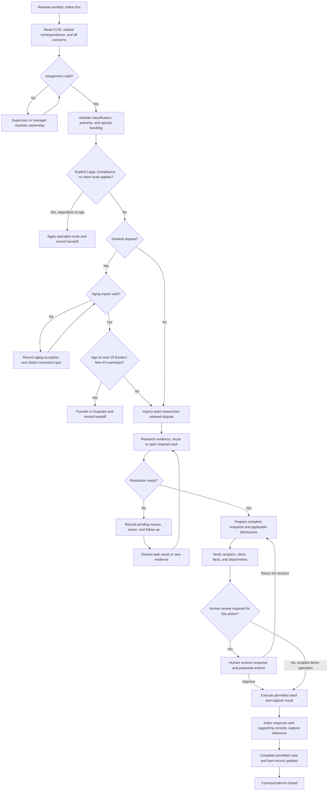

# Business Requirements Document

## Borrower Inquiry and Mortgage Servicing Correspondence — Software MVP

| Document control | Value |
| --- | --- |
| Version | 1.4 — simulated systems, synthetic data, and automated demo actions confirmed |
| Prepared | 22 September 2026 |
| Status | Working MVP requirements; agentic automation, simulated systems, synthetic data, routing precedence, and dispute aging confirmed; scenario selection in clarification |
| Intended deliverable | Software application MVP demonstrating agentic automation |
| Business process | Receipt, assessment, research, response, retention, and closure of borrower servicing correspondence |
| Business context | Newrez / Shellpoint Mortgage Servicing and applicable client, investor, and co-brand portfolios identified in the supplied material |
| Business owner / sponsor | To be assigned by the organization |
| Evidence base | All 26 supplied files under docs/ and its six nested folders; see Appendix A |

## Contents

1. [Executive overview](#1-business-purpose-and-outcomes)
2. [Evidence and scope](#2-evidence-scope-and-interpretation)
3. [Stakeholders](#3-stakeholders-and-accountability)
4. [Process and operating model](#4-process-and-operating-model)
5. [Business requirements](#5-business-requirements)
6. [Functional requirements](#6-functional-requirements)
7. [Scenario and domain requirements](#7-scenario-and-domain-requirements)
8. [Business rules](#8-business-rules-and-exceptions)
9. [Data and records](#9-data-and-record-requirements)
10. [Systems and dependencies](#10-systems-and-dependencies)
11. [Quality and service requirements](#11-quality-security-and-service-requirements)
12. [Measurement](#12-reporting-and-success-measures)
13. [Acceptance scenarios](#13-business-acceptance-scenarios)
14. [Decisions, resolutions, and source limitations](#14-decisions-resolutions-and-source-limitations)
15. [Readiness and approval](#15-delivery-readiness-and-business-approval)
16. [Source inventory](#appendix-a-complete-source-inventory)
17. [Classification catalog](#appendix-b-complete-classification-catalog)
18. [Response-library coverage](#appendix-c-response-library-coverage)
19. [Task catalog](#appendix-d-task-and-specialist-action-catalog)
20. [Glossary](#appendix-e-glossary)

## 1. Business purpose and outcomes

The business needs a consistent, controlled process for answering mortgage servicing correspondence. An agent must understand every issue raised, confirm ownership and classification, research the correct loan and supporting records, obtain specialist action when required, and provide an accurate response through the appropriate client channel. The response and supporting documents must be retained, and the correspondence record must reflect the actual outcome.

The intended deliverable is a **software application MVP demonstrating agentic automation**, as confirmed by the user. It will demonstrate borrower correspondence work currently distributed across CCT, ILS, the Customer Service Portal, OneNote, Kiteworks/Accellion, OnBase, reports, and specialist teams. The app will automatically assess a case, gather relevant evidence, determine the next permitted step, prepare a response or referral, and track the outcome. The user accepted **simulated CCT, ILS, OnBase, and Kiteworks/Accellion with synthetic loan records and documents**, including automated simulated sending, record updates, and case closure. Section 2.7 defines the automated workflow and retained human-review capability.

This BRD defines the business behavior, supporting evidence, and first-release scope. Throughout the source workflow, **inquiry agent** means the human servicing employee; **AI agent** means the app's automated case-handling capability. Routine supported demo cases can run through simulated execution automatically. A human reviewer remains available for exceptions and for demonstrating review of prepared actions. Company test-system connections and live borrower communication or servicing changes are outside the confirmed demo scope; future operational use retains human review and applicable business authority.

The intended outcomes are:

- Complete and understandable answers to all borrower concerns, with evidence supporting material statements.
- Correct treatment of inquiries, disputes, complaints, documents, and follow-up correspondence.
- Consistent handling of client, investor, loan-product, bankruptcy, representation, and state-specific differences.
- Fewer duplicate tasks, incorrect transfers, missing documents, inappropriate templates, and premature closures.
- Traceable correspondence from receipt through specialist action, communication, indexing, and final comments.
- A maintained knowledge base that distinguishes approved instructions from historical examples and extraction defects.
- A visible demonstration of the AI agent completing multiple evidence-based steps, adapting to missing information or tool results, and reporting a verifiable outcome.

No transaction-volume baseline, staffing model, cost estimate, savings target, or approved service-level agreement was supplied. Benefits are therefore qualitative until the measures in Section 12 are baselined.

## 2. Evidence, scope, and interpretation

### 2.1 Review coverage

The review inventoried every supplied file, extracted the Word document text and workbook cells, reviewed the image-based flow map, and used local OCR to examine all embedded sample-response images. Material sample inconsistencies were checked against the images. There are **17 substantive Word documents**, **2 Excel workbooks**, **5 OneNote table-of-contents files**, and **2 Word temporary owner/lock files**.

The Word documents contain **47 embedded images**: one process map and 46 sample-response screenshots. The 15 sample cases are distributed equally across five scenario folders. The Excel review covered all three worksheets, including the response workbook's Summary sheet; no hidden worksheets were present.

| Source ID | Source | Coverage and significance |
| --- | --- | --- |
| S01 | [Process Steps.docx](../docs/Process%20Steps.docx) | Written end-to-end operating steps, assignment rules, dispute aging, research, response, indexing, and final comments. |
| S02 | [Borrower Inquiry - Process Flow Map.docx](../docs/Borrower%20Inquiry%20-%20Process%20Flow%20Map.docx) | Image-based process and decision branches; explicitly shows the inclusive 20-day dispute-transfer boundary. |
| S03 | [Class - Sub Class.xlsx](../docs/Class%20-%20Sub%20Class.xlsx), `Sheet1` | Rows 2–150: 149 classification combinations, 17 Work Types, 18 Classes, and 144 distinct Sub Class text values. |
| S04 | [Inquiry_Responses_Extracted_Pro.xlsx](../docs/Inquiry_Responses_Extracted_Pro.xlsx), `Extracted Data` | Rows 2–528: 527 populated entries in 16 categories. Entries include responses, instructions, fragments, links, and multiple scenarios within single cells. |
| S05 | Same response workbook, `Summary` | Historical metadata reports a 295-page source PDF and 525 extracted rows. The verified count for the supplied workbook is 527; use 527 throughout this BRD. The original PDF is not supplied. |
| P01–P03 | Profile-change samples | Two completed name changes and one request for required name-change documents. |
| D01–D03 | Document-request samples | Evidence of occupancy, unavailable appraisal, and amortization schedule. |
| T01–T03 | Tax-payment samples | School and town tax bills, anticipated amounts, TAR updates, and payment scheduling. |
| C01–C03 | Credit-reporting samples | Bankruptcy-status investigation, commercial-credit request, and Chapter 7 non-reaffirmation. |
| L01–L03 | Loan-servicing samples | Payment-channel difficulty and fee request, hardship and property sale, and an ambiguous EFT request. |

References such as `S04:r179` mean the physical Excel row number in `Extracted Data`, including the header row. `S03:r103` similarly identifies a physical row in `Sheet1`. Full sample paths are in Appendix A.

### 2.2 Evidence labels and priorities

Requirements use the following labels:

- **D — Documented:** explicitly supported by operating instructions or workbook content. This means documented in the supplied files, not independently verified as current policy or law.
- **O — Observed:** demonstrated in a sample. A sample demonstrates what was sent; it does not establish that the response was correct, complete, approved, or successfully received.
- **U — User-confirmed:** clarified directly by the user for this MVP; linked to a dated decision in Section 14.2.
- **P — Proposed:** a recommended business control or operational definition added to make the process complete and testable.

**Must** means necessary for the proposed business baseline within a scenario included in the MVP; **Should** means a recommended improvement. A Must priority does not automatically put every domain in the first release. Documented rules, observed examples, user-confirmed decisions, and proposed controls retain their distinct evidence labels. User-confirmed decisions are recorded with their date and affected requirements, without implying independent approval by an organizational role. Section 14 distinguishes settled facts, corrected BRD interpretation, actual policy questions, and evidence/configuration dependencies.

### 2.3 Source corrections and interpretation

The following corrections apply to the BRD and its interpretation of the sources. The original source documents remain historical evidence and have not been edited.

| Item | Corrected treatment | Effect on requirements |
| --- | --- | --- |
| Response entry count | Use **527 populated entries**, supported by physical rows 2–528 and the category totals. The Summary sheet's 525 is inconsistent historical metadata. | Count reconciliation is settled for this source snapshot; reconstructing the unavailable PDF's extraction history is a separate dependency. |
| Repeated subclass labels | The supplied taxonomy has **149 distinct Work Type/Class/Sub Class combinations**. Repeated subclass text under different parents is not itself a duplicate or error. | Match classifications using their parent combination; retain all 149 combinations. Do not merge entries solely because subclass labels match. |
| Different classification dimensions | S03 Work Type/Class/Sub Class, S04 response Category/Sub Category, and sample folder names serve different purposes. | Treat the first as the supplied operational taxonomy, the second as knowledge organization, and the third as sample grouping. Any crosswalk must be explicit. |
| Defective response examples | Preserve the observed response as evidence of the defect; use the corrected handling in Section 7.2 to define expected behavior. | A contradiction or incomplete answer is not an approved response pattern. Do not choose a real case's bankruptcy status, commercial service capability, or financial outcome from conflicting/incomplete evidence. |
| Incomplete knowledge entries | A filled cell is not necessarily a complete response. Split mixed topics, distinguish instructions from customer text, and withhold incomplete/inconsistent content from operational reuse. | FR-31 applies to reconstructed knowledge items, not merely to nonblank spreadsheet rows. |
| Missing original evidence | Missing OneNote sections, source PDF, attachments, and live records are evidence limitations. | They limit verification of the affected detail; they do not invalidate the confirmed inventory or require invented replacement content. |

### 2.4 Included scope

The business-process scope covers servicing correspondence already present in the worklist; review of its origin and supporting documents; related email CCIDs; classification; inquiry/dispute assessment; research; specialist referral; task and pending-work management; borrower or authorized-representative responses; client-specific communication; supporting attachments; OnBase indexing; final comments; and correspondence closure. The MVP must define which activities the AI agent performs, which require a human inquiry agent or specialist, and how completion evidence returns to the app.

The reference catalog extends beyond the five sample folders to every Work Type in S03 and every category in S04. It includes payments, ACH, escrow, tax, insurance, loss draft, fees, assumptions, ownership, SII/authorization, documents, credit reporting, bankruptcy-related correspondence, recast, HELOC, web access, foreclosure/loss-mitigation referrals, military-benefit inquiries, and manufactured-home or collateral matters. **Catalog coverage is not a commitment to implement every scenario in the MVP.** The launch subset and handling of other scenarios must be explicit.

### 2.5 Scope boundaries

The files do not define upstream mail scanning, CCID creation, original loan boarding, staffing allocation algorithms, or a complete omnichannel contact-center process. They establish email-oriented inquiry handling and routing of incorrectly assigned Chat, Call, or Credit Reporting records. Samples also contain mail/fax-originated requests, so the original channel must remain distinguishable from the work queue and reply channel.

The BRD covers obtaining, tracking, and communicating specialist decisions. It does not grant inquiry agents new authority to approve credit changes, release liens, change contractual obligations, adjudicate bankruptcy, approve assumptions, waive fees, or move funds. Such actions remain governed by the applicable business authority and specialist workflow.

The supplied `.onetoc2` files are notebook navigation metadata, not the referenced OneNote pages. No `.one` sections, original `Inquiry Responses OneNote.pdf`, standalone sample attachments, complete disclosure catalog, live application access, or approved client/investor policy set was supplied. References to attached PDFs in screenshots establish attachment names or presence, not the contents of those attachments.

### 2.6 MVP release definition

The software MVP, agentic automation, four simulated systems, and synthetic case data are confirmed in RES-05, RES-08, and RES-10. The following capabilities define the working demo scope. Scenario coverage is the next product decision; detailed behavior below is proposed where not explicitly user-confirmed.

| Capability | Working MVP behavior | Scope / remaining detail |
| --- | --- | --- |
| Case workspace | Present synthetic correspondence, evidence, concerns, classification, owner, and status; show the AI agent's progress and results. | Simulated CCT is confirmed. Internal caseworker/reviewer use is a working assumption from the source workflow. |
| Assignment and routing | Automatically assess ownership, apply specialist precedence and Section 8.2 aging, and record permitted simulated transfers or pending referrals. | Simulated case/task updates are confirmed; define receiving-team and acknowledgment fixtures for selected cases. |
| Evidence and knowledge | Retrieve synthetic loan records and documents plus usable source guidance through tools; associate findings with evidence and detect missing or conflicting facts. | Simulated ILS/OnBase and synthetic data are confirmed; select scenario fixtures and curated guidance. |
| Response preparation | Automatically draft a response addressing each concern and validate variables, disclosures, attachments, and client/recipient. | Automated preparation and retained review are confirmed; configure templates and review-required examples for the demo. |
| Pending work and handoff | Reuse existing simulated tasks, create permitted tasks/referrals, record ownership, and resume when synthetic evidence or a specialist result arrives. | Simulated task operations are confirmed; prepare task-result and missing-information variants. |
| Delivery and record completion | Automatically send to the simulated secure outbox, index the response/attachments, add loan notes, and close the simulated case when completion checks pass. | Simulated execution is confirmed; retain operation results and references for review. |
| Exception handling | Identify unsupported scenarios, conflicting evidence, missing authority, and failed actions; record a specific next step for a human or specialist. | Retained review and handoff behavior; selected launch scenarios determine the exception examples. |

The MVP must distinguish a prepared action, an action awaiting review, a confirmed simulated result, and a failed/uncertain attempt. Simulated completion requires a corresponding change in demo records and returned evidence. Test-system and operational execution are future extension concepts, not required modes in this MVP.

### 2.7 Agentic MVP behavior and action boundaries

**User-confirmed scope:** demonstrate agentic handling through simulated systems and synthetic data, with automated demo actions and retained human review. **Behavioral requirements:** the AI agent performs the following sequence for selected launch scenarios; detailed controls remain labeled P where they are implementation recommendations:

1. Read the case and related correspondence; identify each concern, ownership issue, classification, and applicable restriction.
2. Determine the evidence needed and retrieve relevant loan records, documents, task history, and usable guidance. Show concise actions and evidence references so a reviewer can understand progress.
3. Evaluate the retrieved results, apply deterministic routing/aging rules, and choose the next permitted step. If information is missing, contradictory, or unavailable, identify exactly what is needed and prepare the appropriate request or handoff.
4. Draft the response and prepare any required task, referral, attachment package, or record update. Validate concern coverage, factual support, recipient/client, disclosures, and completion prerequisites.
5. Present the review package when human review is required; execute only operations enabled for that environment and action. Capture the returned result before advancing the case.
6. Resume after a review decision, new evidence, or task result; report completed work, outstanding concerns, and the next owner/action. Preserve partial failures so completion can be reconciled.

| Activity | Working MVP treatment | Decision status |
| --- | --- | --- |
| Case assessment, evidence retrieval, routing calculation, drafting, and validation | Run automatically through app tools; show evidence and outcomes in the case workspace. | U: RES-08,RES-10; P: detailed behavior. |
| Human review | Allow the inquiry agent to inspect, edit, approve, or return a prepared response/action. Pause for unresolved exceptions or when the demonstration explicitly requires review; revalidate changes before execution. | U: review approach retained; P: review interactions and scenario configuration. |
| Simulated delivery, task updates, indexing, and closure | Execute automatically against synthetic records when prerequisites pass, with visible simulated results and retained references. Routine supported cases need no approval for each simulated step. | User-confirmed: RES-10. |
| Connected test-system operations | Outside this demo release; evaluate as a later integration phase. | Simulation selected in RES-10. |
| Real borrower communication or servicing changes | Outside this demo release; any later operational phase requires human review and applicable business authority. | Confirmed simulation boundary; operational policy remains separate. |
| Unsupported scenario, missing evidence, conflicting rule, or failed operation | Record the exception and next owner/action; resume when the missing input or permitted disposition is supplied. | P: implementation of existing evidence, authority, and completion controls. |

The demo should make changes in evidence visibly affect the AI agent's next action, such as requesting a missing document or reusing an existing task. A successful run may end in a complete response, a documented pending state, or a specialist handoff. Automated handling does not make every source scenario eligible for automatic substantive resolution. The model, technology stack, and internal arrangement of AI agents remain implementation choices.

The AI agent's assessment, retrieval choices, and generated response must use the case evidence returned by the tools. Simulator records and specialist outcomes may be prepared in advance for repeatability, but the visible result must reflect what the agent actually did with those inputs. Simulation implements the required system behaviors and records; reproducing the proprietary applications' screens is not an MVP requirement.

### 2.8 Working demo scenarios and users

**Working assumption:** the first release is an internal caseworker/reviewer demo. A presenter starts synthetic cases, observes the AI agent's actions, supplies prepared follow-up evidence, and performs review when the scenario requires it. A borrower-facing portal, a replica of each proprietary application, and production staffing/access administration are not part of this working scope.

The recommended launch selection is **one synthetic case from each of the five sample groups**, with reusable variants for aging, review, and partial failures. This selection is awaiting the user's scope preference; it is a concrete working proposal, not a claim that all 15 historical cases or all 149 classifications have automated resolution.

| Demo family | Proposed synthetic case | Agentic behavior to demonstrate | Expected case outcome | Source / acceptance trace |
| --- | --- | --- | --- | --- |
| Profile change | A legal-name-change request initially lacks a required supporting document. | Identify the missing prerequisite, prepare a specific request, and resume after the presenter supplies synthetic evidence and any required specialist result. | Pending information initially; complete only after sufficient authority and a verified simulated update result. | P01–P03; RULE-13; FR-09,FR-15,FR-23; AC-13,AC-48,AC-52 |
| Document request | A borrower requests an available amortization schedule. | Locate the correct synthetic document, verify loan/recipient and attachment, draft a complete response, and execute simulated send/index/closure. | Completed simulated response with retrievable attachment and records. | D03; FR-20–28; AC-10,AC-37,AC-50 |
| Tax payment | A borrower asks whether a town-tax bill was received and scheduled for payment. | Compare the supplied bill with synthetic tax records and task history, address receipt and timing separately, and report only the supported payment status. | Complete a supported inquiry; if records disagree, create/reuse a task and retain a pending state. | T01–T03; RULE-03; FR-10,FR-18,FR-23; AC-16,AC-46,AC-50 |
| Credit reporting | A borrower reports a bankruptcy-related credit-reporting concern and the available records conflict. | Detect the contradiction, avoid a conflicting response, and apply the specialist route. Show an explicit classification exception if no approved S03 mapping exists. | Documented specialist handoff or pending clarification; a substantive conclusion requires a supplied determination. | C01; Section 7.2; RULE-04; GAP-03,GAP-08; AC-23,AC-41,AC-48 |
| General loan servicing | A borrower requests an EFT change without saying whether it concerns an incoming payment or outgoing funds. | Identify the ambiguity, ask a specific clarification question, and use the answer to select the supported next step. | Pending clarification followed by evidence gathering or specialist handoff; no unsupported enrollment or funds movement. | L03; Section 7.2; FR-15,FR-23; AC-21,AC-48,AC-52 |

All dates, identities, balances, addresses, documents, and task results in these cases are synthetic inputs created for the demo. Prepared specialist results demonstrate workflow continuation; they do not verify the historical sample or establish general company policy. Reusable variants also cover the confirmed 19/20/21-workday boundary, special-route precedence, a review-required action, and a send/indexing failure.

## 3. Stakeholders and accountability

The roles below are evidenced by the process or proposed for governance. Named employees in historical instructions must be mapped to maintained roles and contact directories before operational use.

| Role | Accountability | Basis |
| --- | --- | --- |
| Borrower / co-borrower | Provides the request, relevant evidence, consent, and clarification; receives the permitted response. | D/O |
| Authorized third party, confirmed SII, executor, or attorney | Acts within the authorization actually recorded; supplies evidence where authority is incomplete. These roles are not interchangeable. | D |
| Inquiry agent (human) | Owns the case; reviews AI-prepared evidence, responses, and actions as required; resolves exceptions within their authority and confirms permitted completion. The source process assigns this employee research, sending, indexing, and final record completion. | S01–S02; U: retained review approach; P: MVP role allocation |
| MVP product owner | Defines the release's users, scenarios, integration/automation boundaries, and acceptance priorities. | U: software MVP purpose; P: role assignment |
| Supervisor | Resolves conflicting email-CCID ownership and operational exceptions. | S01–S02 |
| Manager | Arranges reassignment of Chat, Call, or Credit Reporting CCIDs incorrectly assigned to an inquiry agent. | S01–S02 |
| Disputes / Compliance / Regulatory teams | Own routed disputes, specified credit or modification complaints, regulatory matters, and privacy-event review under the agreed routing policy. | D |
| Bankruptcy / Legal teams | Confirm case status, liability and representation; handle designated legal correspondence and legal restrictions. | D/O |
| Servicing specialist teams | Perform authorized payment, escrow, tax, insurance, loss-draft, recast, assumption, document, lien, HELOC, or loss-mitigation actions. | D |
| Customer Resolution Team (CRT) / assigned SPOC | Handles applicable callback and assistance referrals; supplies completion evidence to the inquiry owner. | D |
| Knowledge and policy owners | Approve classifications, templates, disclosures, task mappings, effective dates, and client/investor exceptions. | P |
| Quality assurance / operations leadership | Reviews outcomes, defects, aging, completeness, and corrective actions. | D/P |
| IT, application owners, identity/security, and records management | Maintain access, operational interfaces, identity-verification support, secure delivery, retention, and recoverability. | D/P |

## 4. Process and operating model

### 4.1 Source process and confirmed MVP interpretation

1. Open **CCT → Worklist → Servicing Worklist**, retrieve or export the list, and work oldest to newest.
2. Open the loan and the relevant email CCID under **Prior Correspondence**. Read the inquiry and check related assignments.
3. Resolve assignment exceptions. Validate and correct Class/Sub-class against the actual concerns.
4. Determine whether the matter is an inquiry or dispute. Apply explicit Legal, Compliance, and client-specific routing before the general age rule, including for cases older than 20 workdays. For an ordinary dispute with no applicable special route, transfer at **20 workdays or less** and retain in Inquiry at **more than 20 workdays**. Count Monday–Friday dates in US Eastern time after the original receipt date through the evaluation date, including weekday holidays. Receipt is day 0 and reassignment never resets age; Section 8.2 defines the complete calculation.
5. Research ILS, loan notes/status, CSP, OneNote, reports, and relevant documents. Identify an existing task or open a required new task. Escalate when necessary.
6. If resolution depends on a task or escalation, update CCT status/comments and move to another inquiry.
7. When ready, select the correct client Kiteworks/Accellion account, obtain the recipient address from ILS or CSP, use the appropriate template, address all concerns, add applicable disclosures, and attach the supporting documents.
8. Send the response. Index the response and applicable attachments in OnBase using the Hyland Software Virtual Printer, correct Document Type/Correspondence Type, loan number in **Sherman ID**, and the **CCID**. Combine documents into one PDF when they should be retained together.
9. Close the correspondence work in CCT and add the final ILS comment using **Standout Comment**, **Servicing**, and **INQ Email Reply** when a final email response was sent. Record the destination email and that tracking was updated.

The phrase “Close the Loan in CCT” is interpreted here as closing the inquiry/correspondence work item. It must not be confused with paying off a mortgage, closing a HELOC line, or releasing a lien. The simulator implements correspondence closure using the logical states and completion controls below. Mapping that behavior to an actual CCT action remains a future operational dependency. Section 2.7 determines automatic execution, human review, and recording of simulated outcomes.

### 4.2 Required logical flow

The diagram applies the confirmed specialist-routing precedence and complete aging convention. The AI agent performs assessment, research, preparation, and permitted simulated execution automatically for selected scenarios. Human review follows Section 2.7. Any missing evidence, invalid aging input, or unresolved rule conflict produces an explicit exception for the affected step. The source-system status mappings remain operational dependencies; the simulator uses explicit logical case states.



Every execution step, including a referral or task update, follows the operation's review and authority requirements. Progress beyond an execution step requires a confirmed result. A failed or uncertain result remains an action exception for reconciliation under FR-37; it cannot lead directly to closure.

### 4.3 Logical case states

These are **proposed business states**, not a claim about the complete CCT status configuration. `Waiting on Other Department` and references to a CCID turning green appear in S04; their technical meanings must be confirmed. The app also records the action environment; a simulated sent/closed state is displayed and reported as simulated.

| State | Entry condition | Required exit evidence |
| --- | --- | --- |
| Received / queued | Correspondence is available for work. | Loan/CCID, original receipt information, and assigned owner. |
| Assignment exception | Ownership or assigned work method is incorrect. | Supervisor/manager disposition and recorded receiving owner. |
| Under review | Correct owner is researching the concern. | Issue assessment, evidence, and action or response decision. |
| Waiting for borrower | Required clarification, evidence, or authorization is missing. | Requested items received, or an approved unresolved disposition. |
| Waiting on other department | Resolution depends on specialist research, task, or approval. | Linked result and evidence sufficient to address the concern. |
| Ready for response | Required research is complete. | Complete draft, correct recipient/client, disclosures, and attachments. |
| Awaiting human review | A prepared response/action requires a review decision. | Recorded approval for the reviewed version, or a return for revision with the reason. |
| Sent / records incomplete | A response has been sent but record completion is outstanding. | Send record, OnBase reference, CCT disposition, and final ILS note. |
| Closed | All completion controls for the selected disposition are satisfied. | Retained evidence permitting reconstruction of the outcome. |
| Transferred / reassigned | Responsibility moved to the designated team. | Destination, reason, time, and ownership acknowledgment; transfer is not substantive resolution. |

Reopening, follow-up intervals, and unsuccessful-delivery handling are proposed requirements because the supplied end-to-end process does not define them completely.

## 5. Business requirements

| ID | Requirement and expected business result | Priority | Basis |
| --- | --- | --- | --- |
| BR-01 | Every actionable correspondence item shall have a traceable loan, CCID, owner, receipt history, and disposition. Related CCIDs shall remain identifiable. | Must | S01–S02; P for full history |
| BR-02 | Work shall be classified from the borrower's actual concern, including the distinction between a request, an alleged error, dissatisfaction, and a courtesy request. | Must | S03; S04:r337–343,r361 |
| BR-03 | The organization shall route work to authorized teams while preserving responsibility for unresolved concerns. | Must | S01–S02; S04:r156–163,r331–336 |
| BR-04 | Material responses shall be supported by current loan records, relevant documents, or an identifiable specialist determination. | Must | S01; C01–C03; P for explicit evidence control |
| BR-05 | Every concern in a correspondence item shall be answered, referred with a recorded reason, or identified as awaiting information. | Must | S01; S04:r52; C02,L01,L03 |
| BR-06 | Communications shall use the correct client identity, authorized recipient, response method, and applicable disclosure set. | Must | S01; S04:r29–36,r160–163,r474–483; samples |
| BR-07 | Task creation and specialist requests shall follow scenario prerequisites and avoid unnecessary duplication. | Must | S01; S04:r179–181,r229,r484–515 |
| BR-08 | The sent response, supporting attachments, and final comments shall form a retrievable evidence chain before correspondence is considered fully complete. | Must | S01–S02; P for completion reconciliation |
| BR-09 | Policy and response content shall be maintained with ownership, effective dates, applicability, approval, and correction of known source defects. | Must | P; defects in Section 14 |
| BR-10 | Operations shall measure timeliness, completeness, accuracy, unresolved work, and repeat contact with definitions that distinguish referrals from resolutions. | Should | P |
| BR-11 | The MVP shall demonstrate automated case assessment, evidence gathering, response/action preparation, and adaptation to results, with visible human review where required and verifiable action outcomes. | Must | U: RES-08; P: Section 2.7 behavior and controls |

## 6. Functional requirements

### 6.1 Intake, classification, and assignment

| ID | Requirement | Priority | Basis / trace |
| --- | --- | --- | --- |
| FR-01 | Provide access to the servicing worklist and a controlled export. Order work from oldest to newest using a defined receipt/aging field. Any operational priority override shall record its reason. | Must | D: S01–S02; P: override audit; BR-01 |
| FR-02 | Show the loan, selected CCID, correspondence method, original request, attachments, prior correspondence, and related open items together or through reliable references. | Must | D: S01; P: consolidated visibility; BR-01 |
| FR-03 | Check that multiple email CCIDs for the loan are assigned to the same agent; refer conflicting ownership to a supervisor. Refer Chat, Call, or Credit Reporting CCIDs incorrectly assigned to Inquiry to a manager. | Must | D: S01–S02; BR-03 |
| FR-04 | Maintain the S03 Work Type → Class → Sub Class combinations and query descriptions. Identify a classification by its complete parent combination, preserve distinct combinations with repeated subclass labels, and keep source labels separate from normalized search/display aliases. Permit correction based on the actual request and retain the original value, corrected value, reason, actor, and time. | Must | D: S01,S03; P: change history and aliases; BR-02 |
| FR-05 | Record inquiry/dispute assessment independently of topic classification. Represent multiple concerns even where the application permits only one primary classification. | Must | D: S01,S04:r52; P: secondary concerns; BR-02,BR-05 |
| FR-06 | Apply explicit Legal, Compliance, and client-specific routing before the general dispute-age rule at every age. With no special route, transfer at most 20 workdays to Disputes and retain older disputes in Inquiry. Apply Section 8.2: original receipt is day 0; count subsequent Monday–Friday Eastern dates through evaluation, including weekday holidays; reassignment does not reset age. Record the inputs, age, matching rule, and route reason. Missing/invalid age inputs prevent a general age-based decision and produce an explicit exception. | Must | D: S01–S02,S04:r156–157,r331,r343; U: RES-06–07,RES-09; P: rule trace/input validation; BR-03 |
| FR-07 | Assess internal communications and document-only submissions using the documented exceptions. Preserve forwarded borrower correspondence and allegations of error instead of treating them as routine internal mail. | Must | D: S04:r333–336; BR-02,BR-03 |

### 6.2 Research, authority, and pending work

| ID | Requirement | Priority | Basis / trace |
| --- | --- | --- | --- |
| FR-08 | Review loan status, transaction and note history, loan product, investor/client, relevant documents, warning codes, and scenario instructions before deciding a response or action. | Must | D: S01,S04; BR-04 |
| FR-09 | Establish whether the requester and intended recipient are a borrower, co-borrower, authorized third party, confirmed SII, executor, or representing attorney. Request missing evidence and honor restrictions/consents. | Must | D: S04:r123–148,r156–163; BR-06 |
| FR-10 | Search existing relevant ILS tasks before opening a new task. Record the linked task information in CCT; create a task only when the scenario requires one and its prerequisites are satisfied. | Must | D: S01,S04:r179,r229; BR-07 |
| FR-11 | Include sufficient task context: concern, requested action, relevant dates and amounts, existing findings, document references, and the scenario-specific information in Appendix D. | Must | D: S04:r484–515; P: common task envelope; BR-04,BR-07 |
| FR-12 | When a task or escalation remains outstanding, record CCT status and comments. Also retain the pending reason, responsible team, next review date, and action needed to resume work. | Must | D: S01; P: owner and follow-up fields; BR-03 |
| FR-13 | Review completed tasks and escalations, validate their result against the inquiry, and resume response preparation. A color change alone shall not establish that every concern is resolved. | Must | D: S04:r53; P: all-concern validation; BR-04,BR-05 |
| FR-14 | Distinguish an exact repeat of a resolved question from a follow-up on open work and from a new concern. Apply the documented duplicate/repetitive rules and BANA exception. | Must | D: S04:r74,r81–82,r331; BR-01,BR-05 |
| FR-15 | Where the request is unclear, a stated attachment is missing, or evidence cannot be read, request the specific missing information through an approved route and record what is outstanding. | Must | D: S04:r86–88; P: unreadable-evidence disposition; BR-05 |

### 6.3 Response preparation and delivery

| ID | Requirement | Priority | Basis / trace |
| --- | --- | --- | --- |
| FR-16 | Select content by scenario, loan product, status, client, investor, authorization/representation, state, and applicable version. Internal instructions shall remain separate from borrower-facing wording. | Must | D: S04; P: structured selection/versioning; BR-06,BR-09 |
| FR-17 | Resolve template placeholders from verified case data. Remove historical example dates, names, balances, addresses, account details, and inapplicable alternatives. | Must | P, supported by S04 defects; BR-04,BR-09 |
| FR-18 | Check every identified concern against the response. A generic referral, evidence request, or consumer-credit explanation shall not silently substitute for a different requested outcome. | Must | D: S01,S04:r52; P: concern checklist; BR-05 |
| FR-19 | Select disclosures through the Letter Template report and approved policy. Bankruptcy-specific wording, investigation conclusions, and the body of the response shall agree with verified facts. Preserve wording explicitly required verbatim. | Must | D: S01,S04:r29–36,r48–49; P: consistency control; BR-04,BR-06 |
| FR-20 | Use the applicable client Kiteworks/Accellion identity and obtain the destination address from ILS or CSP, subject to authorization and representation rules. Resolve conflicting recipient records before sending. | Must | D: S01,S04:r475; P: discrepancy handling; BR-06 |
| FR-21 | Attach the correct loan's requested/supporting documents. Verify actual attachment presence, readability, relevance, and consistency with statements such as “attached” or “enclosed.” | Must | D: S01,D01,D03; P: verification gate; BR-04,BR-06 |
| FR-22 | Provide approved instructions for secure attachment access. Support cases with and without attachments; retain delivery identifiers and any applicable expiration information. | Must | O: D01,D03; P: structured delivery metadata; BR-06,BR-08 |
| FR-23 | Distinguish interim acknowledgment, document request, final resolution, specialist referral, and approved repetitive response. Do not state that an account update, refund, payment, or approval occurred without evidence. | Must | D: S01,S04:r53–54; P: explicit response types; BR-04,BR-05 |
| FR-24 | Retain send status and permit controlled handling of failed, returned, or expired communications. If a send result is uncertain, verify it before retrying to avoid duplicate correspondence. | Must | P; BR-01,BR-08 |

### 6.4 Indexing, closure, and knowledge management

| ID | Requirement | Priority | Basis / trace |
| --- | --- | --- | --- |
| FR-25 | Index response records in OnBase using the appropriate Document Type and Correspondence Type, loan number in Sherman ID, and CCID. Retain a document handle/reference. | Must | D: S01; P: explicit reference retention; BR-08 |
| FR-26 | Combine the response and attachments into one PDF when they belong in one indexed package, preserving readable content and the relationship to the documents actually sent. Retain separately indexed evidence where required by document policy. | Must | D: S01; P: relationship and exception handling; BR-08 |
| FR-27 | Complete the final ILS record using Standout Comment, Department = Servicing, and INQ Email Reply when applicable; use the correct final-response template, record the actual destination email, and record the tracking update. | Must | D: S01–S02; BR-08 |
| FR-28 | Treat closure as complete only when the selected disposition, sent communication or authorized exception, indexing, and final comments reconcile. Preserve a recoverable records-incomplete state if one system update fails. | Must | P, grounded in S01's completion steps; BR-08 |
| FR-29 | Support an approved process for reopening or linking new follow-up correspondence when evidence or unresolved concerns arise after closure. Preserve prior responses and decisions. | Should | P; BR-01,BR-05 |
| FR-30 | Maintain classifications, task routes, contacts, forms, templates, disclosures, and client settings as separately governed reference data with ownership and effective dates. | Must | P; BR-09 |
| FR-31 | Validate imported knowledge content for missing text, unrelated merged scenarios, duplicates, obsolete instructions, embedded credentials, and sensitive case examples before publishing it for operational use. | Must | P; S04,S05 and Section 14; BR-09 |
| FR-32 | Preserve source traceability from the approved requirement/template back to the source file and row or sample; record policy-owner decisions when the approved version differs. | Should | P; BR-09 |

### 6.5 Agentic execution and review

These requirements apply to the selected MVP scenarios using the confirmed simulated systems and synthetic data. Detailed controls implement the user's accepted automation and review approach; their P labels distinguish implementation recommendations from source policy.

| ID | Requirement | Priority | Basis / trace |
| --- | --- | --- | --- |
| FR-33 | From a selected case, automatically identify concerns and evidence needs, retrieve relevant records/guidance using available tools, assess results, and select the next permitted action. Apply configured routing/aging rules consistently and retain supporting evidence references. | Must | U: RES-08; P: behavior; BR-02–05,BR-11 |
| FR-34 | Adapt the next action to tool results: reuse relevant existing tasks, identify missing or conflicting evidence, and prepare a specific information request or specialist handoff. Keep an unresolved concern pending until adequate evidence or an authorized disposition is available. | Must | P; FR-10,FR-13–15; BR-05,BR-07,BR-11 |
| FR-35 | Present the proposed response/actions with concern coverage, source evidence, recipient/client, attachments, and outstanding issues. Let the human reviewer approve, edit, or return them. Associate approval with the reviewed version; changed evidence or content must trigger revalidation and renewed review where it affects an approved action. | Must | U: review approach retained in RES-08; P: review/version behavior; BR-04–06,BR-11 |
| FR-36 | Identify each operation as simulated and define its review requirement. Execute routine supported demo actions automatically when prerequisites pass; pause for configured review or unresolved exceptions. Keep prepared, awaiting-review, simulated-complete, failed, and uncertain results distinguishable. Company test-system and live execution are outside this release. | Must | U: RES-10; P: action contract; Section 2.7; BR-06–08,BR-11 |
| FR-37 | Record each attempted action and its returned status/reference. Advance send, indexing, task, or closure state only on supporting results. On partial failure or an uncertain outcome, reconcile the prior attempt before retrying; preserve already completed work and prevent duplicate sends/tasks. | Must | P; FR-10,FR-24,FR-28; BR-07–08,BR-11 |
| FR-38 | Show a concise activity history of evidence retrieval, rule decisions, prepared actions, human decisions, execution results, and exceptions. Resume from retained case state after a review, new evidence, or task result; report completed and outstanding concerns with the next owner/action. | Must | P; NFR-04–05; BR-01,BR-05,BR-11 |
| FR-39 | Provide simulated CCT, ILS, OnBase, and Kiteworks/Accellion operations with synthetic loan, correspondence, document, and task data. A successful simulated action must update the corresponding demo state and return a retrievable reference; display its simulated status. Preserve the required evidence, authority, and completion checks within the simulated workflow. | Must | U: RES-10; P: simulator behavior in Section 10.1; BR-04,BR-08,BR-11 |
| FR-40 | Support repeatable demonstration runs from versioned synthetic starting data. Allow a presenter to supply prepared missing evidence, specialist results, or tool-failure conditions and resume the case. A fresh run has its own identity/history; restarting a scenario must not silently rewrite the previous run's evidence. | Should | P: repeatable demo and recovery verification; FR-34,FR-37–38; BR-11 |

## 7. Scenario and domain requirements

### 7.1 Detailed review of every supplied sample

The following is a case-by-case interpretation. “Observed response” describes the artifact and does not imply a complete investigation or approved outcome. Names, loan numbers, personal contact details, and other borrower identifiers are intentionally omitted.

| Sample | Borrower need | Observed response / evidence | Required business handling and gap |
| --- | --- | --- | --- |
| P01 | Change the account surname. | Secured email confirms completion; no attachment shown. | Verify the authorized account update before using completion language. The sample does not show the underlying evidence or task. |
| P02 | Change the account surname. | Secured email confirms completion; no attachment shown. | Same confirmation requirement; the second case supports consistent completion wording but does not establish the update procedure. |
| P03 | Identify documents needed for a legal name change. | Requests signed, dated handwritten request plus one legal document; asks for updated ID when the legal document does not reflect the change; explains web/app upload limits. | Distinguish evidence collection from completed change. Apply HELOC-specific requirements separately. |
| D01 | Obtain a document showing that the property is not the primary residence. | Secure attachment response; screenshot lists `Lease Agreement.pdf`. | Validate that the available document addresses the requested evidence. Do not infer occupancy merely from its filename; attachment content is absent. |
| D02 | Obtain a VA appraisal from the loan file. | No attachment; conditionally recommends contacting the county or closing party if the document is not on file. | Perform and record the search, then clearly distinguish unavailable records from records still being researched. Confirm the appropriate external custodian. |
| D03 | Obtain an amortization table for the mortgage term. | Secure email shows an amortization-schedule PDF and attachment expiration. | Provide the applicable schedule; verify loan terms, modification context, and the requested period. The PDF itself was not supplied. |
| T01 | Supply a tax bill and confirm it will be paid. | Explains estimated prior-year amount, TAR-based updates, and scheduled school-tax payment before the stated due date; includes escrow-portal guidance. | Verify tax responsibility, installment, and schedule. Do not treat a schedule as proof of disbursement. |
| T02 | Submit school-tax paperwork with a payment request. | Same TAR explanation and scheduled school-tax payment; no response attachment shown. | Check whether the bill requires a tax task or routine acknowledgment; preserve the submitted evidence and relevant dates. |
| T03 | Ensure a town/city tax bill was received because the authority does not forward it. | Explains TAR updates and scheduled town-tax payment before the stated due date. | Answer receipt/coverage as well as timing; verify the taxing authority and actual loan tax lines. |
| C01 | Assert that the account was discharged in bankruptcy. | Page 1 reports a dismissed Chapter 13 case and no discharge; page 2 says it was subsequently discharged with liability retained. | Material contradiction: require Bankruptcy confirmation and one consistent status/exception block throughout the response. This sample must not be used unchanged. |
| C02 | Ask four questions about an LLC's commercial-credit reporting, enrollment/authorization, and trade-reference verification. | Reply states monthly reporting to four consumer CRAs. | The supplied reply does not explicitly answer the commercial bureau, enrollment, documentation, and verification questions. Research commercial capability, investor suppression, and guarantor treatment; obtain specialist answers. |
| C03 | Request restoration of reporting to the credit report. | Explains Chapter 7 discharge without reaffirmation and uses liability-discharge wording. | Verify discharge and reaffirmation evidence; explain the applicable servicing position and refer legal questions appropriately. Do not infer a universal legal rule from one case. |
| L01 | Report IVR/website payment difficulty and seek late-fee relief. | Reply refers the borrower to Loss Mitigation and states delinquency; includes California-related disclosures. | Verify channel restrictions/outage and payment history, address the fee request separately, and use the applicable state disclosures. The observed reply does not explicitly dispose of both issues. |
| L02 | Explain divorce/medical hardship, inability to afford payments, and court/attorney permission to sell. | Acknowledges the circumstances and provides assistance/Loss Mitigation routes. | Provide the correct assistance referral without treating a reported court permission as a servicing decision or promising a workout outcome. |
| L03 | Ask about EFT transfers to avoid check-clearing delays. | Detailed monthly recurring-ACH instructions, form submission, NSF rules, and New York disclosures. | Clarify direction and purpose of funds: payment to servicer, refund/direct deposit to borrower, or HELOC draw. The sample does not establish that recurring mortgage payments were intended. |

### 7.2 Corrected handling of defective samples and extracted content

These corrections make the expected behavior explicit without asserting unverified facts about the original borrowers. They are requirements for a completed response; any final account-specific statement still depends on the relevant research and applicable policy.

| Example / source | Corrected handling | Completion evidence |
| --- | --- | --- |
| C01 — contradictory bankruptcy status | Obtain the authoritative Bankruptcy result. If the case was dismissed without discharge, remove the paragraph asserting discharge. If discharge is verified, correct the case findings and select the applicable liability wording. If evidence conflicts, retain the unresolved status and obtain clarification; do not send a definitive status claim. | One supported case status and a consistent body/disclosure set; FR-08, FR-19, AC-23. |
| C02 — commercial-credit request | Answer each of the four questions separately: current reporting to the named commercial bureaus; whether reporting under the LLC can be initiated; required documentation/authorization; and support for trade-reference verification. Distinguish those services from consumer reporting for guarantors. Explicitly refer an unanswered question to the appropriate owner instead of implying the consumer-CRA paragraph answers it. | Verified answer or documented pending referral for each question; DR-10, AC-24. Commercial service availability remains a policy/capability question. |
| L01 — payment difficulty plus fee request | Research both channel access and the fee request. Explain the verified restriction or technical issue, the permitted payment route, and the supported fee disposition or pending review. Referral to Loss Mitigation alone does not dispose of the fee question. | Separate findings and outcomes for both concerns; DR-07, DR-09, AC-20. |
| L03 — ambiguous EFT request | Establish the direction and purpose of funds. Use recurring/one-time payment guidance for funds paid to the servicer, signed-consent refund guidance for applicable funds returned to the borrower, or HELOC draw guidance for a draw request. If intent remains unclear, request clarification. | Recorded intent and the corresponding procedure; S04:r229,r266,r523; AC-21. |
| S04:r19 — 1099-C heading / 1099-INT body | Treat this as a mismatched extracted item. The body concerns escrow-interest reporting and cannot answer a cancellation-of-debt question. Keep the two form topics separate and obtain the correct 1099-C guidance if needed. | No 1099-C response selected from 1099-INT text; FR-16, FR-31. |
| S04:r54 — PMI and escrow text mixed | Separate the PMI cancellation material from the escrow-removal material. For a PMI-only case, exclude the unrelated escrow paragraph; for a multi-issue case, address the two requests separately with their own verified status and applicable wording. | One clearly identified topic per response block; no inferred approval or universal turnaround commitment. |
| S04:r244 — monthly heading / semi-monthly body | Select wording from the actual plan on the account. A monthly-plan response must describe that monthly plan; do not reuse the semi-monthly body under a monthly label. | Plan name, schedule, and statement explanation agree with the account; DR-08. |
| S04:r317 and other interleaved rows | Separate tax instructions, insurance instructions, contacts, and disclosure/portal text only where their context can be established. Obtain the missing original context for fragments that cannot be reconstructed reliably. | Complete, attributable knowledge items; no unrelated instruction inherited because it occupied the same spreadsheet cell. |

### 7.3 Domain requirements across the full source library

All DR requirements are **Must** for the corresponding scenario when included in the MVP, with actual specialist actions limited to the confirmed automation scope and business authority. This table is the full domain reference catalog, not a list of all features committed for the first release. Unsupported scenarios must have an explicit handoff/exception outcome rather than an invented answer. Appendix C accounts for every response-library category.

| ID | Domain | Required capability and decision inputs | Evidence / acceptance link |
| --- | --- | --- | --- |
| DR-01 | Document fulfillment | Identify document type and period; search OnBase and applicable records; provide available authorized copies, secure access, or a substantiated unavailable-document response. Include note, deed, history, amortization, statement, agreement, valuation, and release-related requests. Documents from the prior servicing period may still be provided after servicing transfer when available. | D01–D03; S03:r116–127; S04:r26–28,r65–74,r92,r95,r100; AC-10–12 |
| DR-02 | Profile and identity changes | Separate legal name, mailing address, property address, occupancy, taxpayer information, portal username, and ILS email changes. Apply each evidence and approval route; do not treat a profile edit as modification of the Note or release of liability. ILS email updates use the documented DMRS approval/ticket route. | P01–P03; S04:r104–155,r336,r449–456,r515–519; AC-13–15 |
| DR-03 | Authorization, death, and SII | Distinguish authorization from confirmed ownership succession and assumption. Collect applicable signed authority, identity, death, estate, relationship, or transfer documents; track missing items and the scope of confirmed authority. A surviving co-borrower already on the Note is not automatically a new SII. | S04:r123–148,r371,r375,r486; AC-15 |
| DR-04 | Tax servicing | Distinguish routine payment confirmation from nonpayment, wrong amount/parcel, refund, exemption, supplemental tax, tax sale, or payment-option change. Research lender responsibility, taxing authority, parcel, tax year, installment, due date, amount, TAR, and actual disbursement. Handle state-specific and special-assessment cases through applicable policy. | T01–T03; S03:r97–104; S04:r290–317,r494–496; AC-16–17 |
| DR-05 | Escrow | Explain analysis, payment changes, shortage/surplus, and responsibility from actual records. Distinguish adding taxes, adding insurance, removing either/both, and changing shortage repayment. Require explicit removal scope before task 993; apply investor/state/product eligibility and approved analysis results. | S03:r40–48; S04:r164–210,r498–502; AC-18 |
| DR-06 | Insurance and loss draft | Track policy/declaration evidence, mortgagee clause, renewal, payment, lender-placed insurance, and coverage corrections. Distinguish premium servicing from claim-proceeds release. Obtain signed authority and specialist approval for permitted use of loss-draft funds; apply inspection/completion requirements and approved claim channels. | S03:r89–96; S04:r317–330,r334,r497; AC-19 |
| DR-07 | Payments, statements, and refunds | Explain receipt, allocation, suspense/unapplied funds, contractual due date, fees, missing payments, prior-servicer payments, bank errors, statements, and refunds from history. Obtain payment proof before tasks requiring it. Treat incoming ACH payment enrollment and outgoing ACH refunds as separate requests with separate consent. | L01,L03; S04:r211–289,r506–515; AC-20–22 |
| DR-08 | ACH plans | Research product, delinquency, bankruptcy consent, certified-funds/NSF holds, existing plan, signed form, draft schedule, and requested change. Search OnBase before requesting an already-submitted form. Apply verified draft-date/frequency rules and distinguish monthly, bi-weekly, and semi-monthly plans. | S04:r211–249; L03; AC-21–22 |
| DR-09 | Fees and error correction | Distinguish alleged servicer error, bank error, goodwill request, paid fee, prior-servicer fee, and a previously granted courtesy. Obtain the required approval/evidence before communicating waiver or reimbursement; retain transaction evidence of the result. | S03:r62–75; S04:r274,r287,r505,r510; L01; AC-20 |
| DR-10 | Credit and bankruptcy | Distinguish inquiry, alleged inaccuracy, goodwill deletion, consumer reporting, commercial reporting, investor suppression, and guarantor reporting. Verify relevant payment history, reporting history, investor policy, bankruptcy case status, discharge, retained liability, and reaffirmation. Use approved specialist routing and consistent disclosures. | C01–C03; S04:r29–36,r337–355; AC-23–25 |
| DR-11 | Hardship, foreclosure, and assistance | Distinguish assistance requests, settlement, reinstatement, foreclosure concerns, disaster-related contacts, specific modification-error appeals, and requests to reapply. Consult actual loss-mitigation contacts/status and applicable specialist routes. A subsequent unrelated contact does not prove resolution without an approved policy. | L01–L02; S04:r24–25,r281–289,r356–368; AC-26 |
| DR-12 | Assumptions and ownership conversions | Determine product/client eligibility, confirmed SII status where relevant, current/delinquent status, and the appropriate purchase, successor, spousal, trust, or LLC process. Track forms, evidence, investor decision, and release-of-liability implications. Resolve the assumption-task conflict before choosing an operational route. | S03:r76–88; S04:r139–144,r369–386,r488; AC-27 |
| DR-13 | Recast and refinance referrals | Distinguish eligibility enquiry, denial, missing agreement, missing curtailment/fee, work in progress, and completed recast. Validate investor participation, product, prior recast, approval, signed agreement, and posted funds before task 322 or a completion response. Apply client restrictions to refinance referrals. | S03:r31–32,r143–146; S04:r459–473,r503–504; AC-28 |
| DR-14 | HELOC and identity verification | Apply special identity/signature verification for applicable account changes and draws. Route missing comparison documents, signature mismatch, and Socure Red/Refer outcomes to the approved workflow. Distinguish payoff, line closure, temporary freeze, credit-score freeze, and approved reinstatement; task 947 completion precedes the applicable approval response. | S03:r49–55; S04:r451,r493,r515–528; AC-29 |
| DR-15 | Portal and access assistance | Distinguish registration/linking, username, password, MFA, account status restrictions, geographic access, documents, and actual technical faults. Follow approved identity controls; preserve MFA; route unresolved technical issues to IT. Do not represent a template statement as evidence that an account is secure or a fault is fixed. | S03 Website/IVR rows; S04:r409–458; AC-30 |
| DR-16 | Tax forms, military benefits, and collateral specialties | Support form-year/type and prior-servicer distinctions for 1098/1099/W-9, SCRA evidence and specialist outcomes, manufactured-home requests, CEMA/stock and lease, partial release, subordination, and REO/conveyance routing. Use approved specialized requirements rather than generalizing examples. CEMA tasks are restricted to the designated agents. | S04:r2–23,r37–43,r65–80,r99–107,r391–408,r484–493; AC-31 |

## 8. Business rules and exceptions

These are documented rules or proposed safeguards, not independent legal interpretations. Open contradictions take precedence over apparent precision in an individual historical template.

| ID | Trigger / rule | Required behavior | Basis |
| --- | --- | --- | --- |
| RULE-01 | Ordinary dispute with no applicable Legal, Compliance, or client-specific route; age **≤20 workdays**. | Transfer to Disputes under the general workflow. Exactly workday 20 is included. Calculate age from original receipt using the complete Eastern weekday convention in Section 8.2. | D: S01–S02; U: RES-06–07,RES-09 |
| RULE-02 | Ordinary dispute with no applicable Legal, Compliance, or client-specific route; age **>20 workdays**. | Inquiry retains handling and the dispute designation. Calculate age under Section 8.2; explicit specialist/client rules override this general retention rule at any age. | D: S01–S02,S04:r331; U: RES-06–07,RES-09 |
| RULE-03 | Neutral tax-payment confirmation or neutral PMI cancellation request. | Classify as an inquiry when the request does not allege error/dissatisfaction. S03 explicitly identifies these as inquiry cases; it also distinguishes neutral partial release, subordination, and refinance requests. | D: S03:r103,r108,r141–142,r146 |
| RULE-04 | Credit reporting alleges error, or modification appeal identifies a specific error. | Apply the documented Customer Upset / Compliance route before the general dispute-age rule, even above 20 workdays. Preserve the allegation and evidence and coordinate assignment through the applicable manager process. | D: S04:r343,r361; U: RES-06 |
| RULE-05 | Relevant ILS task already exists. | Record/reuse it; open a new task only if an additional distinct authorized action is required. An absent task is not by itself a reason to create one. | D: S01; P: distinct-action check |
| RULE-06 | Duplicate/follow-up while original is Waiting on Other Department. | Apply the documented acknowledgment only in that status. A further identical follow-up may be cancelable under the documented rule, subject to BANA restrictions. Exact repeats after a completed response use the applicable repetitive-letter process; new questions do not. | D: S04:r74,r81–82,r331 |
| RULE-07 | BANA callback request. | Refer to CRT with two required contact attempts; wait for attempt/result evidence before responding. BANA duplicate cancellation requires designated review. Preserve specified BANA dispute handling. | D: S04:r331–332 |
| RULE-08 | Attorney, legal warning, or designated-law-firm correspondence. | Apply the explicit legal route and no-work/no-update restrictions before the general age rule at any age. Use attorney-directed wording and attachment format for permitted responses. Where two special rules conflict, preserve the restrictions and obtain supervisory/specialist disposition; do not fall back to the ordinary age route. | D: S04:r156–163; U: RES-06; P: handling conflicting special rules |
| RULE-09 | Active representation or cease-and-desist restriction. | Apply AttyRep, AttyCons, or C&D according to the actual instruction. Direction to communicate through an attorney is not automatically C&D. C&D reversal requires a written request under the source process. | D: S04:r158–163,r387–390 |
| RULE-10 | Escrow deletion while both taxes and insurance are escrowed. | Obtain explicit scope: taxes, insurance, or both. Do not open task 993 when scope is unspecified. For named “tree” portfolios, initiate the DA approval-request step; confirm whether approval must be received before task creation. | D: S04:r179–181 |
| RULE-11 | No error found in a worked dispute. | Include the approved verbatim statement: “Upon investigation of your dispute, we have been unable to determine that an error occurred. You have the right to request documentation supporting our determination.” | D: S04:r48 |
| RULE-12 | Error found in a worked dispute. | Include the approved verbatim apology in S04:r49, together with the actual findings and disposition. The apology is not a substitute for answering the dispute. | D: S04:r49; P: disposition completeness |
| RULE-13 | Normal legal-name change. | Require a handwritten signed/dated request and one specified legal document; request additional identity evidence where the change is not demonstrated. HELOC has a separate front/back ID requirement. | D/O: S04:r115–117,r519; P03 |
| RULE-14 | Product/plan restrictions for ACH. | Apply the approved monthly-only treatment for HELOC/draw loans and relevant buydown restrictions. Active-bankruptcy recurring plans require the documented specific attorney consent exception. Do not use conflicting draft schedules until confirmed. | D: S04:r218–219,r227,r237 |
| RULE-15 | Returned recurring payments. | Source guidance describes cancellation after two NSF returns in a rolling six-month period and six months of clean pay before a hold-removal request. Confirm applicability, calculation, and approval; do not promise automatic reinstatement. | D: S04:r211–237; L03 |
| RULE-16 | Modification to recurring plan near the next draft. | Apply the documented restriction on online changes within seven days of the next draft and provide an approved alternative; confirm exact boundary and processing calendar. | D: S04:r245,r247–249 |
| RULE-17 | Missing payment or request for bank-fee reimbursement. | Collect required payment/fee proof before the task. Distinguish task 618 for current-servicer payments from 917 for prior-servicer payments; observe the first-week boarding restriction on 917. | D: S04:r277,r287,r508,r510–511 |
| RULE-18 | Commercial investor reporting question. | Check the investor suppression rules and distinguish reporting of personal guarantors to consumer CRAs from reporting the entity to commercial bureaus. Consumer reporting does not establish commercial reporting capability. | D/P: S04:r351–355; C02 |
| RULE-19 | Socure Red/Refer, signature mismatch, or missing comparison evidence. | Follow the documented identity escalation/records route; do not treat failed or incomplete verification as authority to complete the requested update or draw. | D/P: S04:r515–519 |
| RULE-20 | Possible privacy event. | Report immediately through the approved Compliance route with affected loan references, date, information/documents involved, and delivery method. Keep the investigation and corrective action traceable. | D: S04:r393–407; P: tracking |

### 8.1 Timing statements that require controlled use

The following timings are source statements for particular scenarios. They are **not universal inquiry-resolution SLAs**. The user-confirmed Eastern Monday–Friday calendar applies to the **20-workday dispute-routing threshold**. It does not automatically redefine mortgage delinquency, statutory deadlines, ACH schedules, or other scenario turnaround statements. For those other timings, a source's unqualified “days” still requires its own applicable policy.

| Scenario | Source timing | Use / limitation |
| --- | --- | --- |
| General dispute transfer | ≤20 workdays transfer; >20 workdays retained for ordinary disputes | U: Eastern Monday–Friday dates, including weekday holidays; original receipt is day 0; no reassignment reset. Section 8.2 gives the formula. Explicit Legal/Compliance/client routing overrides at any age. |
| PMI cancellation review | Up to 20 business days | S04:r54; row also contains escrow wording and requires content repair. |
| Reinstatement quote tool | Typically 5–7 business days; OnBase availability typically within 24 hours of completion comment | S04:r25; eligibility restrictions and route apply. |
| Partial release | Response within 10 business days; approximately 60 days after complete package | S04:r74; not a guarantee for all collateral requests. |
| Trust/LLC conversion | 30 days to submit requested documents; up to about 60 days for transfer | S04:r139–140; approval and form requirements apply. |
| Assumption initiation | 5–7 business days for eligibility/contact/denial communication; 30 days for documents if eligible | S04:r380–382; channel varies by client; task policy conflicts. |
| Recast | Typically up to 60 days after required items; a particular follow-up template says within 7 days | S04:r459,r466; not the same trigger or milestone. |
| Paid-in-full refund | Up to 20 business days from payoff | S04:r278; distinguish issuance, receipt, and lien release. |
| Lien-release recordation | Source describes 60–90 business days depending on county | S04:r65; HELOC source also cites up to 30 days for processing in r521, potentially a different milestone. |
| Consumer bureau update | 30–45 days in specific paid-off/reporting scenarios | S04:r340,r354–355; distinguish file submission from bureau display. |
| Insurance document update | 3–5 business days in an embedded insurance instruction | S04:r317; text is interleaved with tax content and needs repair. |
| Privacy event | Immediately on discovery | S04:r395; precise internal escalation service target to be owned by Compliance. |

### 8.2 MVP dispute-aging and routing contract

| Component | Definition | Status |
| --- | --- | --- |
| Business time zone | US Eastern time, represented as `America/New_York`; observe EST/EDT daylight-saving changes rather than using a fixed UTC offset. | User-confirmed time zone; standard implementation interpretation. |
| Countable weekdays | Monday through Friday; Saturday and Sunday do not increase the workday count. | User-confirmed. |
| General boundary | Ordinary disputes at age 20 workdays or less transfer to Disputes; older ordinary disputes remain with Inquiry. | Documented boundary plus user-confirmed calendar. |
| Special routing | Explicit Legal, Compliance, and client-specific routing overrides the general boundary at every age. | User-confirmed. |
| Clock anchor | Original receipt of the correspondence, not CCID creation or the start of an employee's review. | User-confirmed: RES-09. |
| First-day convention | The Eastern local receipt date is day 0 and is excluded. Count eligible dates after receipt through and including the Eastern local evaluation date. Weekend receipt remains day 0; the following Monday is day 1. | User-confirmed convention; P: explicit formula. |
| Reassignment | Reassignment never resets the original receipt anchor or accumulated age. | User-confirmed: RES-09. |
| Holiday treatment | Include every Monday–Friday date, including US holidays falling on those weekdays. No holiday exclusion calendar applies to this threshold. | User-confirmed: RES-09. |
| Invalid or missing inputs | Missing/invalid receipt data, an unknown timestamp time zone, or an evaluation instant before receipt produces an aging exception. Do not substitute CCID creation, assume age 0, or select the ordinary age-based route. An independently applicable special route still takes precedence. | P: implementation safeguard. |

Convert receipt and evaluation timestamps to `America/New_York` before extracting their local dates. For valid inputs, calculate:

```text
receipt_date = Eastern local date of original receipt
evaluation_date = Eastern local date of evaluation
workday_age = count of dates d where:
    receipt_date < d <= evaluation_date
    and d is Monday, Tuesday, Wednesday, Thursday, or Friday
```

The age changes on eligible Eastern calendar dates, not after successive 24-hour periods or accumulated office hours. Record both original timestamps, local dates, the calculated age, and the rule/calendar version so the result can be reproduced. This convention applies only to the dispute-routing threshold; it does not redefine other source timelines in Section 8.1.

The following are calculation examples, not historical borrower cases. All dates in this table are Eastern local dates. Ordinary routes assume no applicable special rule.

| Original receipt | Evaluation | Workday age | Expected result / reason |
| --- | --- | --- | --- |
| Friday, 2026-09-04 | Friday, 2026-09-04 | 0 | Receipt date is excluded; ordinary dispute transfers. |
| Friday, 2026-09-04 | Sunday, 2026-09-06 | 0 | Weekend dates do not increment age. |
| Friday, 2026-09-04 | Monday, 2026-09-07 | 1 | Labor Day counts because it is Monday. |
| Saturday, 2026-09-05 | Monday, 2026-09-07 | 1 | Weekend receipt is day 0; Monday is the first counted date. |
| Tuesday, 2026-09-01 | Monday, 2026-09-28 | 19 | Ordinary dispute transfers to Disputes. |
| Tuesday, 2026-09-01 | Tuesday, 2026-09-29 | 20 | Ordinary dispute transfers; the boundary is inclusive. |
| Tuesday, 2026-09-01 | Wednesday, 2026-09-30 | 21 | Ordinary dispute stays with Inquiry. Reassignment on September 29 does not reset age. |
| Friday, 2026-10-30 | Monday, 2026-11-02 | 1 | The daylight-saving transition over the weekend does not add a workday. |

For a UTC boundary example, receipt at `2026-09-21T02:00:00Z` is Sunday, September 20 at 22:00 Eastern; evaluation at `2026-09-21T14:00:00Z` is Monday at 10:00 Eastern, so age is **1**. During the fall clock change, `2026-11-01T05:30:00Z` and `2026-11-01T06:30:00Z` both map to November 1 at 01:30 Eastern with different offsets; neither creates an additional date to count.

The confirmation establishes special rules ahead of the general age rule. It does not establish a new order among conflicting Legal, Compliance, and client-specific rules. Existing explicit restrictions continue to apply; any unresolved conflict within that group requires a recorded supervisory/specialist disposition.

## 9. Data and record requirements

| Entity / information | Minimum business content | Control / source |
| --- | --- | --- |
| Correspondence | CCID, loan identifier, original method/source, receipt date/time, request text, inbound-document references, assigned agent/team, client, current state. | S01; P for complete field set. Preserve loan identifiers as text, including leading zeros. |
| Dispute aging and route | Original receipt timestamp with offset/source time zone; CCID creation timestamp retained separately; evaluation timestamp; Eastern receipt/evaluation dates; calculated workday age or input exception; rule/calendar version; matching special rule; selected route; decision reason. | U: RES-06–07,RES-09 establish original receipt/day 0, Eastern weekdays including holidays, no reset, and special precedence; P: reproducible record and input validation. |
| Issue assessment | Individual concerns; Work Type/Class/Sub Class; inquiry/dispute/complaint assessment; reason; correction history; relationship to other CCIDs. | S01,S03,S04:r52; P for issue-level trace. |
| Loan context | Product, investor/client, active/inactive/paid-off/transferred status, contractual due date, delinquency, relevant balances, escrow responsibility, warnings, and research time. | S04; use only fields necessary for the scenario. |
| Party and authority | Requester/recipient role, approved contact source, authorization/consent evidence, representation, SII status, communication restrictions, preferred language. | S04:r123–163; sample disclosures. |
| Research finding | Fact or conclusion, source system/document, relevant effective date, researcher, and unresolved discrepancy. | P supporting S01 and BR-04. |
| Task / escalation | Task ID/type, target team, reason, prerequisites, request date, required action, notes, linked documents, status/result, and follow-up owner/date. | S01,S04 Task category; P for normalized tracking. |
| Outbound response | Response type, concern coverage, approved template/version, actual content, client/sender identity, actual recipient, disclosure set, author/reviewer as applicable, send time/result. | S01; P for explicit versions/review fields. |
| Attachment | Document name/type, loan association, source handle, period/version, send association, secure-access/expiry metadata where applicable. | S01; D01,D03; P for structured linkage. |
| OnBase index | Document Type, Correspondence Type, Sherman ID = loan number, CCID, indexed date, resulting handle, response/attachment package relationship. | S01. Document-type mappings also appear in S04:r386. |
| Completion record | CCT disposition; final ILS note type/department/comment; response recipient; tracking update; unresolved follow-up or transfer reference; completion timestamp. | S01; P for reconciliation data. |
| Knowledge item | Stable ID, category/scenario, internal instructions, approved customer text, inputs, applicability, evidence requirements, task route, owner, version, effective/retirement dates, approval, and source reference. | P. Do not use category/subcategory text alone as a unique key. |
| Exception / incident | Failed action or discrepancy, affected records, impact, escalation, owner, corrective action, and verification. | S04:r393–407; P for general exceptions. |
| Agent run / action | Run and case reference, action purpose, evidence/tool references, simulation environment, human/AI actor, prepared payload/version, required review and decision, attempt time, returned status/reference, and next owner/action. | P: FR-33–40. Distinguish preparation, review, completed simulated actions, and failed/uncertain attempts without copying unnecessary sensitive data. |
| Synthetic scenario | Scenario ID/version, synthetic loan and CCID, fictional parties/client settings, receipt/evaluation inputs, correspondence, documents, loan facts, existing tasks, optional specialist result, and selected failure/review conditions. | U: RES-10; P: FR-39–40. Scenario data is separate from historical source cases and traceable to the business pattern it demonstrates. |

Amounts, dates, interest rates, balances, tax years, and loan-status statements must come from applicable records, not fixed examples in the workbook. Research time and transaction/effective date must remain distinguishable. Sensitive evidence should be referenced in its controlled repository rather than copied unnecessarily into narrative notes or general reporting.

## 10. Systems and dependencies

The sources establish the operational use of the systems below, but do not establish available APIs or permission to connect to them. In plain language, **CCT tracks the case**, **ILS holds loan records and tasks**, **OnBase stores documents**, and **Kiteworks/Accellion sends secure correspondence**. “System access” means whether the MVP can read those records or perform actions in those applications. A read-only connection retrieves information; a write-back connection can change records or initiate an action.

The user confirmed simulation of these four systems with synthetic loan records and sample-style documents in RES-10. The AI agent will demonstrate the complete workflow with simulated sends, tasks, indexing, notes, and case updates. Company test environments and live connections are outside this demo release. The MVP does not depend on access to those systems.

### 10.1 Confirmed simulation scope

The following operation contract is proposed detail for the confirmed four-system simulation. Each operation returns a result that the AI agent must inspect before advancing. Synthetic scenarios use fictional borrowers, identifiers, contacts, amounts, and evidence; original case identifiers and exposed source credentials are excluded from demo data.

| Simulated system | Evidence available to the AI agent | Enabled demo actions | Observable result |
| --- | --- | --- | --- |
| CCT | Worklist, selected case, related correspondence, owner, classification, status, and receipt history. | Record classification/route, assignment or handoff, pending reason/comments, and permitted case closure. | Updated case state and action history with the case/run reference. |
| ILS | Loan/party/client context, relevant transactions, warning codes, notes, existing tasks, and supplied specialist results. | Reuse/create permitted tasks, record task/result links and loan notes, and apply a scenario-supported simulated record update. | Task/reference and updated synthetic loan history; financial or specialist outcomes require supplied scenario evidence. |
| OnBase | Searchable synthetic documents associated with the correct loan and case. | Retrieve evidence/attachments and index the response package with required loan/CCID labels. | Retrievable document reference and the actual stored package. |
| Kiteworks / Accellion | Synthetic client sender settings and prepared response/attachment information. | Record a simulated secure send, or return a configured failed/uncertain result. | Simulated outbox entry with content, recipient, attachments, time, status, and delivery reference. |

For selected scenarios, supporting CSP/report facts and specialist determinations may be supplied as labeled synthetic evidence or simulated task results. The MVP does not require a separate replica of every resource in the source catalog. Keep approved/source-supported guidance distinct from synthetic case facts. An unresolved policy conflict still receives the documented exception/handoff; fabricated company-policy approval is not a substitute for resolving it.

To demonstrate review without interrupting every routine action, a scenario can require a human decision before a simulated send/update. Other supported scenarios run automatically after validation. A presenter can supply new evidence or a prepared specialist result to demonstrate resumption. The app must identify these inputs and each action's outcome in the activity history.

### 10.2 Source-system reference catalog

The table below preserves all systems/resources identified in the files. It describes the business context and possible future dependencies; it does not add live integrations to this MVP.

| System / resource | Business use and dependency | Information exchanged |
| --- | --- | --- |
| CCT | Case/worklist tracker: requests, prior correspondence, CCID assignment, classification, task references, status/comments, and closure. | Case ownership, request, assessment, action, and outcome. |
| ILS | Loan servicing records: loan details, warnings, borrower information, payment history, specialist tasks, and final notes. | Verified loan data, requested actions, task results, notes. |
| Customer Service Portal / CSP Admin | Borrower contact verification, permitted portal support, registration/preferences, online-access research. | Contact and account-access information, approved assistance actions. |
| OneNote / maintained knowledge repository | Scenario research, response language, final-comment templates, and task guidance. | Approved instructions and content; original pages are not present in this directory. |
| Letter Template reports | Response letters and applicable state disclosures. | Approved text and disclosure output for the particular loan. |
| Kiteworks / Accellion | Secure borrower email and attachments using the appropriate client's sender identity. | Recipient, response, attachments, send/access metadata. |
| OnBase / Hyland Software Virtual Printer | Document repository: find and retain evidence, sent responses, and attachments with the correct case/loan labels. | Evidence documents, sent response package, document handles. |
| SSRS / business reports | Creditor/investor checks, payment research, SPOC, bankruptcy case, credit reporting history, and relevant status data. | Facts and assignments supporting the response. Actual links/permissions require validation. |
| DA tool / DMRS / ServiceNow | Particular approval, data update, portal support, and records/technical requests. | Approved request payload, attachments, ticket number, decision, completion. |
| Socure | Applicable HELOC/customer identity verification and referral outcomes. | Verification status and controlled evidence references; avoid duplicating identity artifacts. |
| Specialist/vendor resources | Tax/insurance vendors, Loss Draft portal, Bankruptcy, Legal, Disputes, CRT, SPOC, and other servicing teams. | Referral, supporting evidence, determination, completion. |
| DocuSign | Recast agreement issuance/execution in the response-library process. | Agreement and execution/completion status. |
| Salesforce | Mentioned in the process summary and resource links. | Its mandatory role and any required update are not defined sufficiently; open decision. |
| Tableau / audit tools | Audit agent view, results, and calibration resources listed in S04. | Quality and performance views; operational/reporting ownership to be confirmed. |

## 11. Quality, security, and service requirements

These requirements express business acceptance needs rather than a prescribed technical architecture.

| ID | Requirement | Priority / basis | Acceptance expectation |
| --- | --- | --- | --- |
| NFR-01 | Protect borrower documents, identity, financial details, and private contacts through approved access and secure communication controls. | Must; D/P | Authorized personnel can perform their role; unauthorized party/client access and transmission are prevented in acceptance exercises. |
| NFR-02 | Keep client sender identity, contact information, and disclosures correctly associated with the loan. | Must; D/P | Switching between clients does not retain the prior client's sender, signature, recipient, or attachments. |
| NFR-03 | Keep credentials out of the business knowledge library, generated documents, logs, and exports. Use the organization's approved access-management mechanism. | Must; P prompted by S04:r474 | No plaintext credential values are included in approved knowledge imports or this BRD. Account owners assess and replace exposed/shared credentials under their policy. |
| NFR-04 | Preserve a reconstructable audit trail of classification, evidence, approvals, response, indexing, and closure. | Must; D/P | An authorized reviewer can trace a closed CCID to supporting records and the actual sent content. |
| NFR-05 | Preserve work through outages and partial failures without claiming unsent responses, lost attachments, or complete closure. | Must; P | Failed send/index/comment operations remain identifiable, recoverable, and reconcilable without duplicate delivery. |
| NFR-06 | Apply an approved retention schedule and legal-hold treatment to correspondence and evidence, including secure exports. | Must; P | Records are retained/retrieved/disposed of according to the approved schedule; no retention duration is invented here. |
| NFR-07 | Make responses readable, appropriately worded, and usable by the intended recipient, including relevant language-assistance information and readable attachments. | Must; O/P | No clipped text, unreadable scans, internal notes, stale placeholders, or unapproved disclosure edits appear in accepted output. |
| NFR-08 | Control reference-data changes and policy versions without silently altering historical records. | Must; P | The version used for a historical response remains identifiable after content changes. |
| NFR-09 | Establish capacity, response-time, availability, recovery, and support targets from measured demand and business hours. | Should; P | Owners approve measurable targets and a realistic workload profile before technical service acceptance; the source files supply no capacity baseline. |
| NFR-10 | Use synthetic loan records, correspondence, and documents for this MVP demo. Keep demo records separate from historical borrower examples and identify simulated outcomes in the interface and exports. | Must for demo; U: RES-10; P: separation/labeling | Demo inputs and outputs use fictional case details; source borrowers' identifiers and credentials are excluded. Any future use of real/anonymized operational data requires a separately defined scope. |

## 12. Reporting and success measures

The following measures are proposed. Owners must set baselines, reporting frequency, and targets before claiming improvement. Counts of templates and samples are not workload estimates.

| Measure | Business definition | Likely evidence |
| --- | --- | --- |
| Receipt-to-final-response time | Elapsed time from original receipt to the applicable final response; report pending time separately. | CCT timestamps and send record. |
| Open work aging | Open CCIDs by age, client, work type, owner, and pending reason; show the Eastern Monday–Friday workday age used for the 20-workday dispute threshold separately from elapsed time. | CCT/app timestamps and versioned aging rules. |
| Complete-response rate | Reviewed responses addressing every identified concern divided by all responses reviewed. | Issue assessment and QA. |
| Classification accuracy | Reviewed CCIDs with correct topic and inquiry/dispute assessment divided by reviewed CCIDs. | S03 mapping and QA result. |
| First-response resolution | Cases substantively resolved by the first response without a related unresolved follow-up during an approved observation window. | CCT relationships and dispositions. |
| Pending specialist aging | Time outstanding by task/team, with due-review breaches and missing completion evidence. | ILS/task references and follow-up records. |
| Duplicate-task rate | Unnecessary same-issue tasks divided by tasks reviewed. | Loan/task history. |
| Record-completion rate | Completed correspondences with valid OnBase index and required ILS/CCT records divided by correspondences marked complete. | Reconciliation report. |
| Delivery exceptions | Failed or uncertain sends, expired-access follow-ups, and repeated sends requiring review. | Secure-mail metadata and case notes. |
| Critical response defects | Wrong recipient/client, contradictory material facts, unsubstantiated completion, missing applicable disclosure, or wrong/missing attachment. | QA/incident records. |
| Knowledge quality | Approved active items, quarantined fragments, unresolved policy conflicts, and overdue content reviews. | Knowledge governance register. |
| Transfers versus resolutions | Separately count reassignment, interim acknowledgment, referral, cancellation, and substantive resolution. | Approved disposition mapping. |
| Agentic demo outcomes | For the selected cases, report automatic steps completed, human review/intervention steps, evidence-backed outcomes, and exceptions. Identify all results as simulated; establish measurable targets after scenario selection. | Agent activity history, action results, and reviewer decisions. |

## 13. Business acceptance scenarios

These are MVP business acceptance scenarios, not tests executed against a built app or live servicing systems. Expected results incorporate user-confirmed decisions where identified. Execute the selected release scenarios with synthetic data in the four-system simulation, verify actual demo state changes and returned references, and label results as simulated. No company test-system or live operation is required for demo acceptance. Scenario-specific policy questions must either be resolved for the demonstration or lead to the explicit exception/handoff defined for that case.

| ID | Scenario | Required observable result | Trace |
| --- | --- | --- | --- |
| AC-01 | Retrieve a worklist with different receipt dates. | Oldest work is first under the agreed age field; any override is explained. | FR-01; BR-01 |
| AC-02 | Two email CCIDs on one loan belong to different agents. | Supervisor disposition establishes coordinated ownership and preserves both records. | FR-02–03 |
| AC-03 | A Chat, Call, or Credit Reporting CCID is assigned to Inquiry. | Manager reassignment route is used; topic alone does not bypass assignment controls. | FR-03,FR-06 |
| AC-04 | Wrong class/subclass and two distinct concerns. | Classification is corrected with history and both concerns remain tracked. | FR-04–05,FR-18 |
| AC-05 | An ordinary dispute received September 1, 2026 is evaluated on September 28, 29, and 30, using Eastern local dates. | Ages are respectively 19, 20, and 21. With no special route, the first two transfer to Disputes and the third is retained in Inquiry. Receipt is excluded and weekday holidays are included. | FR-06; RULE-01–02; Section 8.2; RES-09 |
| AC-06 | Internal-only email, internally forwarded borrower dispute, and insurance-only document. | Each receives its applicable documented treatment; the forwarded allegation is preserved. | FR-07; S04:r333–336 |
| AC-07 | Existing task, missing task with required action, and no task needed. | Reuse the first, create the second with prerequisites, and create none for the third. | FR-10–11; RULE-05 |
| AC-08 | Specialist response is pending, then arrives. | CCT pending reason/owner/review are retained; actual task result is assessed before a detailed response. | FR-12–13 |
| AC-09 | Exact resolved repeat, pending follow-up, follow-up with new facts, and BANA duplicate. | Distinct approved treatments occur; new facts remain actionable and BANA review is respected. | FR-14; RULE-06–07 |
| AC-10 | Available occupancy-related document and requested amortization schedule. | Correct authorized documents are verified, attached securely, and indexed; filenames alone do not establish relevance. | DR-01; D01,D03 |
| AC-11 | Requested appraisal cannot be located. | Search outcome is recorded; response accurately states availability and an appropriate next route. | DR-01; D02 |
| AC-12 | Released servicing account has requested historical documents in OnBase. | Available authorized copies from the servicing period are supplied using the applicable transfer context. | DR-01; S04:r95 |
| AC-13 | Ordinary name change with complete documents versus missing signed request. | Only the completed verified update receives confirmation; missing evidence is specifically requested. | DR-02; P01–P03 |
| AC-14 | HELOC name/address change with only front ID or failed verification. | Additional evidence/verification route applies; generic profile-change completion is prevented. | DR-02,DR-14 |
| AC-15 | Unauthorized requester, executor, confirmed SII, and existing co-borrower. | Authority is assessed separately; data is disclosed only within the applicable recorded authority. | FR-09; DR-03 |
| AC-16 | Neutral school/town tax bill with scheduled payment. | Reply distinguishes estimated amount, TAR update, and schedule from actual payment. | DR-04; T01–T03 |
| AC-17 | Tax nonpayment/wrong parcel/tax-sale allegation. | Correct classification, evidence fields, and tax specialist/task route are selected; routine confirmation is not substituted. | DR-04; S04:r494–496 |
| AC-18 | “Remove escrow” on a loan escrowed for both taxes and insurance. | Scope is clarified before task 993; client/investor approval steps and evidence are recorded. | DR-05; RULE-10 |
| AC-19 | Insurance-policy-only submission and request to use loss-draft funds for payoff. | Document-only handling is distinguished from signed payoff-authority/specialist handling. | DR-06 |
| AC-20 | Website/IVR payment difficulty with a fee-waiver request. | Payment restriction/outage and fee eligibility are both addressed; waiver is not promised without required approval. | DR-07,DR-09; L01 |
| AC-21 | Ambiguous EFT request to avoid check delays. | Determine incoming payment, outgoing refund, or draw before selecting consent/form instructions. | DR-07–08; L03 |
| AC-22 | Missing payment to current/prior servicer without proof; HELOC recurring-plan request. | Required proof and correct payment task are selected; HELOC gets the approved eligible plan. | DR-07–08; RULE-14,17 |
| AC-23 | Dismissed Chapter 13 case with a discharge paragraph in the draft. | Draft inconsistency is detected and corrected against Bankruptcy evidence before sending. | FR-19; DR-10; C01 |
| AC-24 | LLC asks all four commercial-credit questions. | Each question is answered or explicitly referred based on verified capability/investor policy; consumer bureau wording alone is insufficient. | FR-18; DR-10; C02 |
| AC-25 | Chapter 7 reporting-restoration request with no reaffirmation evidence. | Relevant records are verified; approved response and liability disclosure agree; legal questions go to the appropriate professional/team. | DR-10; C03 |
| AC-26 | Hardship/property-sale inquiry and a specific modification-error appeal. | Assistance referral and complaint/escalation are distinguished; neither receives an unsupported approval statement. | DR-11; L02 |
| AC-27 | Assumption request across Newrez, Shellpoint, and co-brand clients. | Correct approved channel is used, eligibility/prerequisites are respected, and conflicting task guidance is resolved. | DR-12 |
| AC-28 | Recast missing fee/agreement or conflicting fee values. | Missing items and approved investor/product fee are determined; task 322/completion follows prerequisite verification. | DR-13 |
| AC-29 | HELOC freeze request, investor decision, and task 947. | Approval/denial is distinguished; approved reinstatement response waits for task completion. | DR-14 |
| AC-30 | MFA disable request, username change, and actual portal failure. | MFA remains protected; identity-controlled changes and technical support follow their approved routes. | DR-15 |
| AC-31 | Historical tax form, SCRA evidence request, and CEMA collateral request. | Form year/servicer, military-benefit specialist evidence, and restricted CEMA ownership are correctly distinguished. | DR-16 |
| AC-32 | BANA callback with one attempt versus two attempts. | Final handling waits for required two-attempt evidence and CRT result. | RULE-07 |
| AC-33 | Attorney representation with and without direct-contact consent; C&D reversal without written request. | Correct authorized recipient/restriction applies; unsupported reversal is prevented. | FR-09,FR-19–20; RULE-08–09 |
| AC-34 | Client switch, mismatched recipient, wrong-loan attachment, or missing disclosure. | Response fails the completion check until the specific mismatch is corrected. | FR-16–22; NFR-01–02 |
| AC-35 | Response says “attached,” but no file is present or file is unreadable. | Send preparation identifies the defect; the correct readable evidence is included. | FR-21 |
| AC-36 | Send succeeds but OnBase or ILS update fails. | Sent evidence is retained; records remain incomplete; recovery does not send a duplicate response. | FR-24–28; NFR-05 |
| AC-37 | Index a response with an attachment package and leading-zero loan identifier. | Correct Document/Correspondence Type, Sherman ID, CCID, readable package, and retrievable document handle are retained. | FR-25–27 |
| AC-38 | Import the 527 response entries as candidate content. | Counts reconcile; fragments, conflicting text, duplicate labels, credential content, and unrelated merged scenarios are held for correction. | FR-30–32; NFR-03 |
| AC-39 | Possible misdirected borrower information is discovered. | Immediate approved privacy escalation records affected references, content, date, and delivery method. | RULE-20 |
| AC-40 | Audit a closed correspondence with several concerns and a specialist referral. | Reviewer reconstructs each concern, evidence, response, referral outcome/status, index, and final comments without counting a transfer as a resolved issue. | BR-05,BR-08,BR-10 |
| AC-41 | A Legal, Compliance, or client-specific routing rule applies to a dispute older than 20 workdays. | The applicable special route is selected; the general age rule does not retain it in Inquiry. The rule and reason are recorded. Conflicting special rules receive a recorded exception disposition. | FR-06; RULE-02,04,08; RES-06 |
| AC-42 | Use the UTC/local-date and daylight-saving examples in Section 8.2. | Receipt at September 21, 2026 02:00 UTC and evaluation that day at 14:00 UTC produce age 1 because receipt is Sunday in Eastern time. October 30 to November 2 produces age 1. Repeated November 1 local clock times do not add a date. | FR-06; Section 8.2; RES-07,RES-09 |
| AC-43 | Evaluate a September 4, 2026 receipt on September 4, 6, and 7; also evaluate a September 5 receipt on September 7, all Eastern dates. | The first case has ages 0, 0, and 1; the weekend-receipt case has age 1. Labor Day counts as Monday; receipt day and weekend days are excluded. | Section 8.2; RES-09 |
| AC-44 | A case received September 1, 2026 has a later CCID creation date and is reassigned September 29; evaluate September 30 Eastern. | Age remains 21 using original receipt. Neither CCID creation nor reassignment resets the clock; the ordinary route remains Inquiry. | FR-06; Section 8.2; RES-09 |
| AC-45 | Original receipt is missing/invalid, its timestamp time zone is unknown, or evaluation precedes receipt. | Record an aging-input exception; no invented age, CCID fallback, or general age-based route. A valid independent special route remains applicable. Correcting the input permits a recorded recalculation. | FR-06; Section 8.2 |
| AC-46 | Start a selected supported case with sufficient evidence and an existing relevant task; then supply an additional fact requiring another document. | The AI agent retrieves evidence, classifies and routes the case under applicable rules, reuses the existing task, and prepares a supported response/action. The additional fact changes its next step to retrieve or request the needed document; activity and evidence references are visible. | BR-11; FR-33–34,FR-38 |
| AC-47 | Configure a synthetic response/action to require review; return or edit it, then approve the revised version. | The simulated action waits for approval; changes are revalidated and approval is tied to the executed version. Prepared, awaiting-review, simulated-complete, and failed/uncertain outcomes remain distinguishable. Routine automatic scenarios follow the separate mode in AC-50. | FR-35–36; Section 2.7 |
| AC-48 | The AI agent encounters contradictory material facts, missing authorization, or a scenario outside launch coverage. | It identifies the specific unresolved issue, prepares a supported information request or handoff, and records the next owner/action. It does not invent a factual determination or claim substantive resolution. | FR-15,FR-34,FR-38; BR-04–05 |
| AC-49 | A permitted send succeeds but indexing fails, or a send/task attempt returns an uncertain result; then resume the case. | Completed work is retained, closure remains incomplete, and the app reconciles uncertain results before retrying. It resumes remaining work without duplicate delivery/tasks and preserves the activity history and environment. | FR-24,FR-28,FR-37–38; NFR-04–05 |
| AC-50 | Start a supported synthetic case with complete evidence and automatic demo execution enabled. | The AI agent retrieves facts, prepares and validates the response, sends it to the simulated outbox, indexes the actual response package, records final notes, and closes the simulated case without approval at every step. Each result has a retrievable reference and reconciles with the case. | FR-33,FR-36–39; RES-10 |
| AC-51 | Inspect a demo run's data, available operations, outbox, retained documents, and exported results. | All borrower cases/documents are synthetic, action outcomes are labeled simulated, and company test/live send or servicing operations are unavailable. The demo works without company-system credentials. | FR-39; NFR-03,NFR-10; Section 10.1 |
| AC-52 | Restart a synthetic scenario as a fresh run, then introduce missing evidence or a prepared specialist result in a waiting case. | Starting data and run identity are reproducible, prior run history remains distinguishable, and the new evidence changes the agent's next step. Resumption preserves completed actions and does not duplicate sends/tasks. | FR-34,FR-37–40 |

## 14. Decisions, resolutions, and source limitations

### 14.1 Issue status and disposition

**Resolved in BRD** means the document now has an unambiguous, evidence-supported interpretation. **User-confirmed** means the user has settled the identified MVP decision. **Partly confirmed** means the confirmed portion is recorded and the remaining question is explicit. **BRD corrected; evidence needed** means the required handling is explicit, but the underlying case or source content has not been verified or repaired. **Policy decision needed** requires clarification of intended business behavior. **Evidence/configuration dependency** identifies missing reference material or implementation detail. None of these statuses implies that the original files, live accounts, or external systems have been changed. Owners below are suggested accountable roles.

| ID | Status | Finding | BRD disposition / remaining action | Proposed owner |
| --- | --- | --- | --- | --- |
| GAP-01 | Resolved in BRD | Summary metadata says 525; the supplied data sheet contains 527 entries. | Use 527 as the verified snapshot count in every requirement and coverage measure. Source/PDF extraction lineage remains an evidence dependency under GAP-02, not uncertainty about this count. | Knowledge owner |
| GAP-02 | Evidence dependency | Original PDF, OneNote sections, certain forms, and job aids are absent. | Explicitly limit verification to supplied material. Obtain authoritative originals when needed for a specific operational rule; do not invent missing content. | Knowledge / document owners |
| GAP-03 | BRD corrected; evidence needed | C01 contradicts itself about dismissal and discharge. | Section 7.2 defines conditional correction using the authoritative Bankruptcy result; FR-19 and AC-23 require consistency. Actual case status and specimen repair remain unverified. | Bankruptcy / Compliance / QA |
| GAP-04 | Policy decision needed | C02 answers a commercial-credit request with consumer-reporting text. | Section 7.2 now requires answers to all four questions. Confirm commercial-bureau reporting/enrollment, documentation, trade-reference capability, and the responsible team. | Credit Reporting / Compliance |
| GAP-05 | BRD corrected; evidence needed | L01 omits explicit disposition of two issues; L03's EFT intent is ambiguous. | Section 7.2 requires separate channel/fee findings and distinct payment/refund/draw branches. The original cases' outcomes and EFT intent are not invented. | Servicing / Payments / QA |
| GAP-06 | User-confirmed | General age-based routing overlaps with special Legal, Compliance, and client rules. | Explicit special rules override the general age rule, including above 20 workdays. Applied in FR-06, RULE-01/02/04/08, the flow, and AC-41. Conflicts among special rules still require a recorded supervisory/specialist disposition. | Inquiry / Disputes / Compliance / Legal |
| GAP-07 | User-confirmed | The complete dispute-aging convention is settled. | Original receipt is day 0; count subsequent Eastern Monday–Friday dates through evaluation, including weekday holidays. Reassignment never resets age. Section 8.2 defines the formula and examples; AC-05,AC-42–45 cover boundaries and input exceptions. | Operations / Compliance |
| GAP-08 | Policy decision needed | The supplied operational taxonomy lacks a Credit Reporting Class. | Knowledge categories and sample groups are now explicitly separate dimensions. Confirm the approved operational mapping for credit, bankruptcy, loss mitigation, and other unmapped topics. | Classification owner |
| GAP-09 | Resolved in BRD | Subclass labels repeat under different parent combinations. | Preserve all 149 distinct combinations and identify them using Work Type/Class/Sub Class. Keep source wording and normalized aliases separate; repeated labels alone do not justify merging. | Classification / data owner |
| GAP-10 | BRD corrected; evidence needed | Extracted entries mix form types, PMI/escrow, plan frequencies, or unrelated tax/insurance instructions. | Section 7.2 specifies the correction for identified examples. Exclude uncertain fragments from reuse until context and complete wording are established; source-library cleanup has not been performed. | Knowledge / domain owners |
| GAP-11 | Policy decision needed | Assumption guidance both retires tasks/packages and describes task 337. | Confirm the active process by client/type and whether 337 is obsolete or retained for exceptions. | Assumptions |
| GAP-12 | Policy decision needed | Recast entries cite $250 versus $300, and one cites 10% curtailment. | Confirm current fee/curtailment rules and investor/product exceptions; no universal amount has been selected. | Recast / investor-policy owner |
| GAP-13 | Policy decision needed | ACH entries conflict on every 15 days/every other Monday and start-date windows. | Confirm frequency, legacy/new-plan distinctions, permitted start dates, and grace-period boundaries. | Payments |
| GAP-14 | Policy decision needed | Upload guidance conflicts on five web documents versus one combined file; app guidance cites one 3 MB file. | Confirm current web/app/client limits and effective versions. | Portal / mobile owners |
| GAP-15 | Evidence/configuration dependency | Source r474 contains plaintext shared-account credentials. | Credential values remain excluded from the BRD and must be excluded from knowledge content. Account/security remediation of the source and live credentials is separate work and has not been performed. | Identity / Security / application owner |
| GAP-16 | Evidence/configuration dependency | Historical examples contain case details, fixed dates/amounts, named personnel, and inconsistent contact/brand text. | FR-17 requires current verified variables; FR-30 requires maintained contact/client configuration. Confirm authoritative contacts and versions for operational use. | Knowledge / client owners |
| GAP-17 | Evidence/configuration dependency | Complete disclosure, complaint-definition, and deadline policies are not supplied. | Identify the authoritative policy set and applicability. Do not derive legal deadlines or universal eligibility rules from historical examples. | Compliance / Legal |
| GAP-18 | Policy decision needed | CCT states, green indicator, pending review, reopen, closure sequence, and delivery failures are incompletely defined. | Confirm operational meanings and required completion/follow-up behavior; proposed logical states remain distinguished from actual CCT values. | CCT / Operations / Records |
| GAP-19 | Policy decision needed | r363 permits closure after later contact even about a different topic. | Confirm whether issue-specific resolution evidence is required or whether a defined exception permits closure. Proposed completeness controls do not silently supersede the current policy. | Operations / Compliance / QA |
| GAP-20 | Policy decision needed | DA approval request precedes task 993, but the need to wait for the decision is unclear. | Confirm whether task creation requires submission of the request or receipt of approval. | Escrow / investor-policy owner |
| GAP-21 | Policy decision needed | FEMA at exactly 60 days, LLC “51%>”, 30+/60+ payment restrictions, and lien-processing milestones are ambiguous. | Confirm each applicable boundary and milestone; distinguish conditions applying to different products or case types. | Relevant specialist owners |
| GAP-22 | Partly confirmed | Agentic automation, four simulated systems, synthetic data, and automatic demo execution are confirmed; the scenario selection remains under clarification. | RES-10 settles the environment and action boundary. Section 2.8 proposes one case per sample group and an internal presenter/reviewer workflow. Finalize scenario fixtures, fictional client settings, review examples, and applicable demo service targets; live-system access is not a dependency. | Product / Business / IT / Records |
| GAP-23 | Resolved in BRD | Response screenshots do not show full investigation, approvals, attachment contents, delivery, or closure evidence. | Treat them as observed communication examples only. Case-by-case limitations and acceptance evidence are explicit; absence of evidence is not proof that a live operational step failed. | QA / Operations |

### 14.2 Resolution and decision history

| Record | Basis | Decision / correction | Affected content |
| --- | --- | --- | --- |
| RES-01 | Source recheck, 22 September 2026 | Adopt 527 as the physical response-entry count; retain the historical Summary discrepancy for provenance. | Section 2, Appendix C, GAP-01. |
| RES-02 | Source recheck, 22 September 2026 | Preserve all 149 parent-qualified classifications; distinguish operational classification, knowledge organization, and sample grouping. | Section 2.3, FR-04, Appendix B, GAP-08–09. |
| RES-03 | Document correction, 22 September 2026 | Specify conditional corrections and complete handling for C01, C02, L01, L03 and the identified extracted-content defects. | Section 7.2, FR-16–19, FR-31, relevant acceptance scenarios. |
| RES-04 | Document correction, 22 September 2026 | Separate confirmed facts, unresolved policies, and missing evidence/configuration; retain original sources as evidence. | Section 14 and document status. |
| RES-05 | User confirmation, 22 September 2026 | This BRD will be used to build a software application MVP. This confirms the product purpose, not every catalog scenario, system integration, or automation capability. | Document control; Sections 1, 2.4–2.6, 10, 13, 15; GAP-22. |
| RES-06 | User confirmation, 22 September 2026 | Explicit Legal, Compliance, and client-specific routing rules take precedence over the general 20-day dispute rule, including older cases. | Section 4; FR-06; RULE-01/02/04/08; AC-41; GAP-06. |
| RES-07 | User confirmation, 22 September 2026 | The dispute-age calculation uses US Eastern time and Monday–Friday workdays. This initial calendar decision is completed by RES-09. | Section 8.2; FR-06; RULE-01–02; data/reporting definitions; AC-05,AC-42; GAP-07. |
| RES-08 | User confirmation, 22 September 2026 | Retain the review-based MVP approach and emphasize automation to demonstrate agentic abilities. Specify automatic assessment, evidence gathering, preparation, and visible action outcomes. The integration choice raised with this decision is settled by RES-10. | Sections 1, 2.6–2.7, 4, 10, 12, 15; BR-11; FR-33–38; AC-46–49; GAP-22. |
| RES-09 | User acceptance of recommendation, 22 September 2026 | Use original receipt as the dispute-aging anchor; receipt day is day 0; reassignment never resets age; count all Monday–Friday dates including weekday US holidays. Apply the previously confirmed Eastern time zone with daylight-saving changes. The convention applies to the dispute-routing threshold only. | Sections 4, 8.1–8.2, 9, 15; FR-06; RULE-01–02; AC-05,AC-42–45; GAP-07. |
| RES-10 | User acceptance of suggestions, 22 September 2026 | Use simulated CCT, ILS, OnBase, and Kiteworks/Accellion with synthetic loan records and documents. Demonstrate automated research, classification, routing, drafting, evidence checks, simulated sending, record updates, and closure. Retain human-review capability for exceptions and review demonstrations. Company test/live integrations are outside this demo release. This confirmation does not settle unresolved source policies or the subsequent scenario-selection question. | Sections 1, 2.6–2.7, 6.5, 9–10, 13–15; FR-36,FR-39–40; NFR-10; AC-47,AC-50–52; GAP-22. |

The confirmed decisions above govern the affected MVP requirements. Simulated systems, synthetic data, automated demo actions, and the dispute-aging convention require no further confirmation. The current clarification concerns the proposed five-family scenario selection in Section 2.8. The internal presenter/reviewer workflow and detailed scenario fixtures are working implementation assumptions that can be refined without reopening the confirmed simulation choice.

Remaining operational dependencies include the authoritative policy/knowledge baseline, relevant specialist evidence, disposition of conflicts among special routing rules, and maintained client/investor configuration. Section 14.3 defines their treatment in this simulated MVP. Special-route precedence over general age routing is already settled. Only an unresolved issue that affects a particular scenario's claimed outcome limits acceptance of that outcome; a missing reference does not make every independently supported requirement unresolved.

### 14.3 Effect of remaining gaps on the simulated MVP

The simulation choice removes company-system access as a prerequisite. It does not erase source defects or confirm missing policy. Apply the following working treatment when defining the selected demo cases:

| Remaining dependency | Demo treatment | What remains unresolved |
| --- | --- | --- |
| Missing originals, attachments, or historical case evidence: GAP-02,03,05,10,23 | Use clearly synthetic evidence for selected scenarios and demonstrate the corrected response/exception behavior. | Authenticity, completeness, or actual outcome of the original cases and missing source material. |
| Specialist-policy and classification conflicts: GAP-04,08,11–14,17,20–21 | Use supported rules where available; an affected unresolved rule or mapping produces an explicit exception or specialist handoff. Scenarios outside the selected launch set remain reference coverage. | Current company policy, operational taxonomy mapping, and real financial/eligibility determinations. |
| CCT statuses and closure policy: GAP-18–19 | Use the logical states and completion-evidence controls in this BRD for simulated records. An unrelated later contact does not prove that a synthetic case's original concerns are resolved. | Actual CCT value mappings, indicator meanings, and any operational closure-policy exceptions. |
| Credentials, contacts, and client configuration: GAP-15–16 | Use fictional demo identities/contact settings; exclude source credentials and borrower identifiers. | Live credential remediation and authoritative production configuration. |
| Release details: GAP-22 | Use the proposed Section 2.8 cases until the scope preference is supplied; finalize their evidence, outcomes, and review/failure variants. | Final scenario selection and measurable performance expectations for the demo. |

These treatments define a usable simulated workflow while preserving the issue register. They are not findings that the underlying company policies or historical records have been repaired.

## 15. Delivery readiness and business approval

The following is a proposed sequence for defining, building, and accepting the software MVP. Simulated systems and synthetic data are confirmed; delivery dates, staffing, technology stack, and hosting remain implementation planning details.

1. **Define the first release:** finalize the Section 2.8 scenario selection and synthetic fixtures, fictional client settings, and reviewer/presenter interactions. Apply the confirmed simulated-operation contract in Section 10.1 and identify the evidence that demonstrates each outcome.
2. **Establish the applicable policy baseline:** use the confirmed routing precedence and complete aging convention in Section 8.2; resolve rules needed for launch scenarios, correct relevant content defects, and identify the required forms/disclosures. Demonstrate an explicit exception where a scenario lacks an authoritative determination.
3. **Specify and build the MVP:** turn the selected requirements into app workflows, data definitions, permissions, tool operations, review interactions, exception handling, and a prioritized implementation backlog. Include observable agent actions and adaptation to results; keep unsupported scenarios on an explicit handoff path.
4. **Perform MVP acceptance:** execute the relevant Section 13 scenarios, including automatic end-to-end completion, agentic evidence retrieval, human review, client switches, missing evidence, clock boundaries, special-route precedence, and partial failures. Verify changes in the simulated systems and their returned references, preserving each run's evidence.
5. **Pilot and measure:** use the selected representative scope, assess QA/aging/completeness, resolve critical defects, and confirm readiness before broader use.

Demo readiness requires selected synthetic scenarios and documents, the four simulated systems, configured operations, clear review/exception behavior, and reproducible evidence of the AI agent's results. Synthetic facts and simulated actions must be identified as such. Company access and organizational approval for live servicing are not prerequisites for this demo; the remaining source-policy gaps follow Section 14.3.

Operational adoption additionally requires an accountable business owner; approved operational and specialist policy for the chosen scope; complete accessible forms/templates/disclosures; trained inquiry agents; validated access; retrievable evidence; and agreed exception handling. Acceptance must not depend on unresolved critical defects such as contradictory bankruptcy text, incorrect recipients, unapproved financial actions, or inability to reconstruct a closed case. The following organizational approval areas concern operational adoption and are not approvals to continue drafting this BRD.

| Approval area | Approval sought | Status |
| --- | --- | --- |
| Business / servicing operations | Scope, priorities, responsibilities, workflow, and success measures. | Pending |
| Disputes / Compliance / Legal | Routing, complaint distinctions, communication restrictions, disclosures, investigation wording, and deadlines. | Pending |
| Specialist departments | Domain prerequisites, task mappings, authority, timing, and investor/product exceptions. | Pending |
| Client / investor-policy owners | Sender identity, contact data, client restrictions, and policy applicability. | Pending |
| IT / Security / Records | Access, secure handling, approved integrations, recovery, indexing, and retention. | Pending |
| Quality assurance | Acceptance evidence, critical-defect treatment, and pilot results. | Pending |

## Appendix A. Complete source inventory

The original folder names are retained below, including the truncated `taxe` folder name. The outer `Borrower requesting document` folder is a sample container; its name does not classify every nested case as a document request.

```text
correspondence/
├── Borrower Inquiry - Process Flow Map.docx
├── Class - Sub Class.xlsx
├── Inquiry_Responses_Extracted_Pro.xlsx
├── Process Steps.docx
└── Borrower requesting document/
    ├── Borrower Profile change not completed/
    │   ├── Sample 1.docx
    │   ├── Sample 2.docx
    │   ├── Sample 3.docx
    │   ├── Open Notebook.onetoc2
    │   ├── ~$74981162_Response.docx
    │   └── ~$79841377_Response.docx
    ├── Borrower requesting document/
    │   ├── Sample 1.docx
    │   ├── Sample 2.docx
    │   ├── Sample 3.docx
    │   └── Open Notebook.onetoc2
    ├── Borrower wants to confirm we are paying taxe/
    │   ├── Sample 1.docx
    │   ├── Sample 2.docx
    │   ├── Sample 3.docx
    │   └── Open Notebook.onetoc2
    ├── Credit Reporting/
    │   ├── Sample 1.docx
    │   ├── Sample 2.docx
    │   ├── Sample 3.docx
    │   └── Open Notebook.onetoc2
    └── Loan Servicing/
        ├── Sample 1.docx
        ├── Sample 2.docx
        ├── Sample 3.docx
        └── Open Notebook.onetoc2
```

| ID | Original file | Bytes | Review disposition |
| --- | --- | --- | --- |
| S02 | [Borrower Inquiry - Process Flow Map.docx](../docs/Borrower%20Inquiry%20-%20Process%20Flow%20Map.docx) | 451,303 | One embedded flow-map image reviewed. |
| N01 | [Borrower requesting document/Borrower Profile change not completed/Open Notebook.onetoc2](../docs/Borrower%20requesting%20document/Borrower%20Profile%20change%20not%20completed/Open%20Notebook.onetoc2) | 5,040 | OneNote table-of-contents metadata inspected; no substantive page text recovered and no associated .one sections supplied. |
| P01 | [Borrower requesting document/Borrower Profile change not completed/Sample 1.docx](../docs/Borrower%20requesting%20document/Borrower%20Profile%20change%20not%20completed/Sample%201.docx) | 275,723 | Query text and 3 embedded response screenshots reviewed; assessment in Section 7.1. |
| P02 | [Borrower requesting document/Borrower Profile change not completed/Sample 2.docx](../docs/Borrower%20requesting%20document/Borrower%20Profile%20change%20not%20completed/Sample%202.docx) | 271,792 | Query text and 3 embedded response screenshots reviewed; assessment in Section 7.1. |
| P03 | [Borrower requesting document/Borrower Profile change not completed/Sample 3.docx](../docs/Borrower%20requesting%20document/Borrower%20Profile%20change%20not%20completed/Sample%203.docx) | 317,218 | Query text and 3 embedded response screenshots reviewed; assessment in Section 7.1. |
| M01 | [Borrower requesting document/Borrower Profile change not completed/~$74981162_Response.docx](../docs/Borrower%20requesting%20document/Borrower%20Profile%20change%20not%20completed/~%2474981162_Response.docx) | 162 | 162-byte Word owner/lock metadata inspected; not a response document or independent business requirement. |
| M02 | [Borrower requesting document/Borrower Profile change not completed/~$79841377_Response.docx](../docs/Borrower%20requesting%20document/Borrower%20Profile%20change%20not%20completed/~%2479841377_Response.docx) | 162 | 162-byte Word owner/lock metadata inspected; not a response document or independent business requirement. |
| N02 | [Borrower requesting document/Borrower requesting document/Open Notebook.onetoc2](../docs/Borrower%20requesting%20document/Borrower%20requesting%20document/Open%20Notebook.onetoc2) | 5,040 | OneNote table-of-contents metadata inspected; no substantive page text recovered and no associated .one sections supplied. |
| D01 | [Borrower requesting document/Borrower requesting document/Sample 1.docx](../docs/Borrower%20requesting%20document/Borrower%20requesting%20document/Sample%201.docx) | 391,454 | Query text and 3 embedded response screenshots reviewed; assessment in Section 7.1. |
| D02 | [Borrower requesting document/Borrower requesting document/Sample 2.docx](../docs/Borrower%20requesting%20document/Borrower%20requesting%20document/Sample%202.docx) | 180,133 | Query text and 2 embedded response screenshots reviewed; assessment in Section 7.1. |
| D03 | [Borrower requesting document/Borrower requesting document/Sample 3.docx](../docs/Borrower%20requesting%20document/Borrower%20requesting%20document/Sample%203.docx) | 294,748 | Query text and 3 embedded response screenshots reviewed; assessment in Section 7.1. |
| N03 | [Borrower requesting document/Borrower wants to confirm we are paying taxe/Open Notebook.onetoc2](../docs/Borrower%20requesting%20document/Borrower%20wants%20to%20confirm%20we%20are%20paying%20taxe/Open%20Notebook.onetoc2) | 5,040 | OneNote table-of-contents metadata inspected; no substantive page text recovered and no associated .one sections supplied. |
| T01 | [Borrower requesting document/Borrower wants to confirm we are paying taxe/Sample 1.docx](../docs/Borrower%20requesting%20document/Borrower%20wants%20to%20confirm%20we%20are%20paying%20taxe/Sample%201.docx) | 238,484 | Query text and 3 embedded response screenshots reviewed; assessment in Section 7.1. |
| T02 | [Borrower requesting document/Borrower wants to confirm we are paying taxe/Sample 2.docx](../docs/Borrower%20requesting%20document/Borrower%20wants%20to%20confirm%20we%20are%20paying%20taxe/Sample%202.docx) | 235,066 | Query text and 3 embedded response screenshots reviewed; assessment in Section 7.1. |
| T03 | [Borrower requesting document/Borrower wants to confirm we are paying taxe/Sample 3.docx](../docs/Borrower%20requesting%20document/Borrower%20wants%20to%20confirm%20we%20are%20paying%20taxe/Sample%203.docx) | 325,426 | Query text and 3 embedded response screenshots reviewed; assessment in Section 7.1. |
| N04 | [Borrower requesting document/Credit Reporting/Open Notebook.onetoc2](../docs/Borrower%20requesting%20document/Credit%20Reporting/Open%20Notebook.onetoc2) | 5,040 | OneNote table-of-contents metadata inspected; no substantive page text recovered and no associated .one sections supplied. |
| C01 | [Borrower requesting document/Credit Reporting/Sample 1.docx](../docs/Borrower%20requesting%20document/Credit%20Reporting/Sample%201.docx) | 318,173 | Query text and 3 embedded response screenshots reviewed; assessment in Section 7.1. |
| C02 | [Borrower requesting document/Credit Reporting/Sample 2.docx](../docs/Borrower%20requesting%20document/Credit%20Reporting/Sample%202.docx) | 2,981,026 | Query text and 3 embedded response screenshots reviewed; assessment in Section 7.1. |
| C03 | [Borrower requesting document/Credit Reporting/Sample 3.docx](../docs/Borrower%20requesting%20document/Credit%20Reporting/Sample%203.docx) | 3,168,963 | Query text and 3 embedded response screenshots reviewed; assessment in Section 7.1. |
| N05 | [Borrower requesting document/Loan Servicing/Open Notebook.onetoc2](../docs/Borrower%20requesting%20document/Loan%20Servicing/Open%20Notebook.onetoc2) | 5,040 | OneNote table-of-contents metadata inspected; no substantive page text recovered and no associated .one sections supplied. |
| L01 | [Borrower requesting document/Loan Servicing/Sample 1.docx](../docs/Borrower%20requesting%20document/Loan%20Servicing/Sample%201.docx) | 575,334 | Query text and 3 embedded response screenshots reviewed; assessment in Section 7.1. |
| L02 | [Borrower requesting document/Loan Servicing/Sample 2.docx](../docs/Borrower%20requesting%20document/Loan%20Servicing/Sample%202.docx) | 425,767 | Query text and 3 embedded response screenshots reviewed; assessment in Section 7.1. |
| L03 | [Borrower requesting document/Loan Servicing/Sample 3.docx](../docs/Borrower%20requesting%20document/Loan%20Servicing/Sample%203.docx) | 5,604,406 | Query text and 5 embedded response screenshots reviewed; assessment in Section 7.1. |
| S03 | [Class - Sub Class.xlsx](../docs/Class%20-%20Sub%20Class.xlsx) | 23,988 | One worksheet; all 149 data entries reviewed. |
| S04 / S05 | [Inquiry_Responses_Extracted_Pro.xlsx](../docs/Inquiry_Responses_Extracted_Pro.xlsx) | 122,652 | Both worksheets reviewed; 527 data entries plus summary. |
| S01 | [Process Steps.docx](../docs/Process%20Steps.docx) | 18,008 | Text reviewed; end-to-end process. |

## Appendix B. Complete classification catalog

This appendix transcribes all 149 Work Type/Class/Sub Class combinations from S03, preserving wording except trimming outside whitespace for readability. The full `Query Description` remains in S03 at the cited row and is required reference content under FR-04. Parent relationships identify distinct classifications; repeated subclass labels are valid when their parent combination differs. Source labels remain the reference values, with search/display normalization maintained separately. Missing operational mappings remain subject to GAP-08; the parent-identity interpretation is settled in GAP-09.

| Work Type | Classification entries |
| --- | --- |
| Payments | 29 |
| Recast | 2 |
| ACH | 7 |
| Escrow | 9 |
| HELOC | 7 |
| Foreclosure | 6 |
| Fees | 14 |
| Assumptions | 10 |
| Brw Profile Change | 2 |
| SII/UATP | 1 |
| Insurance | 5 |
| Loss Draft | 3 |
| Tax | 8 |
| PMI | 4 |
| Websites | 7 |
| Document Request | 12 |
| Others | 23 |
| Total | 149 |

The 18 Classes are: `Loan Servicing`, `Payment Posting`, `Website/IVR`, `Servicer Transfer`, `Escrow`, `HELOC`, `Foreclosure`, `Document Received`, `Fees`, `Assumption`, `Insurance`, `Loss Draft Insurance`, `Tax`, `PMI`, `Servicing Operations`, `Chattel`, `Doc Admin`, `Refinance`.

| Source row | Work Type | Class | Sub Class |
| --- | --- | --- | --- |
| S03:r2 | Payments | Loan Servicing | Borrower wants to confirm payment received |
| S03:r3 | Payments | Loan Servicing | Borrower wants to confirm payment amount |
| S03:r4 | Payments | Loan Servicing | Borrower requesting payment options/address |
| S03:r5 | Payments | Loan Servicing | C&D not processed |
| S03:r6 | Payments | Loan Servicing | Due Date Change not processed |
| S03:r7 | Payments | Loan Servicing | Payoff not received |
| S03:r8 | Payments | Payment Posting | Refund Request not received |
| S03:r9 | Payments | Payment Posting | Payment incorrectly applied, not posted to principal |
| S03:r10 | Payments | Payment Posting | Payment incorrectly applied, not posted to escrow |
| S03:r11 | Payments | Payment Posting | Payment incorrectly applied, not posted to fees |
| S03:r12 | Payments | Payment Posting | Payment incorrectly applied to the wrong account |
| S03:r13 | Payments | Payment Posting | Payment posted to unapplied incorrectly |
| S03:r14 | Payments | Payment Posting | Payment not drafted from bank yet |
| S03:r15 | Payments | Payment Posting | Payment Returned/Rejected |
| S03:r16 | Payments | Payment Posting | Payment not received/posted yet |
| S03:r17 | Payments | Website/IVR | Cannot access payment history |
| S03:r18 | Payments | Website/IVR | Not able to pay additional amounts through IVR |
| S03:r19 | Payments | Website/IVR | Cannot make IVR payment |
| S03:r20 | Payments | Website/IVR | IVR payment incorrectly processed |
| S03:r21 | Payments | Website/IVR | IVR payment double posted |
| S03:r22 | Payments | Website/IVR | IVR does not recognize account |
| S03:r23 | Payments | Website/IVR | Cannot make web payment |
| S03:r24 | Payments | Website/IVR | Cannot change bank account info |
| S03:r25 | Payments | Website/IVR | Cannot change payment amount/date |
| S03:r26 | Payments | Website/IVR | Cannot pay with Debit Card |
| S03:r27 | Payments | Website/IVR | Mobile App cannot make payment |
| S03:r28 | Payments | Website/IVR | Mobile App cannot view documents |
| S03:r29 | Payments | Website/IVR | Mobile App cannot cancel/change payment |
| S03:r30 | Payments | Servicer Transfer | Paid prior servicer |
| S03:r31 | Recast | Loan Servicing | Recast Inquiry not responded to |
| S03:r32 | Recast | Loan Servicing | Recast Denied Incorrectly |
| S03:r33 | ACH | Loan Servicing | ACH not setup after borrower sent in |
| S03:r34 | ACH | Payment Posting | ACH not setup after borrower sent in |
| S03:r35 | ACH | Payment Posting | ACH double posted |
| S03:r36 | ACH | Payment Posting | ACH drafted wrong amount |
| S03:r37 | ACH | Payment Posting | ACH draft was Unauthorized |
| S03:r38 | ACH | Website/IVR | Cannot cancel ACH |
| S03:r39 | ACH | Servicer Transfer | ACH didn’t transfer |
| S03:r40 | Escrow | Escrow | Incorrect escrow payment on analysis |
| S03:r41 | Escrow | Escrow | Escrow delete request |
| S03:r42 | Escrow | Escrow | Shortage incorrect |
| S03:r43 | Escrow | Escrow | Overage payment not received |
| S03:r44 | Escrow | Escrow | Insurance or Tax Amount incorrect |
| S03:r45 | Escrow | Escrow | Not escrowed for taxes and claims should be |
| S03:r46 | Escrow | Escrow | Not escrowed for insurance and claims should be |
| S03:r47 | Escrow | Escrow | HOA dues not paid |
| S03:r48 | Escrow | Escrow | Escrow Payment Increase |
| S03:r49 | HELOC | HELOC | HELOC Billing Statement incorrect |
| S03:r50 | HELOC | HELOC | HELOC interest accrual error |
| S03:r51 | HELOC | HELOC | HELOC Incorrect payment amount |
| S03:r52 | HELOC | HELOC | HELOC not closed as requested |
| S03:r53 | HELOC | HELOC | HELOC draw check not received |
| S03:r54 | HELOC | HELOC | HELOC Fee assessed incorrectly |
| S03:r55 | HELOC | HELOC | HELOC available credit amount incorrect |
| S03:r56 | Foreclosure | Foreclosure | Foreclosure sale date incorrect |
| S03:r57 | Foreclosure | Foreclosure | FC sale not on hold |
| S03:r58 | Foreclosure | Foreclosure | Attorney misconduct |
| S03:r59 | Foreclosure | Foreclosure | Referred to foreclosure incorrectly |
| S03:r60 | Foreclosure | Foreclosure | Claims dual tracking |
| S03:r61 | Foreclosure | Document Received | Foreclosure notice received |
| S03:r62 | Fees | Fees | Late Charge assessed incorrectly |
| S03:r63 | Fees | Fees | NSF assessed incorrectly |
| S03:r64 | Fees | Fees | Legal Fee assessed incorrectly |
| S03:r65 | Fees | Fees | Winterization Fee assessed incorrectly |
| S03:r66 | Fees | Fees | Property Maintenance Fee assessed incorrectly |
| S03:r67 | Fees | Fees | Inspection/Vacancy Fee assessed incorrectly |
| S03:r68 | Fees | Fees | FEMA inspection Fee assessed incorrectly |
| S03:r69 | Fees | Fees | Recording Fee assessed incorrectly |
| S03:r70 | Fees | Fees | BK Fee dispute |
| S03:r71 | Fees | Fees | BPO/Appraisal Fee |
| S03:r72 | Fees | Fees | Requesting late fee waiver |
| S03:r73 | Fees | Fees | Recast Fee incorrect |
| S03:r74 | Fees | Fees | Prepayment Penalty Incorrect |
| S03:r75 | Fees | Fees | PMI Appraisal Fee incorrect |
| S03:r76 | Assumptions | Assumption | Assumption Denied incorrectly |
| S03:r77 | Assumptions | Assumption | Borrower requesting Assumption |
| S03:r78 | Assumptions | Assumption | Can't access account online after Assumption |
| S03:r79 | Assumptions | Assumption | Delay with Assumption process |
| S03:r80 | Assumptions | Assumption | Escrow refund not received after Assumption |
| S03:r81 | Assumptions | Assumption | Incorrect BK status after Assumption |
| S03:r82 | Assumptions | Assumption | Incorrect Credit Reporting after Assumption |
| S03:r83 | Assumptions | Assumption | Incorrect Escrow payments after Assumption |
| S03:r84 | Assumptions | Assumption | Lack of Communication during Assumption |
| S03:r85 | Assumptions | Assumption | Requesting additional docs for Assumption |
| S03:r86 | Brw Profile Change | Loan Servicing | Borrower Profile change not completed |
| S03:r87 | Brw Profile Change | Loan Servicing | Property/Mailing Address incorrect |
| S03:r88 | SII/UATP | Loan Servicing | Authorization not added after provided |
| S03:r89 | Insurance | Insurance | Insurance Documents not received |
| S03:r90 | Insurance | Insurance | Flood Requirements |
| S03:r91 | Insurance | Insurance | Lender placed Insurance placed incorrectly |
| S03:r92 | Insurance | Insurance | Lender place insurance notice received |
| S03:r93 | Insurance | Insurance | Insurance not paid |
| S03:r94 | Loss Draft | Loss Draft Insurance | Loss Draft borrower wants to know next steps |
| S03:r95 | Loss Draft | Loss Draft Insurance | Loss Draft Check not received |
| S03:r96 | Loss Draft | Loss Draft Insurance | Loss Draft disagrees with monitored claims process |
| S03:r97 | Tax | Tax | Property taxes not paid |
| S03:r98 | Tax | Tax | Property taxes paid but incorrect amount |
| S03:r99 | Tax | Tax | Property taxes paid but wrong account |
| S03:r100 | Tax | Tax | Tax amount incorrect on notice |
| S03:r101 | Tax | Tax | Not escrowed for taxes and claims should be |
| S03:r102 | Tax | Tax | Supplemental taxes not paid |
| S03:r103 | Tax | Tax | Borrower wants to confirm we are paying taxes |
| S03:r104 | Tax | Tax | Tax refund not received |
| S03:r105 | PMI | PMI | MI Cancellation Appraisal Dispute |
| S03:r106 | PMI | PMI | MI Cancellation Delay |
| S03:r107 | PMI | PMI | MI Cancellation Denied |
| S03:r108 | PMI | PMI | PMI Cancellation Request |
| S03:r109 | Websites | Website/IVR | Cannot login, password reset |
| S03:r110 | Websites | Website/IVR | Cannot login, technical difficulties |
| S03:r111 | Websites | Website/IVR | Not able to pay additional amounts through IVR |
| S03:r112 | Websites | Website/IVR | IVR does not recognize account |
| S03:r113 | Websites | Website/IVR | Mobile App cannot login |
| S03:r114 | Websites | Website/IVR | Mobile App locked out/password reset |
| S03:r115 | Websites | Website/IVR | Mobile App not working/outage |
| S03:r116 | Document Request | Website/IVR | Cannot view documents |
| S03:r117 | Document Request | Website/IVR | Cannot upload documents |
| S03:r118 | Document Request | Website/IVR | Mobile App cannot view documents |
| S03:r119 | Document Request | Servicing Operations | 1098 not received |
| S03:r120 | Document Request | Servicer Transfer | Didn’t receive welcome letter |
| S03:r121 | Document Request | Servicer Transfer | Didn’t receive goodbye letter |
| S03:r122 | Document Request | Loan Servicing | Borrower requesting document |
| S03:r123 | Document Request | Document Received | Demand Letter issue |
| S03:r124 | Document Request | Document Received | Solicitation Letter Issue |
| S03:r125 | Document Request | Document Received | Statement Issue |
| S03:r126 | Document Request | Document Received | Servicing Transfer letter received |
| S03:r127 | Document Request | Document Received | Questioning Past Due Amount on Statement |
| S03:r128 | Others | Chattel | Settlement Request |
| S03:r129 | Others | Chattel | Lot Rent Disbursement Request |
| S03:r130 | Others | Chattel | Abandonment Request, |
| S03:r131 | Others | Chattel | Surrender Request |
| S03:r132 | Others | Chattel | Request for assistance |
| S03:r133 | Others | Chattel | Reinstatement request |
| S03:r134 | Others | Chattel | Delay with Lien Release |
| S03:r135 | Others | Doc Admin | Lien Release Delay |
| S03:r136 | Others | Doc Admin | Lien Released with incorrect info |
| S03:r137 | Others | Doc Admin | Delay with Partial Release process |
| S03:r138 | Others | Doc Admin | Partial Release Denial |
| S03:r139 | Others | Doc Admin | Subordination Denial |
| S03:r140 | Others | Doc Admin | Delay with Subordination process |
| S03:r141 | Others | Doc Admin | Borrower requesting Partial Release |
| S03:r142 | Others | Doc Admin | Borrower requesting Subordination |
| S03:r143 | Others | Refinance | Refinance is taking too long |
| S03:r144 | Others | Refinance | Credit pulled incorrectly |
| S03:r145 | Others | Refinance | Loan Officer told borrower not to pay |
| S03:r146 | Others | Refinance | Request to Refinance |
| S03:r147 | Others | Servicing Operations | 1099 issued in error |
| S03:r148 | Others | Servicing Operations | 1099 incorrect amount |
| S03:r149 | Others | Servicing Operations | Requesting SCRA benefits |
| S03:r150 | Others | Servicing Operations | Denied SCRA incorrectly |

## Appendix C. Response-library coverage

S04 has 527 populated entries in the 16 categories below. Counts refer to physical entries, not independent complete scenarios or approved templates. All three main fields are populated, but some descriptions contain only a bullet or a fragment. Repeated category/subcategory keys occur in 14 groups; identical bodies can also represent repeated bullets or extraction fragments rather than reusable responses. Imports must reconcile both rows and reconstructed business meaning.

| Source category (original label) | Entries | Source rows | Business coverage |
| --- | --- | --- | --- |
| 1098-1099 | 22 | S04:r2–r23 | Tax years/forms, borrower reporting, box-level questions, prior-servicer differences, and form availability. |
| Simple Responses | 84 | S04:r24–r107 | Documents, bankruptcy wording, CEMA/chattel, disputes, PMI, military benefits, repeated requests, transfer, and taxpayer evidence; many embedded additional scenarios. |
| Account-Ownership Updates | 48 | S04:r108–r155 | Address/name/occupancy, authorization, death/SII, trust/LLC, security passcodes, and marketing preferences. |
| Attorney Correspondence | 8 | S04:r156–r163 | Legal routing, designated attorney list, representation, consent, warnings, notes, and attorney-addressed responses. |
| Escrow | 47 | S04:r164–r210 | Analysis, adding/removing items, eligibility, shortage/surplus, payment recalculation, and servicing transfer. |
| PMT - STMT | 79 | S04:r211–r289 | ACH plans, payment options/history, statements, allocations, refunds, fees, missing payments, and hardship-related payment routes. |
| Taxes - Insurance | 41 | S04:r290–r330 | Tax responsibility/TAR/exemptions/special bills, insurance documentation/payment/coverage, and loss-draft handling. |
| BANA-Not QWR's - Links | 6 | S04:r331–r336 | BANA callback/dispute/duplicate rules, internal/document-only exceptions, resource links, and DMRS email-update approval. |
| Credit -FC-LM-FEMA | 32 | S04:r337–r368 | Credit inquiries/disputes, bankruptcy and investor suppression, foreclosure, modification appeals, assistance, and disaster referrals. |
| Assumption | 18 | S04:r369–r386 | Product/client eligibility, successor/purchase/spousal cases, channels/packages, follow-up, and embedded OnBase naming conventions. |
| Forms-REO-Job Aids-FAQ | 22 | S04:r387–r408 | C&D, REO/conveyance routing, privacy events, corrective-action information, forms, and resource references. |
| Website | 50 | S04:r409–r458 | Portal registration, account linking, username/password/MFA, documents, payment restrictions, and technical assistance. |
| Recast | 15 | S04:r459–r473 | Eligibility, missing prerequisites, investor/product restrictions, agreement/fee/curtailment, and completion. |
| Signitures-Kitework Emails | 10 | S04:r474–r483 | Client sender/signature/contact variants; credential-bearing content must be excluded from any published knowledge base. |
| Task | 32 | S04:r484–r515 | Task codes and prerequisites; also contains an interleaved HELOC/Socure procedure. |
| HELOC-SOCURE | 13 | S04:r516–r528 | Identity verification, address/name changes, wire draws, line closure, freeze reasons, and investor-approved reinstatement. |
| Total | 527 | S04:r2–r528 | All 16 source categories accounted for. |

## Appendix D. Task and specialist-action catalog

Task numbers are **observed operational reference data**, not authorization to perform an action. Validate active codes, ownership, prerequisites, and effective policy before use. The dedicated Task category has 32 entries, including one entry with two primary task codes. Its final entry also includes unrelated Socure instructions, illustrating why rows cannot be imported blindly.

| Task ID | Source purpose | Trigger / prerequisite / qualification | Source |
| --- | --- | --- | --- |
| 156 | Property inspection request | Suspicious activity/squatters at vacant property. | S04:r484 |
| 243 | CEMA | Specialized exchange-attorney/collateral route; CEMA agents own task creation under r39. | S04:r485 |
| 280 | Deceased borrower | Death certificate and deceased/informant details; source also permits verbal notification for the specified BOA context. | S04:r486 |
| 315 | Billing statement | Source limits this task to changing electronic billing back to paper; reconcile with portal preference instructions. | S04:r487 |
| 337 | Assumption packet request | Source lists proposed assumer identity/contact details; conflicts with r370 instruction that tasks/packages are no longer needed. | S04:r488 |
| 334 | Partial mortgage release | Request to release/sell part of the land; source mentions a later task 264. | S04:r489 |
| 355 | Loan administration co-op | Stock/lease request; related task references 243 and 248. | S04:r490 |
| 458 | Investor information request | Research and callback route; source says not to provide the investor information by phone at initial request. | S04:r491 |
| 490 | Updated borrower information | Incorrect information checked against Note/contract; apply scenario-specific evidence and authority. | S04:r492 |
| 916 | 1098/1099 correction | Requested correction to tax-form information; appears in the same source entry as task 490. | S04:r492 |
| 946 | HELOC close line | Written request required before task. | S04:r493 |
| 251 | Tax request | Tax-line update/research/unapplied-tax context; relevant notice and evidence indexed. | S04:r494 |
| 259 | Tax sale | Tax agency, parcel number, tax year, amount, and tax-sale notice. | S04:r495 |
| 434 | Wisconsin tax option update | Received tax escrow options notice; examine existing option and await completion for the applicable response. | S04:r496 |
| 252 | Insurance request | Insurance-line update and premium-payment work. | S04:r497 |
| 258 | Escrow analysis request | Updated escrow tracking data requiring recalculation of the escrow/monthly payment. | S04:r498 |
| 326 | Add tax to escrow | Written request received; Loan Servicing opens under the source process. | S04:r499 |
| 383 | Add insurance to escrow | Written request received; Loan Servicing opens under the source process. | S04:r500 |
| 345 | Escrow surplus check research | Borrower has not received the surplus check. | S04:r501 |
| 358 | Escrow shortage paid | Record/research shortage payment and applicable adjustment. | S04:r502 |
| 322 | Recast | Task 328 complete and required prerequisites reviewed. | S04:r503 |
| 328 | Recast review | Investor approval, written correspondence, and approved funds/fee requirements; conflicting fee/curtailment guidance needs resolution. | S04:r504 |
| 594 | Fee research | Fee code/description, amount, requester, and concern. | S04:r505 |
| 200 | Payment application instructions | Incorrect posting/reapplication; also mentions lost mailed payments; approved advance-payment rules apply. | S04:r506 |
| 597 | Bank encoding error research | Check payment posted for an incorrect amount. | S04:r507 |
| 618 | Missing payments to Shellpoint/Newrez | Payment amount/method/date/month, check number when relevant, and proof of payment. | S04:r508 |
| 894 | Rogue bi-weekly ACH | Borrower-established alternate schedule, typically bank bill-pay. | S04:r509 |
| 912 | NSF/overdraft/wire fee disbursement | Applicable erroneous/double-draft/refund work; not fee waivers, reversals to unapplied, or the separately referenced void/ACH-check route. | S04:r510 |
| 917 | Paid prior servicer | Proof and payment details; do not open within the first week of boarding under the source instruction. | S04:r511 |
| 961 | Default research request | Assign to payment processing with instructions needed to locate payment. | S04:r512 |
| 1001 | Void/reissue disbursement check | Stale, damaged, lost, or unreceived disbursement check requiring void and reissue. | S04:r513 |
| 1002 | Void disbursement check / ACH | Source description is truncated and mixes an escrow reference; validate full definition before use. | S04:r514 |
| 1004 | Outstanding/loss-draft disbursement research | Prior-servicer escrow check, missing ACH/loss draft, or surviving-spouse reissue research; establish entitlement and locate funds. | S04:r515 |

Additional task/action references outside, or embedded within, the dedicated catalog:

| Reference | Observed use / prerequisite | Source and qualification |
| --- | --- | --- |
| 153 | Legal-fee work for an immediate reinstatement quote when no existing quote is available. | S04:r25; follow designated specialist notification and product restrictions. |
| 248 | Related CEMA/co-op task reference. | S04:r490; complete purpose not supplied. |
| 264 | Partial-release follow-on after initial review. | S04:r489; detailed criteria not supplied. |
| 486 | Apply loss-draft funds to full payoff after signed written request. | S04:r327; distinct from the spreadsheet row number 486, which describes task 280. |
| 575 | Unclaimed/escheatment funds request context. | S04:r273; full task-opening rule not supplied. |
| 804 | SII proof-of-relationship follow-up. | S04:r130; complete task definition not supplied. |
| 913 / 1000 | Referenced as reversals to unapplied and void/ACH-check alternatives excluded from task 912. | S04:r510; do not invent full workflows from these mentions. |
| 947 | Reinstate applicable HELOC line after investor approval; wait for completion before response. | S04:r526. |
| 993 | Escrow deletion after explicit requested scope and eligibility; named portfolios require DA approval-request handling. | S04:r179–181; approval sequence unresolved. |
| DMRS request | ILS borrower-email update with the required data-update spreadsheet and approval/ticket trail. | S04:r336; not a generic direct edit. |
| CRT callback | BANA callback referral requiring two attempts and result evidence. | S04:r331. |
| Records / Socure / HELOC escalation | Missing signature-comparison document, mismatch, or Red/Refer identity result. | S04:r515–516. |

## Appendix E. Glossary

| Term | Meaning in this BRD |
| --- | --- |
| ACH | Automated Clearing House; distinguish recurring borrower payments from outgoing refunds/disbursements. |
| AI agent / agentic automation | App capability that gathers evidence, selects and performs permitted next steps, responds to results, and reports outcomes across a case workflow. Distinct from the human inquiry agent. |
| ATP / UATP | Authorized third party / unauthorized third party. |
| BANA / BOA | Bank of America portfolio references in the source; confirm portfolio identification and applicable policy. |
| BK | Bankruptcy. |
| C&D | Cease and desist communication restriction. |
| CCID | Correspondence record identifier used in CCT; the source does not provide a formal expansion. |
| CCT | Customer Correspondence Tracker; tracks requests, assignment, classification, status, and case closure. |
| CEMA | Consolidation, Extension, and Modification Agreement; specialized collateral/document workflow in the source. |
| CRA | Consumer Reporting Agency in the response-library usage. |
| CRT | Customer Resolution Team. |
| CSP | Customer Service Portal. |
| DA / DMRS | Approval/data-management request tools named in the source; formal expansions and ownership need confirmation. |
| DSI | Daily simple interest. |
| EA | Escrow analysis. |
| EFT | Electronic funds transfer; direction and business purpose must be clarified. |
| HELOC | Home Equity Line of Credit. |
| ILS | Integrated Loan Servicing; holds loan details, payment history, notes, and specialist tasks. |
| Inquiry agent | Human employee responsible for servicing correspondence and required review/exception decisions. |
| Integration / system access | A connection that lets the app read another system's information or perform enabled operations there. Read-only access retrieves information; write-back can change records or initiate actions. |
| IVR | Interactive voice response telephone system. |
| Kiteworks / Accellion | Secure communication applications used to send borrower responses and attachments. |
| LPI | Lender-placed insurance. |
| Loss draft | Insurance claim-proceeds servicing/disbursement, distinct from premium payment. |
| LTV | Loan-to-value ratio; valuation basis and applicable threshold depend on the approved policy. |
| MFA | Multi-factor authentication. |
| MVP | Minimum viable product; the first software release with explicitly selected users, scenarios, capabilities, and acceptance criteria. |
| NSF | Non-sufficient funds / returned-payment context. |
| OnBase | Document repository and indexing system referenced in the process. |
| PIF | Paid in full. |
| PMI / MI / MIP | Private mortgage insurance / mortgage insurance / mortgage insurance premium, as applicable. |
| QWR | Qualified Written Request; source uses this operational label, but legal applicability requires approved policy. |
| REO | Real estate owned; distinct investor, conveyance, and manufactured-home routes appear in the library. |
| ROL | Release of lien. |
| SCRA | Servicemembers Civil Relief Act; benefits and communication handling require approved specialist policy. |
| Sherman ID | OnBase indexing field in which the documented process enters the loan number. |
| SII | Successor in interest. |
| Simulated system | A demo substitute with synthetic records and actions; a simulated send or update changes demo state without establishing a result in the actual company system. |
| SMS | Shellpoint Mortgage Servicing in the supplied material. |
| SPOC | Single point of contact. |
| TAR | Tax Assessment Roll used to update anticipated tax amounts with installment amounts due. |
| TIL | Truth in Lending document. |
| Tool (AI agent) | An operation the app can invoke to retrieve records, search documents, prepare an artifact, or execute an enabled action and obtain its result. |
| UPB | Unpaid principal balance. |
| VOM | Verification of Mortgage. |

This document is complete as a source-based requirements draft. The listed policy decisions and organizational approvals remain prerequisites for adopting it as an operational baseline.
