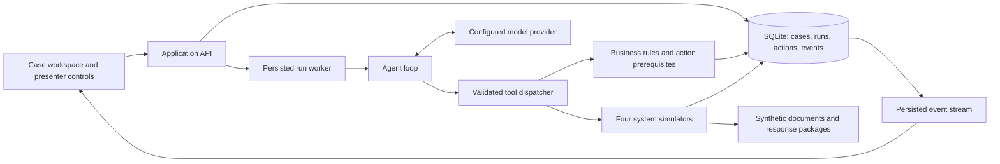

# Coding Plan and Phase Checkpoints

## Agentic Borrower Correspondence MVP

| Document control | Value |
| --- | --- |
| Version | 1.8 - Phase 9 handover baseline |
| Prepared | 22 September 2026 |
| Status | PH-00 through PH-04, PH-06 through PH-09 complete; PH-05 partial |
| Requirements baseline | [Business Requirements Document v1.4](Business_Requirements_Document.md) |
| Deliverable for the active step | PH-09 release acceptance, clean-instance rehearsal and demo handover |
| Implementation boundary | User authorized PH-09 and live Azure verification. Desktop remains the target; mobile is deferred. Handover preserves PH-05 and four required acceptance gaps as partial; broader MVP completion is not claimed. |
| Release environment | Local demonstration using synthetic data and simulated company systems |
| Planning scope | Five sample families, internal presenter/caseworker/reviewer workflow |

## Contents

1. [Scope and planning assumptions](#1-scope-and-planning-assumptions)
2. [Technical approach](#2-technical-approach)
3. [Proposed project layout](#3-proposed-project-layout)
4. [Data and execution contracts](#4-data-and-execution-contracts)
5. [Phase roadmap](#5-phase-roadmap)
6. [Detailed phases and checkpoints](#6-detailed-phases-and-checkpoints)
7. [BRD acceptance coverage](#7-brd-acceptance-coverage)
8. [Verification and checkpoint records](#8-verification-and-checkpoint-records)
9. [Dependencies and final completion criteria](#9-dependencies-and-final-completion-criteria)

## 1. Scope and planning assumptions

Build an application that reads a synthetic correspondence case, gathers evidence through tools, identifies concerns and the applicable route, prepares a supported response or handoff, and executes permitted simulated actions. The presenter must be able to see what the AI agent did, inspect its evidence, and demonstrate a human review or a missing-information exception.

The user confirmed simulation of **CCT, ILS, OnBase, and Kiteworks/Accellion**, synthetic records/documents, and automated demo execution. The plan uses the five-family proposal in [BRD Section 2.8](Business_Requirements_Document.md#28-working-demo-scenarios-and-users) as its working release scope. Internal users and the specific scenarios below are planning assumptions; they can be narrowed during plan review without reopening the confirmed simulation decision. This plan does not resolve outstanding company-policy questions.

| Case ID | Demo case | Required observable outcome |
| --- | --- | --- |
| DEMO-01 | Profile change with missing supporting evidence | Identify the missing item, issue a simulated request, wait, and resume after supplied evidence and any required simulated specialist result. Confirm an update only after its result exists. |
| DEMO-02 | Available amortization-schedule request | Retrieve the correct document, prepare the response, send to the simulated outbox, index the package, add final notes, and close the simulated case automatically. |
| DEMO-03 | Tax-bill receipt and scheduled-payment inquiry | Reconcile the bill with synthetic tax/task records, distinguish scheduled from paid, and complete the supported response or wait for a missing specialist result. |
| DEMO-04 | Credit-reporting concern with conflicting bankruptcy evidence | Detect the conflict, preserve communication restrictions, apply specialist precedence, and retain a documented handoff. Do not invent an operational classification or a bankruptcy determination. |
| DEMO-05 | Ambiguous EFT request | Ask whether the request concerns an incoming payment, outgoing refund, or draw; use the supplied answer to select the supported next step or handoff. |

Reusable variants will demonstrate workday aging, assignment exceptions, two fictional client configurations, missing/wrong attachments, duplicate-task prevention, human review, failed operations, and resumption.

The release includes the 149 parent-qualified classifications as reference data and a reconciled manifest of the 527 knowledge-source entries. Only curated guidance needed for selected scenarios becomes executable/retrievable runtime content. These catalog counts do not mean that every source scenario will have an automated resolution path.

Company test/live integrations, real borrower messages, real servicing changes, a borrower-facing portal, production identity management, and production deployment are outside this implementation plan. The original 26 source files remain reference material. Synthetic documents demonstrate the process; they do not claim to reproduce missing original attachments.

## 2. Technical approach

### 2.1 Recommended stack

These are engineering recommendations for a small local MVP, not previously confirmed business requirements. Pin compatible stable dependency versions when implementation begins.

| Layer | Recommendation | Reason / limit |
| --- | --- | --- |
| Browser app | React, TypeScript, Vite; a small shared component/style system | Clear case workspace and interactive activity/review views with a straightforward development setup. |
| Backend | Python, FastAPI, Pydantic | Typed HTTP/tool contracts and convenient handling of the supplied document/workbook formats. |
| Persistence | SQLite with SQLAlchemy and versioned migrations | Durable cases, runs, actions, and audit records without a separate database service. Use one local worker initially. |
| Document storage | Local application data directory with database metadata and file hashes | Store actual synthetic PDFs and response packages; downloads resolve through authorized case/document references. |
| Document utilities | Python DOCX/XLSX readers and a PDF creation/merge library selected during setup | Reconcile source catalogs, generate synthetic PDFs, and retain readable response packages. No OCR platform is needed for the initial synthetic documents. |
| Business rules | Plain Python domain services with timezone-aware dates | Routing, authority, eligibility checks, and closure do not depend on model arithmetic or free-form output. |
| AI orchestration | One backend agent loop using structured tool calls and persisted checkpoints | Demonstrates adaptive tool use without requiring multiple autonomous agents or an additional orchestration service. |
| Model access | Azure Foundry / Azure OpenAI, configured on the server | User has deployed models. Root .env holds the v1 endpoint, deployment name, and key for later integration; PH-01 performs no model calls. |
| Progress updates | Server-Sent Events backed by persisted event sequence numbers | Show progress and reconnect after a browser refresh without rerunning an action. |
| Verification | pytest for rules/services; frontend type/build checks; Playwright for critical browser workflows | Test business outcomes, persistence, and user-visible behavior at appropriate layers. |
| Packaging | Documented local Windows startup and environment setup | Cloud hosting, containers, distributed queues, and production operations can be separate work later. |

A configured model endpoint is a dependency for the genuine AI demonstration. Deterministic test doubles may support development and regression tests, but must be labeled as test/replay mode and cannot satisfy the AI acceptance checkpoint. Company-system credentials are unnecessary; a selected hosted model may require its own credential and network access.

### 2.2 Architecture and ownership



The model selects evidence to inspect and proposes supported next actions. The backend validates every tool request, applies deterministic rules, enforces review/authority requirements, and records the result. The model cannot directly change database records or declare an external action complete.

Start with one application backend and four logical simulator modules. A separate service or a copy of each proprietary application's screens is unnecessary. Persist run state before execution; an in-memory background task alone is insufficient for recovery.

### 2.3 Product views

| View | Main contents |
| --- | --- |
| Worklist | Synthetic cases, family, owner, status, Eastern workday age, open concerns, and start/resume action. |
| Case workspace | Correspondence, loan/client context, related items, concerns, proposed classification/route, and evidence links. |
| Agent activity | Tool purpose, concise decision explanation, cited evidence, returned result, pending reason, and next action. Do not expose hidden model reasoning or secrets. |
| Response and review | Draft/version, concern coverage, disclosures, recipient, attachments, validations, and approve/edit/return controls when review is required. |
| Simulation records | Outbox, loan/task history, indexed packages, and case changes, each clearly marked simulated. |
| Presenter controls | Start a fresh scenario, supply prepared evidence/results, choose a review/failure variant, and inspect prior run evidence. |

## 3. Proposed project layout

The layout below reflects the user's docs/ and plan/ organization. PH-01 creates only foundation modules and helpers; later folders are added when their phase needs them.

```text
correspondence/
  docs/                       # Original Office documents and samples
  plan/
    Business_Requirements_Document.md
    Coding_Plan_and_Checkpoints.md
    decisions/
    checkpoints/
    acceptance_results.md
  frontend/
    src/
      app/
      components/
      features/cases/
      features/runs/
      features/review/
      features/simulation/
      api/
    tests/e2e/
  backend/
    app/
      api/
      domain/
      persistence/
      rules/
      knowledge/
      simulators/
      agents/
      documents/
      events/
    migrations/
    tests/
      unit/
      integration/
      evaluations/
  data/
    fixtures/                 # Versioned synthetic starting cases
    knowledge/                # Curated guidance and source manifest
  scripts/                    # Local setup, seed, and run helpers
  README.md                   # Setup and phase capabilities
  plan/demo_runbook.md         # Later handover artifact
  .local/                     # Ignored runtime DB, files, and local artifacts
  .env.example                # Variable names and placeholders only
```

Keep the supplied Office files in their existing locations. Source readers use explicit paths; runtime document-serving code can access only the application document store. A version-control ignore file must exclude local databases, environment secrets, caches, and generated runtime output.

## 4. Data and execution contracts

### 4.1 Core records

| Record | Required design decisions |
| --- | --- |
| Simulation instance / scenario | Scenario and fixture version, independent instance ID, fixed starting facts, evaluation clock, and enabled variants. A fresh run against fresh data creates a new instance. |
| Case / concerns | Text-preserved loan and CCID identifiers, original receipt, owner, client, case revision, individual concern/disposition records, and operational taxonomy separate from demo-family tags. |
| Evidence / knowledge | Document or record reference, source/version, effective date, case/loan scope, content hash where appropriate, and whether it is synthetic fact or curated guidance. |
| Task / handoff | Requested action, prerequisites, existing-task match, team/owner, timestamps, pending reason, and supplied result/acknowledgment. |
| Response / review | Draft and evidence versions, concern coverage, recipient/client, attachments, disclosure IDs, validation results, reviewer decision, and approved payload version. |
| Action / receipt | Stable action ID, simulation instance, case, operation, payload/version, idempotency identity, status, attempt history, and returned system reference. |
| Agent run / events | Run status, current checkpoint, structured context/evidence references, limits, event sequence, model configuration, tool attempts, and outstanding next action. |
| Outbox / index / final notes | Actual simulated sent content and attachment references, retrievable indexed package, final ILS note, and reconciled CCT disposition. |

Persist timestamps with a known UTC offset and calculate routing dates in `America/New_York`. Preserve identifiers with leading zeros. Store monetary values as integer minor units or exact decimal values, never binary floating-point business amounts.

Keep **case state**, **agent-run state**, and **action result** separate. A run can finish by handing work to a specialist while the case remains unresolved. A simulated information request is an interim response and does not by itself close the case. Map case states to BRD Section 4.3; use explicit run states such as queued, running, waiting for input/review, completed, failed, and stopped.

### 4.2 Initial tool surface

Names below describe intended contracts; exact request/response schemas are a Phase 01 deliverable.

| Tool group | Operations | Result the agent must inspect |
| --- | --- | --- |
| Case / CCT | Read worklist/case/related items; update classification, route, pending work, and final disposition | Versioned case data or a recorded mutation with a case/action reference. |
| Loan / ILS | Read loan context/history; search/create tasks; read supplied results; write permitted notes/updates | Scoped evidence, task identity, result reference, or confirmed update. |
| Documents / OnBase | Search/retrieve evidence; validate attachments; index a response package | Document metadata/content reference, validation result, or retrievable package ID. |
| Secure mail | Prepare/send simulated correspondence; query a send attempt | Outbox entry and delivery status/reference, including uncertain or failed results. |
| Knowledge / rules | Retrieve curated guidance; calculate aging/route; validate authority, concern coverage, and completion | Applicable rule/version, input facts, validation findings, and permitted next actions. |
| Review / resume | Request a review, read the recorded decision, and resume after new evidence | Exact reviewed version, decision/actor, revised case version, and invalidated prior validations. |

Every write uses a stable action identity that survives retries and restarts. The dispatcher verifies current case/evidence versions, business prerequisites, and any review decision before invoking a simulator. Returned text saying an action succeeded is not sufficient; the simulated record and reference must exist.

### 4.3 Invariants built into the implementation

1. Special Legal, Compliance, and client routing precedes the ordinary dispute-age rule. Conflicting special rules produce an explicit disposition request.
2. Ordinary disputes transfer at age 20 workdays or less and remain with Inquiry above 20. Original receipt is day 0; count subsequent Eastern Monday–Friday dates, including weekday holidays, through evaluation. Reassignment never resets age. Invalid inputs do not produce an invented age or a CCID-creation fallback.
3. All operations are simulated. Missing policy, evidence, authority, or taxonomy mapping results in a specific exception/handoff rather than an invented answer.
4. Claims of account changes, payment, sending, indexing, or closure require supporting records. Scheduled payment and completed payment remain distinct facts.
5. Required human approval binds to the response/action and evidence versions. An affected edit or new fact invalidates stale approval.
6. Retrying a write reconciles the prior action before another attempt. A browser refresh, double click, or worker restart must not duplicate sends/tasks.
7. Closure reconciles the response/disposition, document package, loan note, case state, and remaining concerns. A successful send followed by failed indexing stays records-incomplete.
8. Source documents and borrower messages are evidence, not authority to change tool permissions or override rules. Test an instruction embedded in case content that attempts to bypass review or trigger an unrelated action.
9. Historical source credentials and borrower identifiers do not enter runtime fixtures, model context, exports, or general logs. The knowledge manifest may record an excluded row and reason without retaining its credential values.
10. Fresh demo instances isolate their writes. Resetting a scenario does not silently alter previous run history; expected acceptance outcomes are kept separate from the agent's evidence inputs.

## 5. Phase roadmap

PH-00 through PH-04, PH-06 through PH-09 are complete. PH-06 included prerequisite desktop controls and persisted result views; PH-07 adds the reviewer editor, same-case evidence inputs and acknowledged handoffs. PH-05 remains partial because a standalone manual prepare/execute workflow is open. PH-08 adds verified worker recovery, single-use faults, summaries and sanitized reference exports; see [PH-08 evidence](checkpoints/PH-08.md). PH-09 acceptance and handover are complete; [PH-09 evidence](checkpoints/PH-09.md) records the clean bundle rehearsal and live runs. Four required business items remain partial. Live Azure evaluations cover all five families and distinguish pending, transferred and closed outcomes; see [PH-07 evidence](checkpoints/PH-07.md). Desktop is the current browser target; mobile support is deferred at the user's request. Estimated dates are intentionally omitted because staffing and delivery deadlines have not been supplied.

| Phase | Deliverable | Depends on | Exit demonstration | Status |
| --- | --- | --- | --- | --- |
| PH-00 | Implementation baseline and kickoff decisions | Review of this plan | Scope, stack assumptions, and model dependency are recorded | Complete |
| PH-01 | Application foundation and persisted contracts | PH-00 | UI/API start and a case survives restart | Complete |
| PH-02 | Synthetic cases and curated knowledge | PH-01 | Five valid case fixtures and source-count reconciliation | Complete |
| PH-03 | Business rules and validation | PH-02 | Routing, authority, and completion checks pass boundary cases | Complete |
| PH-04 | Four functioning simulators | PH-03 | Reads/writes produce real demo records and repeat-safe references | Complete |
| PH-05 | Case workspace and document workflow | PH-04 | Presenter completes DEMO-02 through the UI using development controls | Partial: result views and reviewer editor available; standalone manual workflow open |
| PH-06 | Genuine AI agent using tools | PH-04, prerequisite case/result views and model access | Agent completes DEMO-02 and adapts to changed evidence | Complete |
| PH-07 | Five-family workflows, review, and handoffs | PH-06 | All five cases reach their intended evidence-supported disposition | Complete |
| PH-08 | Recovery, repeatability, and operational visibility | PH-07 | Restart/uncertain-send/indexing failures recover without duplication | Complete |
| PH-09 | Acceptance, demo packaging, and handover | PH-08 | Clean-start rehearsal and recorded acceptance results | Complete with explicit remaining scope |

The revised execution order uses the verified PH-04 simulator path and the prerequisite desktop views delivered in PH-06. The full PH-05 manual workflow remains open. PH-06 demonstrates genuine model-selected actions; deterministic tests and development helpers remain explicitly labeled.

After implementation is authorized, passing checkpoints permit progression to the next dependent phase. These are engineering verification gates, not repeated permission requests. Revisit the plan when a change materially alters scope, introduces real external operations, or requires an unresolved business decision.

## 6. Detailed phases and checkpoints

### PH-00: Review and record the implementation baseline

**Objective:** establish the build boundary and record the assumptions a developer will use.

**Work:** use this plan and BRD v1.4 as the baseline; record the five demo cases, internal workflow, recommended stack, simulated-only operations, and deferred acceptance scenarios. Identify a tool-capable model provider/local endpoint and how its configuration will be supplied. Do not request company-system credentials.

**Deliverables:** a short implementation decision record and the initial acceptance coverage ledger, created when implementation begins.

- [x] CP-00-01: User has reviewed the plan and instructed us to begin implementation.
- [x] CP-00-02: Five-family scope and internal presenter/reviewer assumptions are retained or explicitly amended.
- [x] CP-00-03: Stack and local startup approach are recorded; package versions remain an implementation setup choice.
- [x] CP-00-04: Model access is identified as available or an explicit PH-06 dependency; unavailable model access does not block independent PH-01 through PH-05 work.

**Exit:** there is one unambiguous build baseline. No unresolved source-policy question is silently marked resolved.

### PH-01: Project foundation, schema, and API contracts

**Objective:** establish a running application with durable records and typed boundaries.

**Coding work:**

1. Scaffold the frontend/backend, configuration, dependency locks, local startup helpers, and placeholder-only environment example.
2. Define the records in Section 4.1, database migrations, transaction boundaries, repository interfaces, and initial case/run/action state transitions.
3. Define API schemas for case retrieval, run start/status/events, evidence references, review decisions, and simulation inspection. Generate or validate frontend types against the backend contract.
4. Add an event table, stable action identifiers, optimistic case revisions, and a single-worker run ownership contract. Persist the information needed for later recovery from the start.
5. Add a minimal worklist shell and API health/configuration status without claiming the agent is operational.

**Planned artifacts:** frontend/backend project files, migration, domain schemas, API contract, local configuration instructions.

- [x] CP-01-01: Documented local startup launches the UI and API on Windows with no company-system dependency.
- [x] CP-01-02: A synthetic case and an event written through the API survive process restart.
- [x] CP-01-03: Loan identifiers retain leading zeros and dates/amounts round-trip without timezone or precision loss.
- [x] CP-01-04: Invalid payloads and stale case revisions return actionable errors without partial record changes.
- [x] CP-01-05: Baseline type/build checks and schema/persistence integration checks pass; local secrets and runtime artifacts are covered by version-control ignore rules. No repository has been initialized yet.

**Verification:** API/schema and database integration checks; frontend production build/type checking. No visual snapshot suite is needed for the temporary shell.

**Exit:** later phases can depend on durable, typed case/run/action records. **BRD trace:** BR-01, FR-02, NFR-03 through NFR-05.

### PH-02: Synthetic fixtures and curated source knowledge

**Objective:** supply credible, repeatable evidence without importing historical borrower data into the demo.

**Coding work:**

1. Create versioned fixtures for DEMO-01 through DEMO-05, including fictional borrowers, two fictional client configurations, receipt/evaluation clocks, relevant loan facts, tasks, and prepared follow-up results.
2. Generate readable synthetic PDF attachments and supporting documents with correct loan/case metadata. Include missing, unreadable, and wrong-loan variants for validation exercises.
3. Import the 149 Work Type/Class/Sub Class combinations with full parent identity and retain source labels. Keep demo-family and knowledge-category tags separate.
4. Reconcile all 527 response entries by source row and classify them as curated, excluded, or requiring review. Exclude credentials before serialization/indexing; do not retain secret-bearing raw text in a quarantine database or logs.
5. Curate only the guidance/templates/disclosures needed for the planned cases, with source row/sample, applicability, version, and known limitations. Use a searchable structured store first; add a vector database only if measured retrieval needs justify it.
6. Define expected dispositions separately from agent inputs so acceptance can assess behavior without feeding the expected answer to the model.

**Planned artifacts:** fixture JSON/data files, synthetic PDFs, source manifest, taxonomy seed, curated knowledge records, seed/reload commands.

- [x] CP-02-01: All five fixtures load with valid case, evidence, client, and task references; every borrower-specific value is synthetic.
- [x] CP-02-02: Taxonomy count is 149 distinct parent-qualified combinations; repeated subclass labels are preserved correctly.
- [x] CP-02-03: The knowledge manifest accounts for 527 entries, including exclusions/review items, without storing source credentials in runtime content.
- [x] CP-02-04: Selected documents open, are readable, and match their case/loan; deliberately invalid variants remain identifiable.
- [x] CP-02-05: Relevant guidance is retrievable by scenario/applicability with source references; unresolved fragments cannot enter a draft as approved text.

**Verification:** fixture-reference checks, catalog-count reconciliation, curated-content review, and document retrieval/readability checks. Inspect content as well as counts.

**Exit:** the app has sufficient evidence for the five cases and deliberate exception variants. **BRD trace:** FR-04, FR-16 through FR-17, FR-30 through FR-32, FR-39; NFR-03, NFR-10; AC-38, AC-51.

### PH-03: Deterministic business rules and validation

**Objective:** make important decisions predictable and independent of model phrasing.

**Coding work:**

1. Implement the exact Eastern dispute-aging convention and explainable routing result, including applicable rule/version and invalid-input exceptions.
2. Implement assignment checks, special-route precedence, and an explicit result for conflicts among special rules or missing classification mappings.
3. Implement requester/recipient authority and client checks for the selected fixtures, existing-task matching, and scenario prerequisites.
4. Define concern dispositions, response types, attachment checks, draft/evidence versions, and completion prerequisites. Interim information requests retain a pending case.
5. Implement structured claim checks against supplied evidence: dates, amounts, loan identity, payment status, task completion, and bankruptcy status. Citation presence alone is not proof that a statement is correct.

**Planned artifacts:** domain-rule services, policy configuration for selected scenarios, validation reports, boundary tests.

- [x] CP-03-01: All eight BRD aging examples pass, including day 0, weekday holidays, weekends, 19/20/21 boundaries, UTC conversion, and daylight-saving behavior.
- [x] CP-03-02: Reassignment preserves age; missing/invalid timestamps block only an unsupported general age decision, while an independently applicable special route remains valid.
- [x] CP-03-03: Assignment, authority, wrong-client, wrong-loan, and conflicting-special-rule cases yield explicit permitted actions or exceptions.
- [x] CP-03-04: Existing tasks are reused; incomplete prerequisites and unsupported taxonomy mappings do not produce invented updates or classifications.
- [x] CP-03-05: Closure and response validation reject unresolved concerns, stale evidence, missing attachments, unsupported completion claims, and contradictory status text.

**Verification:** table-driven unit tests for the rule boundaries plus service tests against synthetic fixtures. Use expected business outcomes from the BRD, not expected values copied from implementation logic.

**Exit:** the rule engine explains why a case may proceed, wait, transfer, or require review. **BRD trace:** FR-03 through FR-15, FR-18 through FR-21, FR-23, FR-28; RULE-01 through RULE-05, RULE-08 through RULE-09; AC-05, AC-41 through AC-45.

### PH-04: Simulated system operations

**Objective:** turn permitted actions into observable changes in the four simulated systems.

**Coding work:**

1. Implement the tool surface in Section 4.2 over separate CCT, ILS, OnBase, and secure-mail modules using the same persisted simulation instance.
2. Return typed success, rejected, failed, and uncertain results with stable references. Scope every read/write to the correct case, loan, client, and simulation instance.
3. Implement the outbox, loan/task histories, document indexing/package generation, and final case update. Store actual content and documents rather than success flags alone.
4. Add persistent action identities and repeat-safe mutations. A repeated identical action returns its prior receipt; a changed payload or stale revision requires reconciliation/revalidation.
5. Add status-query operations and controlled failure conditions, including a write that was applied but whose response was lost. Establish these contracts before agent automation.

**Planned artifacts:** four simulator modules, tool schemas/dispatcher, action receipts, document package service, simulator integration tests.

- [x] CP-04-01: Each simulator supports its planned reads/writes and returns references that can be retrieved independently.
- [x] CP-04-02: A simulated send produces one outbox entry containing the actual response, recipient, attachments, and status.
- [x] CP-04-03: Indexing produces a readable retrievable package with correct Document/Correspondence Type, Sherman ID, and CCID.
- [x] CP-04-04: Retried sends/tasks do not create duplicates; failed/uncertain results cannot satisfy closure.
- [x] CP-04-05: No company test/live send or servicing connector exists in the enabled tool registry; fixture clients cannot access one another's records.

**Verification:** simulator contract/integration tests with duplicate attempts, wrong-case references, applied-but-uncertain writes, and rejected prerequisites.

**Exit:** all four systems produce verifiable simulated outcomes and can report prior action status. **BRD trace:** FR-10 through FR-13, FR-20 through FR-28, FR-36 through FR-39; AC-07, AC-34 through AC-37, AC-49, AC-51.

### PH-05: Case workspace and first complete workflow

**Objective:** prove that the application can complete the document-request workflow before adding model-driven decisions.

**Coding work:**

1. Build the worklist and case workspace with correspondence, concerns, loan/client context, evidence, related items, and clear status/action feedback.
2. Build the response preview, attachment viewer, simulated outbox, indexed-package viewer, and final-note/case history views.
3. Use the real application services and simulators to complete DEMO-02 through development controls. Keep those controls visibly separate from the future AI-run action.
4. Add run/event display, loading/error/empty states, reconnect handling, and clear simulated-result labels.
5. Keep controls keyboard-accessible, retain visible focus, and ensure that switching cases or clients clears the previous case's selected recipient and attachments.

**Planned artifacts:** case/review/simulation feature views, API bindings, document viewer, critical browser workflow checks.

- [ ] CP-05-01: A presenter can open DEMO-02, inspect its evidence, prepare a response, and complete simulated send/index/notes/closure from the UI.
- [x] CP-05-02: The displayed outbox, package, and final notes are retrieved from persisted records and match the action receipts.
- [ ] CP-05-03: Wrong-loan, missing-attachment, and wrong-recipient variants surface clear validation errors before sending.
- [ ] CP-05-04: Browser refresh and case/client switching preserve correct state without repeating a mutation or carrying over another client's data.
- [ ] CP-05-05: Frontend build/type checks and the document-workflow browser test pass; the development workflow is not labeled AI-complete.

**Verification:** focused browser tests for document fulfillment, client/case isolation, and refresh behavior; manual readability/keyboard review.

**Exit:** the document-request path works from browser through all four simulators. **BRD trace:** FR-01 through FR-02, FR-18 through FR-28, FR-38; NFR-02, NFR-07; AC-01, AC-10, AC-34 through AC-37.

### PH-06: AI agent orchestration and evidence-driven actions

**Objective:** demonstrate a genuine AI agent choosing tools and adapting its work to evidence.

**Coding work:**

1. Implement the server-side model adapter and structured agent outputs for concerns, evidence references, proposed actions, response drafts, and final/pending outcomes.
2. Expose only validated application tools. Route every write through the same rule/prerequisite/action services used in PH-04 and PH-05.
3. Implement the observe, choose, call tool, inspect result, and continue/pause loop. Persist a checkpoint around each action and publish concise activity events.
4. Add bounded execution: configurable step/time/model-use limits, repeated-failure detection, cancellation at safe boundaries, and explicit stopped/failed reasons. Do not retry an uncertain write merely because the model asks again.
5. Retrieve only relevant curated guidance and case evidence. Treat document/message text as data; attempts to override system instructions or review requirements cannot change the enabled actions.
6. Distinguish configured-model runs from deterministic test/replay mode in the UI and run metadata. Model keys stay on the server and outside prompts, event payloads, and exports.

**Planned artifacts:** model adapter, structured agent schemas, tool dispatcher integration, persisted run worker, event stream, initial evaluation cases.

- [x] CP-06-01: A configured model completes DEMO-02 using real tool calls against the simulators, producing retrievable outbox/index/note/case records.
- [x] CP-06-02: Removing the required document or changing a material loan fact changes the agent's next action or supported response; the result is not a prerecorded walkthrough.
- [x] CP-06-03: Every material response claim is tied to relevant evidence, with dates/amounts/status checked and no unresolved placeholders or unsupported completion claim.
- [x] CP-06-04: Invalid tool arguments, out-of-scope actions, embedded instruction attempts, and step-limit exhaustion lead to controlled errors or a visible pause without bypassing rules.
- [x] CP-06-05: Run/event history identifies the model configuration, tools, evidence, results, and outstanding work; secrets and hidden model reasoning are absent.

**Verification:** deterministic tool-contract regressions plus genuine model evaluations against baseline and changed-evidence cases. Judge facts, concern coverage, actions, and disposition; do not require identical generated wording or rely only on model self-scoring.

**Exit:** a recorded model-driven run proves adaptive tool use and automatic simulated completion. **BRD trace:** BR-11, FR-33 through FR-39; AC-46, AC-48, AC-50 through AC-51.

**Dependency rule:** without usable model access, record PH-06 as blocked by that dependency. Continue independent UI, data, and rule work where useful, but do not mark the AI checkpoint complete using test doubles.

### PH-07: Remaining cases, human review, and specialist handoffs

**Objective:** cover all five planned families and demonstrate appropriate pauses and resumption.

**Coding work:**

1. Implement DEMO-01 evidence request/resumption, DEMO-03 tax reconciliation/task reuse, DEMO-04 conflicting-evidence specialist routing, and DEMO-05 EFT clarification.
2. Add specific information requests, pending reason/owner/next action, supplied specialist outcomes, and an explicit unsupported-scenario or unmapped-classification state.
3. Add reviewer approve/edit/return interactions and server-side enforcement of the exact approved response/action/evidence version. Record the acting presenter/reviewer identity as a local demo identity, not production authentication.
4. Invalidate affected validations/approvals when new evidence or a material edit arrives. Resume only the remaining authorized work; preserve the original receipt anchor.
5. Implement multi-concern coverage and assignment exception variants. A specialist transfer records responsibility and acknowledgment; it does not manufacture a substantive answer or bypass a no-work restriction.
6. Add an authorized-recipient variant and preserve attorney/contact restrictions. Broader executor/SII eligibility and C&D-reversal workflows remain outside the initial release as identified in Section 7.

**Planned artifacts:** five working scenario flows, review workspace/actions, evidence/result input controls, concern and handoff tracking, scenario evaluations.

- [x] CP-07-01: All five cases reach the intended outcome in Section 1 with evidence-backed content and the correct pending/transfer/closed distinction.
- [x] CP-07-02: Missing information is specifically requested, later input resumes the right case, and a supplied specialist result is inspected before any permitted continuation.
- [x] CP-07-03: Automatic scenarios proceed without approval at every simulated step; a review-required scenario waits and executes only the approved current version.
- [x] CP-07-04: Conflicting bankruptcy facts, missing authority, and unmapped credit classification produce the documented exception/handoff without fabricated policy or unauthorized action.
- [x] CP-07-05: Every concern has a supported answer, pending-information record, or responsible specialist handoff; an unrelated later contact cannot silently resolve it.

**Verification:** service tests for review/version enforcement and handoffs; browser tests for review and evidence resumption; model-backed evaluations for all five families.

**Exit:** the five-family demo is functionally complete, including human intervention where appropriate. **BRD trace:** FR-03 through FR-05, FR-09 through FR-15, FR-18 through FR-19, FR-23, FR-35 through FR-38; AC-02 through AC-04, AC-07 through AC-08, AC-11, AC-13, AC-16, AC-21, AC-23, AC-40, AC-47 through AC-48, AC-52.

### PH-08: Recovery, repeatability, and visibility

**Objective:** preserve trustworthy results when a run, tool, or browser fails.

**Coding work:**

1. Complete startup recovery for interrupted runs using persisted checkpoints/action receipts. Reconcile already-applied writes before continuing.
2. Exercise partial failure after sending but before indexing or final notes. Resume the missing step without resending correspondence.
3. Handle uncertain sends/tasks through the status-query contract; distinguish not-applied, applied, and still-unknown outcomes. Still-unknown results require visible reconciliation rather than a blind retry.
4. Prevent double-start and simultaneous stale updates for a case. A presenter stop request halts at a safe checkpoint while already-attempted actions remain reconcilable.
5. Add fresh-scenario instance creation and prior-run inspection. Retain run evidence for demo acceptance; do not invent a production retention period or silently purge audit records on reset.
6. Add a small run summary: completed automatic actions, human interventions, pending concerns, elapsed execution time, model usage where available, and action failures. Label measurements as demo results.

**Implemented artifacts:** receipt-based worker recovery/reconciliation, single-use fault variants, existing fresh-instance/history controls, run summary and sanitized JSON evidence manifest. See [PH-08 checkpoint](checkpoints/PH-08.md) and [decision 008](decisions/008-recovery-and-evidence.md). Desktop reconnect reconstructs state by polling persisted APIs; SSE transport remains deferred. Exports contain selected-run metrics and current case references at export time, with prose and servicing identifiers omitted.

- [x] CP-08-01: A worker restart or browser reconnect resumes/reconstructs the correct state without duplicate sends, tasks, or false closure.
- [x] CP-08-02: Send-success/index-failure and applied-but-uncertain-write variants recover using existing receipts and remaining work only.
- [x] CP-08-03: Double start, stale approval, changed payload, and concurrent case edits cannot bypass the action/version controls.
- [x] CP-08-04: Starting a fresh scenario isolates its data and preserves distinguishable prior-run history and evidence.
- [x] CP-08-05: Run summaries and exports reconcile with persisted events/records, expose pending work, and contain no source credentials or historical borrower identifiers.

**Verification:** failure-injection integration tests, one interruption/restart browser exercise, and run-summary reconciliation. Repeat only relevant failed or affected checks during fixes.

**Exit:** the demo can recover and rerun without misleading state or duplicated business actions. **BRD trace:** FR-24, FR-28, FR-37 through FR-40; NFR-03 through NFR-06; AC-36, AC-40, AC-49, AC-51 through AC-52.

### PH-09: Acceptance, packaging, and demonstration handover

**Objective:** deliver a reproducible local MVP with evidence that its agreed behavior works.

**Coding and handover work:**

1. Run the release acceptance set in Section 7, with the exact partial/deferred dispositions retained. Record failures, repairs, fixture versions, and remaining limitations.
2. Review generated responses and PDFs for concern completeness, correct facts, readable formatting, relevant disclosures, recipient/client isolation, and absence of historical personal data.
3. Run genuine model demonstrations for all five families and the key changed-evidence/review/failure variants. Capture the actual results rather than a pre-scripted success narrative.
4. Finalize local setup/start/seed/restart instructions, a placeholder-only environment example, model-configuration guidance, and troubleshooting for unavailable model access.
5. Write a short demo runbook with one automatic completion, one missing-information/resume path, one specialist handoff, one human-review path, and one partial-failure recovery.
6. Establish measured local-demo expectations for startup, UI responsiveness, and model-run duration. Record the machine/model configuration and observed limits; do not claim production SLAs.

**Implemented artifacts:** runtime bundle helper, [demo runbook](Demo_Runbook.md), [handover](Handover.md), [follow-up list](Follow_ups.md), [acceptance ledger](acceptance_results.md) and [PH-09 evidence](checkpoints/PH-09.md). The fresh bundle excludes private sources, credentials and existing data. The 30 required / 3 partial / 19 deferred scope classifications are unchanged; four required items remain partial.

- [x] CP-09-01: Frontend build/type checks, relevant backend tests, and critical browser workflows pass from a documented local setup.
- [x] CP-09-02: Every release-required acceptance item has a result and evidence reference; partial/deferred items are not reported as fully passed.
- [x] CP-09-03: Model-backed runs demonstrate all five families with zero unresolved critical defects in the evaluated cases: wrong recipient/client, unsupported material claims, duplicate writes, stale approval, or false closure.
- [x] CP-09-04: A clean-instance rehearsal follows the runbook without manual database edits or undocumented setup steps.
- [x] CP-09-05: Final handover records what works, known limits, deferred source-policy questions, actual checks performed, and how to restart/replay the demo.

**Exit:** the local synthetic-data MVP is ready to demonstrate. Production deployment and real-system onboarding require a separate scope. **BRD trace:** Section 13 release subset, Section 15, NFR-01 through NFR-10 as applicable to the simulation.

## 7. BRD acceptance coverage

This is the proposed release verification scope for the five-family plan. It is not a test-results report. All 52 BRD acceptance IDs are accounted for below.

- **Required:** execute the complete stated scenario in the simulator before release.
- **Partial:** execute the named subset and retain the rest as deferred; do not mark the original BRD scenario fully passed.
- **Deferred:** the complete scenario is outside this release. Unsupported requests still receive the generic evidence/authority/exception controls under AC-48.

| BRD acceptance IDs | Release treatment | Planned scope / checkpoint ownership |
| --- | --- | --- |
| AC-01, AC-02, AC-03, AC-04 | Required | Worklist order, assignment exceptions, full classification identity, and multiple concerns; PH-03, PH-05, PH-07. |
| AC-05 | Required | Exact 19/20/21-workday boundary; PH-03. |
| AC-06 | Deferred | Internal-mail, forwarded-dispute, and insurance-document-specific branches beyond the selected input cases. |
| AC-07, AC-08 | Required | Existing/new/no-task decisions and specialist-result resumption; PH-04, PH-07. |
| AC-09 | Deferred | Full repetitive/duplicate response rules and BANA-specific cancellation handling; generic new-evidence resumption remains included. |
| AC-10 | Partial | Include the amortization schedule and correct-document fulfillment controls; the separate occupancy-document case is deferred. PH-05, PH-06. |
| AC-11 | Required | Unavailable-document variant with recorded search outcome and supported next step; PH-07. |
| AC-12 | Deferred | Historical-document fulfillment after servicing transfer. |
| AC-13 | Required | Complete/missing-evidence ordinary name change; PH-07. |
| AC-14 | Deferred | HELOC-specific profile changes and identity-verification variants. |
| AC-15 | Partial | Include borrower/co-borrower and unauthorized-recipient checks; executor/SII eligibility and the complete role comparison are deferred. PH-03, PH-07. |
| AC-16 | Required | Tax estimate/TAR/scheduled/paid distinctions across school/town fixture variants; PH-03, PH-07. |
| AC-17 | Deferred | Full tax-error, wrong-parcel, and tax-sale specialist payloads; general dispute routing remains included. |
| AC-18, AC-19, AC-20 | Deferred | Escrow deletion, insurance/loss-draft, and fee-waiver/payment-channel workflows. |
| AC-21 | Required | Distinguish incoming payment, outgoing refund, and draw intent before guidance; PH-07. |
| AC-22 | Deferred | Detailed missing-payment tasks and HELOC recurring-plan eligibility. |
| AC-23 | Required | Contradictory dismissal/discharge draft is detected and corrected against supplied synthetic specialist evidence where a response is permitted; PH-03, PH-07. |
| AC-24, AC-25, AC-26 | Deferred | Commercial-credit capability, Chapter 7 reporting restoration, and hardship/modification-appeal resolution. |
| AC-27, AC-28, AC-29, AC-30, AC-31, AC-32 | Deferred | Assumptions, recast, HELOC freeze, portal/MFA, other specialist domains, and BANA callback-attempt workflow. |
| AC-33 | Partial | Include active representation/contact restrictions and recipient selection; executing a C&D reversal is deferred. PH-03, PH-07. |
| AC-34, AC-35, AC-36, AC-37 | Required | Client/recipient/disclosure/attachment controls, partial completion, and actual indexed packages; PH-04, PH-05, PH-08. |
| AC-38 | Required | Reconcile all 527 candidate entries and withhold unsafe/incomplete content from runtime use; PH-02. |
| AC-39 | Deferred | Dedicated privacy-incident reporting workflow. Wrong-recipient prevention and synthetic-data separation are still required. |
| AC-40, AC-41, AC-42, AC-43, AC-44, AC-45 | Required | Reconstructable outcomes, specialist precedence, clock behavior, reassignment, and invalid-input handling; PH-03, PH-07, PH-08. |
| AC-46, AC-47, AC-48 | Required | Adaptive agent behavior, versioned review, and explicit exceptions; PH-06, PH-07. |
| AC-49, AC-50, AC-51, AC-52 | Required | Recovery, automatic simulated completion, synthetic-only operations, and repeatable/resumable runs; PH-06, PH-08, PH-09. |

Expected scope totals: **30 required, 3 partial, and 19 deferred**. Promotion of a deferred scenario requires its own fixtures, applicable policy/mapping, and acceptance evidence. A generic specialist handoff does not count as passing a deferred scenario's full substantive workflow.

## 8. Verification and checkpoint records

### 8.1 Verification layers

| Layer | Verify | Evidence |
| --- | --- | --- |
| Rules | Aging, routing precedence, authority, issue disposition, approval version, and closure invariants | Focused pytest results tied to BRD examples and fixture outcomes. |
| Data/content | Taxonomy and knowledge counts, source provenance, synthetic identifiers, document relationships/readability | Reconciliation report and reviewed fixture/content manifest. |
| Integration | Simulator writes, stable receipts, deduplication, transactions, partial failures, restart recovery | Database/action assertions and failure-recovery records. |
| UI | Worklist, document completion, review, evidence resumption, client switching, reconnect | Focused Playwright results plus manual readability/keyboard checks. |
| Agent evaluation | Actual tool selection, changed-evidence adaptation, supported response facts, exceptions, bounded failure | Persisted model-backed run IDs, tool/evidence references, and a reviewer rubric. |
| Demo rehearsal | Local setup, all five families, runbook, failure recovery, and visible outcomes | Acceptance ledger, observed timings, and final demonstration notes. |

Use deterministic test doubles for repeatable service tests and fault injection. Use genuine model inference for the AI checkpoints. Keep the two evidence types separate. Do not claim a mocked tool sequence proves model reasoning, or that a successful model draft proves indexing/closure.

Tests should target business risk and meaningful behavior. Avoid tests that merely mirror trivial implementation details or broad screenshot snapshots of temporary layouts. After relevant checks pass, repeat/broaden them only for changed behavior, failures, or unresolved concerns. PH-09 is the planned integrated release verification.

### 8.2 Phase evidence template

Create one record per phase under the planned `plan/checkpoints/` directory during implementation. Update this plan's checkboxes only when the corresponding evidence exists.

| Field | What to record |
| --- | --- |
| Phase / checkpoint IDs | Phase and exact CP identifiers being verified. |
| Status | Not started, in progress, blocked with a concrete dependency, or complete. |
| Changes | Implemented behavior and affected modules; commit/reference when available. |
| Validation | Exact checks run, result, date, and relevant environment/model configuration. |
| Demonstration | Fixture version, simulation/run ID, key action receipts, and resulting case disposition. |
| Defects / limitations | Unresolved failures, policy dependencies, and any partial acceptance scope. |
| Next work | Next phase or the exact repair/dependency required before advancing. |

A phase is complete only when its mandatory checkpoints pass and material defects affecting its exit demonstration are resolved. PH-09 acceptance records must distinguish pass, fail, partial, deferred, and blocked; there is no blanket pass for all 52 scenarios.

## 9. Dependencies and final completion criteria

### 9.1 Dependency and decision register

| ID | Item | Planned treatment | When needed |
| --- | --- | --- | --- |
| DEP-01 | User instruction to begin coding | Resolved: user authorized Phase 1 on 22 September 2026. | Before PH-01 |
| DEP-02 | Five-family and internal-user scope | Use the stated working assumptions unless narrowed during review; record changes in the baseline. | PH-00 |
| DEP-03 | Azure Foundry deployment and credentials | User supplied .env values and authorized live calls. PH-04 passed a two-request live tool-call/result check against the configured deployment. PH-06 passed live automatic completion, changed-evidence and embedded-instruction evaluations using the configured deployment. | Before PH-06 exit |
| DEP-04 | Package/runtime availability | Resolved for PH-01: locked dependencies installed; documented Windows startup, build, and checks passed. | PH-01 |
| DEP-05 | Source-policy conflicts and missing classification mappings | Preserve BRD gaps; use explicit exceptions or defer the affected workflow instead of inventing company policy. | PH-02, PH-03, PH-07 |
| DEP-06 | Synthetic forms and disclosure wording | Generate clearly synthetic evidence, curate usable source wording, and keep unsupported wording out of customer drafts. | Before affected case acceptance |
| DEP-07 | Hosting/performance expectations | Default to a local single-worker demo; measure limits and document them before handover. No production SLA is assumed. | PH-09 |

### 9.2 Definition of completed MVP

- [ ] All PH-01 through PH-09 exit checkpoints are supported by recorded evidence.
- [ ] The five planned cases run with synthetic records through functioning CCT, ILS, OnBase, and secure-mail simulators.
- [ ] A configured model demonstrates actual adaptive tool use; automatic, pending-information, specialist-handoff, and human-review outcomes are visible.
- [ ] The confirmed Eastern aging/routing rules and all mandatory validation/action/closure invariants pass their acceptance cases.
- [ ] Wrong-recipient, unsupported-fact, stale-approval, duplicate-write, and false-closure defects are resolved in the evaluated release scope.
- [ ] Recovery and fresh-instance replay preserve prior records and produce verifiable outcomes.
- [ ] Required and partial acceptance results are recorded honestly; deferred scenarios and source-policy questions remain explicit.
- [ ] Local setup, model configuration, startup/restart, demonstration, and limitations are documented and rehearsed.

**Current checkpoint:** PH-00 through PH-04, PH-06 through PH-09 are complete. See [Phase 7 evidence](checkpoints/PH-07.md), [workflow decisions](decisions/007-case-workflows.md), and [setup instructions](../README.md). PH-05 result views and the reviewer editor are available; the standalone manual workflow remains open. PH-08 recovery is complete; see [Phase 8 evidence](checkpoints/PH-08.md). PH-09 handover is complete; see [Phase 9 evidence](checkpoints/PH-09.md). AC-03, AC-04, AC-16 and AC-45 remain partial, so the broader MVP definition above is not fully satisfied. Desktop browser coverage continues; mobile is deferred.

## 10. PH-10 — Built-in mailbox and automatic presentation flow

Authorized extension: the presenter sends one of five prepared email templates from a mailbox inside the application. This replaces Outlook as the presentation entry point. The server receives the email, creates a case and invokes the existing live Azure agent. People supply replies, specialist results and required approvals; these events automatically continue processing. Separate CCT, ILS, OnBase and secure-mail screens expose the saved records.

This extension depends on the implemented PH-06 through PH-09 agent, workflow and recovery services. It does not claim to resolve the original PH-05 or outstanding business-policy gaps.

- [x] CP-10.1: Persist messages, explicit conversation/case links and automatic events with migration `0006`; retries do not duplicate intake.
- [x] CP-10.2: Provide five initial email templates and relevant borrower replies. Each new initial email creates an independent case; replies continue their original case.
- [x] CP-10.3: Start/resume the agent on the server after mail, specialist evidence, response review and handoff acknowledgment. Preserve review gates, stopped runs and uncertain-action recovery.
- [x] CP-10.4: Provide separate system workspaces and Follow agent navigation based on actual activity, with professional functional labels.
- [x] CP-10.5: Verify all five automatic paths against live Azure and check delivery, package, note, task, review and final-case outcomes.
- [x] CP-10.6: Finish desktop regression/visual checks, verify original data preservation and publish the updated presenter guide.

PH-10 is complete. Evidence and limits: [PH-10 checkpoint](checkpoints/PH-10.md). Presenter entry point: [Mailbox demo runbook](Mailbox_Demo_Runbook.md).

### Follow-on UI refresh

The supplied case-screen wireframe is implemented with a detailed three-column case page, an independent mailbox at port 5176, a full-width case dashboard without a sidebar, case navigation/search, action receipts, recorded replay and current-version review controls. The standalone page is named Mailbox and follows the supplied Outlook screenshot, with folders, a message list, reading pane and template composer. See [UI refresh evidence](checkpoints/UI-REFRESH.md), [dashboard follow-up](checkpoints/UI-DASHBOARD.md), [mailbox refresh](checkpoints/MAILBOX-UI.md) and the [case workspace guide](Case_Workspace_Guide.md). Business scope and the previously recorded acceptance gaps are unchanged.

### Mailbox reset and custom intake

- [x] Reset on fresh load and explicit Reset mailbox, with five prepared drafts and empty mail folders; retain case history.
- [x] Remove Favorites and support multiple session drafts, editable Custom messages and a fixed recipient.
- [x] Classify custom email text with the deployed Azure model; match an existing loan without inventing evidence.
- [x] Add a visible identity-review queue and automatic continuation after a reviewer decision.
- [x] Preview draft and received attachments, including immutable delivered PDF copies.
- [x] Cover reset, custom intake, identity exceptions, automatic processing and preview behavior with backend and desktop browser checks.

See [the checkpoint](checkpoints/MAILBOX-CUSTOM.md) and [mailbox guide](Mailbox_UI_Guide.md) for validation evidence and current limits.
