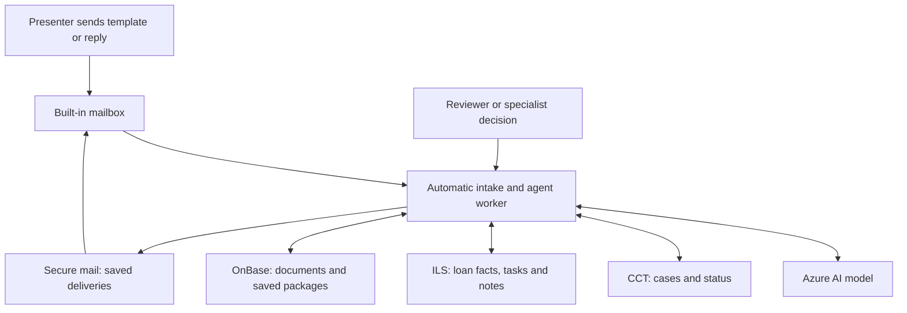

# Demo flows and system connections

The mailbox also accepts **Custom** email text. Azure classifies the request, matches its loan to existing servicing records and continues the supported workflow. Missing or conflicting identity details appear in the desk's **Incoming requests needing review** queue. A review decision automatically continues processing. The [mailbox guide](Mailbox_UI_Guide.md) gives examples and current limits.

Only **Reset mailbox** empties its message folders and restores the five prepared drafts. Refreshing or reopening the page preserves drafts, conversations, attachments and folder choices. Reset preserves cases and system history, and responses from an earlier mailbox session do not reappear in the new one. Draft and received attachments open in a popup preview.

This guide explains what we are showing, what should happen in each demo, and which systems are involved. It describes app **0.9.0 with the built-in mailbox and detailed case workspace**. Open the separate **Mailbox** at `http://127.0.0.1:5176`, open one of the five prepared requests in **Drafts**, and send it. **New mail** opens a blank email. Neither composer has a template dropdown. The agent runs automatically when the email arrives.

The desk at `http://127.0.0.1:5173` opens at a case dashboard. Click any case row to see correspondence on the left, agent activity in the middle and the response on the right. The system screens referenced below are available under **Case → System workspaces**. **Needs review** on the dashboard filters cases needing decisions; **Approve and send**, **Edit draft** and **Return** are in the response panel. Open the desk and mailbox addresses manually in separate tabs; neither has a link to the other. There is no desk sidebar. Start the mailbox with `scripts/start-mailbox.ps1`. See the [case workspace guide](Case_Workspace_Guide.md).

## 1. What the app does

The app helps a servicing team handle questions and requests from borrowers. The AI reads a case, checks the available facts and documents, and chooses the next allowed action. It can prepare a reply, request missing information, perform a supported update, or refer the case to a specialist.

The app checks the AI's proposed actions before carrying them out. It checks the facts, recipient, attachments, approval requirements and remaining work. A person can review a response or provide more information when needed.

**Azure AI calls are live. The company systems below are local simulations using invented borrower data.** Sending a response creates a saved demo delivery record. Updating a loan changes a demo record. No real borrower receives a message and no real servicing system is changed.

## 2. How the systems fit together

| System | Simple explanation | Its part in our demo |
| --- | --- | --- |
| **Built-in mailbox** | The presenter's mailbox inside the app. | Sends the five prepared requests, receives the servicing responses, and supplies borrower replies on the same conversation. No Outlook account is needed. |
| **Correspondence app** | The screen used by the presenter or caseworker. | Shows cases, AI activity, documents, reviews, results and pending work. Coordinates the actions below. |
| **Azure Foundry / Azure OpenAI** | The AI model. | Reads the information provided by the app and chooses which tools to use next. |
| **CCT — Customer Correspondence Tracker** | The case tracker. | Holds the request, case number, owner, case category, concerns and status. Records whether work is waiting, transferred or closed. |
| **ILS — Integrated Loan Servicing** | The loan and servicing record. | Provides loan facts, relevant specialist tasks and previous notes. Holds the supported name update and the final notes about responses. |
| **OnBase** | The document store. | Provides available demo documents and keeps the saved response package: the original question, actual reply and sent attachments. |
| **Secure mail — representing Kiteworks / Accellion** | The delivery system for responses and attachments. | Uses the correct demo sender and recipient, saves what was sent, and returns a delivery reference. The result appears in the local outbox. |
| **Presenter, reviewer or specialist** | A person supplying information or making a required decision. | Provides prepared demo evidence, reviews a response, or acknowledges responsibility for a referred case. |

The AI requests actions through the app. The app checks them and calls the relevant simulator. Each simulator saves a result that the app can inspect later.

Each business system has a separate screen in the app. **Follow agent** moves between them using actual run activity. Clicking a system name lets the presenter inspect its records and turns following off; processing continues. Re-enable following at any time. These are views over the saved system records, and the agent acts through APIs.

The case number and loan reference connect the records. For example, the saved OnBase package contains the CCT case number and the loan number. In OnBase, the loan number is stored in the field called **Sherman ID**. The ILS note also refers to the actual delivery.

Every new initial email creates a fresh case. Replies use the saved conversation link to find the original case, even when several cases share the same loan number. Sending the same request again after a network retry does not create a duplicate. A closed conversation requires a new initial request for further work.

The original process also mentions the Customer Service Portal, OneNote and other reports. The current demo uses prepared loan facts and selected guidance for this information; it has no separate live connection to those applications. The activity label **Send response** refers to the secure-mail simulator. Its internal operation code is `csp.send`.

## 3. The usual response flow

1. The presenter sends one of the five predefined emails from **Mailbox**. Intake creates the case and starts the agent automatically.
2. The agent reads the borrower's questions and identifies every concern that needs an answer.
3. Check loan facts, existing tasks, available documents and the relevant guidance.
4. Request missing information or prepare a response supported by the evidence.
5. Obtain human approval in **Review queue** when required. Approval automatically continues processing.
6. Send the response through the secure-mail simulator.
7. Save the response and its attachments in OnBase.
8. Add a final note in ILS.
9. Close the CCT case if all required work is complete. Otherwise, record what is still needed and who should act next.

An interim request for information can also be sent, saved and noted while the case stays open. A specialist handoff can finish as a transfer without sending a borrower response.

Borrower replies arrive through **Mailbox → Reply**. A specialist supplies a result in **ILS**. Both automatically continue the same case. No normal Start or Resume click is needed. **Resume agent** is reserved for an explicit stop, a failure or a run limit.

Business aging uses Monday–Friday in US Eastern time, including weekday holidays. The prepared cases keep their original receipt dates and fixed evaluation instant of 22 September 2026 at noon Eastern. Mailbox timestamps record the actual send time separately, so repeating a presentation does not change its intended aging example.

**Closing a case means finishing the correspondence work. It does not close or pay off the mortgage.**

## 4. DEMO-01 — Borrower asks for a name change

**Borrower's request:** “Please update my legal name.”

**Starting situation:** A signed request is available, but the supporting legal document is missing.

### Expected flow

1. The AI reads the case, loan information and available documents.
2. It identifies the missing legal proof and sends a specific request for that information.
3. The request is saved in OnBase and noted in ILS. CCT shows that the case is waiting for the borrower.
4. In the same **Mailbox** conversation, the presenter chooses **Reply → Provide legal name-change document → Send**.
5. The email automatically continues the case. The AI reads the new evidence and checks the update requirements.
6. It creates or reuses the matching ILS task, performs the permitted demo name update, and checks the saved result.
7. If review is required, a person approves the current response before it is sent.
8. It sends a supported confirmation, saves the new response package in OnBase, and adds another ILS note.
9. It records a supervisory handoff because an approved case category for this workflow is still missing from the demo's available mappings.

### Connection to the systems

| System | What happens |
| --- | --- |
| CCT | Tracks the original request, missing information and later supervisory handoff. |
| ILS | Holds the loan name, one matching task, the actual update result and the response notes. |
| OnBase | Supplies available supporting documents and keeps both response packages. |
| Secure mail | Keeps two deliveries: the request for legal proof and the later confirmation. |

**Expected final result:** The name update is recorded, but the case is **waiting on department** for the category decision. One task and two response deliveries remain visible.

**What this demonstrates:** The AI recognizes missing evidence, continues the same case when evidence arrives, and confirms an update only after a saved result exists.

## 5. DEMO-02 — Borrower asks for an amortization schedule

An **amortization schedule** shows the planned loan payments and how each payment is divided between interest and repayment of the borrowed amount.

**Borrower's request:** “Please send my current amortization schedule.”

**Starting situation:** The correct schedule is available and the demo client allows automatic handling.

### Expected flow

1. The AI reads the request and checks the loan and authorized recipient.
2. It finds and opens the schedule, checking that it belongs to this loan.
3. It prepares a response with the correct attachment and the required client wording.
4. Secure mail saves the delivery and returns its reference.
5. OnBase saves the combined response package.
6. ILS receives the final response note.
7. The app checks the saved records and closes the CCT case.

### Connection to the systems

| System | What happens |
| --- | --- |
| CCT | Holds the request and changes to closed after completion checks pass. |
| ILS | Provides loan and recipient information and stores the final note. No new specialist task is needed. |
| OnBase | Supplies the schedule and stores the reply with the attachment. |
| Secure mail | Saves one delivery containing the actual selected schedule. |

**Expected final result:** **Closed**, with one delivery, one saved package and one final note.

**What this demonstrates:** A supported request can be completed automatically across the simulated systems.

### Missing or incorrect document variation

The separate **Diagnostics workspace** can start with the schedule missing, unreadable or belonging to another loan. The app identifies the problem and prevents that document from being sent as the correct attachment. The case remains pending. Supply the correct schedule on that diagnostic case and resume; the agent checks the new evidence before completing the response. The standard mailbox template uses the available schedule.

## 6. DEMO-03 — Borrower asks about a tax bill and payment

**Borrower's request:** “Have you received my town-tax bill, and will it be paid before the due date?”

**Starting situation:** A tax bill and an existing Tax Team task are available. Payment is scheduled, but it has not been recorded as paid. This demo client requires human review.

### Expected flow

1. The AI reads the bill, loan records and existing Tax Team task.
2. It prepares an answer based on the recorded bill receipt, amount, due date and scheduled payment date.
3. It pauses for a reviewer. A scheduled payment must be described as scheduled.
4. In **ILS**, the presenter reviews **Specialist result to record** and clicks **Record specialist result**. This updates the existing task and makes the previous draft outdated.
5. The agent automatically reads the new result and prepares a current draft.
6. The reviewer checks the response. They can return it for changes or edit supported facts, then approve the current version.
7. Approval automatically continues processing. Secure mail sends that approved version, OnBase saves the package, and ILS records the final note.
8. CCT closes after the completion checks pass.

### Connection to the systems

| System | What happens |
| --- | --- |
| CCT | Tracks the tax question, review pause and final closure. |
| ILS | Supplies payment facts and the existing Tax Team task. Receives the specialist result and final response note. |
| OnBase | Provides the available bill evidence and keeps the sent response package. |
| Secure mail | Sends one current, approved response to the authorized recipient. |
| Reviewer | Checks the facts and approves the exact version that may be sent. |

**Expected final result:** **Closed**, with the existing tax task reused and one approved response delivered.

**What this demonstrates:** New evidence changes the answer, old approval cannot authorize a changed response, and the AI respects required human review. The demo answers the payment question; it does not make a tax payment.

This walkthrough covers a town-tax bill. The separate school-tax and tax-record update branches remain future work.

## 7. DEMO-04 — Credit-reporting dispute with conflicting bankruptcy information

**The request:** Monica A. Ferrante, the attorney for borrower Gregory P. Lindqvist, writes: his Chapter 13 case was dismissed on July 14, 2026 without a discharge, but his credit report shows the mortgage as "discharged in bankruptcy". She disputes the reporting, asks for a written response and asks the servicer not to contact her client directly.

**Starting situation:** The court's dismissal order and the servicer's own bankruptcy marker ("discharged", from an unverified import) disagree. An existing Bankruptcy Team task is pending. The borrower's signed authorization restricts contact to his attorney.

### Expected flow

1. The AI reads the email, the loan records, the court order, the authorization and the existing Bankruptcy Team task.
2. It identifies the conflict and keeps the contact restriction in place. It does not decide which status is right.
3. It prepares a written **acknowledgment to the attorney**: the dispute and documents were received, her client will not be contacted directly, the dispute has been referred to the bankruptcy and credit reporting specialists, and a written response will follow by October 21, 2026. The letter says plainly that it is not the result of the investigation. It says nothing about how the account is reported, corrections or liability.
4. The reviewer approves that exact version (Harbor Point reviews every letter). Approval automatically continues processing: secure mail sends it to the attorney only, OnBase saves it and ILS records the note.
5. The AI records a handoff to Compliance with an internal routing note, and the case waits on that department.
6. In **ILS**, the presenter records the prepared Bankruptcy Team result. It confirms the dismissal and corrects the servicing marker, and says the credit reporting question belongs to Compliance.
7. The agent automatically reads the result and records a current handoff that cites it. It sends no second letter, because Compliance owns the written response.
8. The presenter acts as the Compliance recipient and acknowledges the current handoff. Acknowledgment automatically continues the agent's verification. The case becomes transferred, and the handoff and remaining concerns stay visible.

### Connection to the systems

| System | What happens |
| --- | --- |
| CCT | Records the dispute, the Compliance route, both handoffs with their routing notes and the acknowledged transfer. |
| ILS | Provides the existing Bankruptcy Team task and receives its result. Holds the corrected bankruptcy marker and the note for the acknowledgment. |
| OnBase | Supplies the court order and the authorization, and keeps the acknowledgment package. |
| Secure mail | Sends exactly one letter, the acknowledgment, to the attorney. Nothing goes to the borrower's own address. |
| Reviewer and specialists | The reviewer approves the acknowledgment. The Bankruptcy Team supplies the determination. Compliance acknowledges responsibility for the referred work. The presenter simulates these actions. |

**Expected final result:** **Transferred**, with the specialist task reused, one acknowledgment to counsel and the remaining concerns tracked. The case is not closed as fully resolved.

**What this demonstrates:** Conflicting evidence leads to a controlled referral, not a decision. The attorney is answered promptly and only within what the records support, and an acknowledged handoff clearly records who owns the next step.

## 8. DEMO-05 — Borrower asks an unclear EFT question

**EFT** means electronic funds transfer.

**Borrower's request:** The borrower mentions an EFT, but it is unclear whether they mean a payment they are sending, a refund they expect, or a draw from a line of credit.

### Expected flow

1. The AI reads the request and available loan information.
2. It recognizes that the purpose is unclear and sends a clarification request.
3. OnBase saves that request, ILS records the note, and CCT waits for the borrower.
4. In the same **Mailbox** conversation, the presenter chooses **Reply → Payment type: Refund → Send**. The reply automatically continues the case.
5. The AI reads the clarification and identifies the required signed authorization and verified instructions.
6. It sends a specific request for those missing items, saves the package and records another note.
7. The case continues to wait for the borrower.

### Connection to the systems

| System | What happens |
| --- | --- |
| CCT | Tracks the unclear request, the supplied answer and the remaining authorization requirement. |
| ILS | Provides relevant loan facts and stores the response notes. |
| OnBase | Provides available evidence and keeps the clarification and follow-up response packages. |
| Secure mail | Keeps the clarification request and the later request for authorization. |

**Expected final result:** **Waiting for borrower**, with two response deliveries retained. No funds are moved.

**What this demonstrates:** The AI asks a useful question, changes its next step after the answer, and keeps the authorization requirement in place.

## 9. Failure and recovery demonstrations

These demonstrations use the same business cases to show how the app handles interrupted or uncertain work.

| Demo variation | What happens | Expected recovery and system result |
| --- | --- | --- |
| **Indexing failure after delivery** | In DEMO-02, secure mail saves the delivery, but saving the package in OnBase fails. | The case stays open. Resume completes the OnBase package and ILS note, then closes CCT. Secure mail still has only one delivery. |
| **Send result unavailable** | Secure mail saves the delivery, but its success response is lost. The app is unsure whether it sent. | Use **Check persisted results**. The app verifies the existing delivery. Resume completes remaining records without sending again. |
| **Send result and status unavailable** | The delivery is saved, but the app cannot receive the result or check its status. | The app stays blocked. Use **Restore status access**, then **Check persisted results**. Resume only after the saved delivery is verified. Exactly one delivery remains. |
| **New task result unavailable** | In a name-change case with the required legal proof supplied, ILS creates the task but its result is lost. | Check the saved result and resume. The agent reuses the same ILS task and continues the remaining name-change work. It must not create a duplicate task. |

**What this demonstrates:** The app checks what each system actually saved before retrying work. A missing success message is not proof that the original action failed.

In the separate **Diagnostics workspace**, the presenter opens **Advanced controls → Recovery test** and selects a failure before starting a new run. It happens once when the matching action is reached. A workflow that never reaches that action will not trigger the selected failure.

## 10. Refresh, stop, restart and replay

| Presenter action | Expected result |
| --- | --- |
| Refresh the desk browser | The desk reloads the saved case and run. Refresh does not start another send or task. |
| Refresh or reopen the mailbox | Drafts, attachments, conversations and folder choices are retained. Later replies are loaded automatically. |
| Click **Reset mailbox** | Message folders empty and five prepared drafts return. Saved cases and runs continue in the desk. |
| Select **Stop agent** | The agent stops at a safe point. Completed actions remain recorded. New mail waits. A person must explicitly resume it; queued mail is then applied before the next run starts. |
| Restart the backend or recover after a power cut | The app reads its saved progress and checks previous results before continuing. After a hard interruption, it may wait up to about 150 seconds with default settings before it can resume safely. |
| Resume after the run's time limit is reached | A new linked run continues from the case's saved results. Earlier deliveries and tasks remain available. |
| Send another initial template | A separate case and conversation are created. Older cases, runs, documents and results remain available for comparison. |

The **Agent activity** run summary shows completed actions, failures, pending concerns, human interventions, elapsed time and reported model usage. **Download evidence** saves a reference list of records and results. Actual response PDFs are available in **OnBase**.

## 11. Expected outcomes at a glance

| Demo | Expected outcome | Why |
| --- | --- | --- |
| DEMO-01: Name change | Waiting on department | The update is recorded; a supervisor still needs to resolve the case-category gap. |
| DEMO-02: Amortization schedule | Closed | The correct document was delivered, saved and noted; completion checks passed. |
| DEMO-03: Tax inquiry | Closed | The current approved answer was delivered and all required records were completed. |
| DEMO-04: Bankruptcy conflict | Transferred | Counsel received one acknowledgment; Compliance acknowledged responsibility; unresolved concerns remain tracked. |
| DEMO-05: EFT clarification | Waiting for borrower | The purpose is known, but authorization or instructions are still missing. |
| Delivery succeeded, indexing failed | Open until recovery finishes | A delivery alone does not complete the records or justify closure. |
| Send or task result is uncertain | Blocked until verified | The app must establish what the relevant system actually saved before continuing. |

For setup and the exact presentation sequence, see the [mailbox demo runbook](Mailbox_Demo_Runbook.md). For current limits and unfinished scope, see [remaining work](Follow_ups.md).
